# Diagramas de Flujos - SincronizadorPqfLegacy

> Documentación visual de todos los procesos del sistema ETL

---

## 📋 Índice de Diagramas

1. [Flujo General del Sistema (Actualizado)](#1-flujo-general-del-sistema-actualizado)
2. [Flujo ETL Individual con Tabla de Control Genérica](#2-flujo-etl-individual-con-tabla-de-control-genérica)
3. [Flujo de Sincronización Masiva](#3-flujo-de-sincronización-masiva)
4. [Flujo de Manejo de Errores con Notificaciones](#4-flujo-de-manejo-de-errores-con-notificaciones)
5. [Flujo de Clasificación de Excepciones](#5-flujo-de-clasificación-de-excepciones)
6. [Flujo de Logs de Sincronización](#6-flujo-de-logs-de-sincronización)
7. [Flujo de Hangfire Jobs](#7-flujo-de-hangfire-jobs)
8. [Flujo de Consulta de Pendientes](#8-flujo-de-consulta-de-pendientes)
9. [Flujo de Reintentos Automáticos (COMPLETO)](#9-flujo-de-reintentos-automáticos-completo)
10. [Secuencia Detallada de Reintentos (NUEVO)](#10-secuencia-detallada-de-reintentos-nuevo)
11. [Estados y Transiciones del Proceso (NUEVO)](#11-estados-y-transiciones-del-proceso-nuevo)
12. [Mecanismos de Reintento (NUEVO)](#12-mecanismos-de-reintento-nuevo)
13. [Flujo de Limpieza de Logs](#13-flujo-de-limpieza-de-logs)
14. [Arquitectura de Capas](#14-arquitectura-de-capas)
15. [Flujo de Datos entre Bases de Datos](#15-flujo-de-datos-entre-bases-de-datos)
16. [Flujo de Monitoreo y Consultas (NUEVO)](#16-flujo-de-monitoreo-y-consultas-nuevo)
17. [Flujo de Notificaciones por Correo (NUEVO)](#17-flujo-de-notificaciones-por-correo-nuevo)

---

## 1. Flujo General del Sistema (Actualizado)

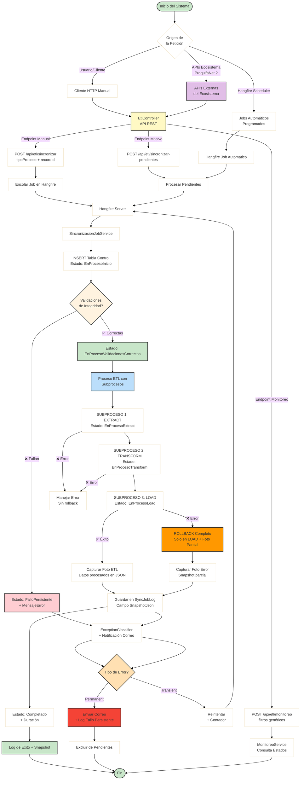
```mermaid
%%{init: {'theme':'base', 'themeVariables': { 'background':'#ffffff', 'mainBkg':'#ffffff', 'secondBkg':'#ffffff'}}}%%
graph TB
    Start([Inicio del Sistema]) --> Origins{Origen de<br/>la Petición}

    Origins --> |Usuario/Cliente| UserClient[Cliente HTTP Manual]
    Origins --> |APIs Ecosistema<br/>ProquifaNet 2| ExternalAPIs[APIs Externas<br/>del Ecosistema]
    Origins --> |Hangfire Scheduler| Scheduler[Jobs Automáticos<br/>Programados]

    UserClient --> API[EtlController<br/>API REST]
    ExternalAPIs --> API
    Scheduler --> RecurringJob[Hangfire Job Automático]

    API --> |Endpoint Manual| ManualTrigger[POST /api/etl/sincronizar<br/>tipoProceso + recordId]
    API --> |Endpoint Masivo| MassTrigger[POST /api/etl/sincronizar-pendientes]
    API --> |Endpoint Monitoreo| MonitorTrigger[POST /api/etl/monitoreo<br/>filtros genéricos]

    ManualTrigger --> Enqueue[Encolar Job en Hangfire]
    MassTrigger --> MassProcess[Procesar Pendientes]
    RecurringJob --> MassProcess
    MonitorTrigger --> MonitorService[MonitoreoService<br/>Consulta Estados]

    Enqueue --> HangfireServer[Hangfire Server]
    MassProcess --> HangfireServer

    HangfireServer --> JobService[SincronizacionJobService]

    JobService --> ControlInsert[INSERT Tabla Control<br/>Estado: EnProcesoInicio]
    ControlInsert --> Validation{Validaciones<br/>de Integridad?}
    
    Validation --> |✅ Correctas| ValidationOK[Estado: EnProcesoValidacionesCorrectas]
    Validation --> |❌ Fallan| ValidationFail[Estado: FalloPersistente<br/>+ MensajeError]
    
    ValidationOK --> ETLProcess[Proceso ETL con<br/>Subprocesos]
    ValidationFail --> ErrorClassifier[ExceptionClassifier<br/>+ Notificación Correo]
    
    ETLProcess --> Subprocess1[SUBPROCESO 1: EXTRACT<br/>Estado: EnProcesoExtract]
    Subprocess1 --> Subprocess2[SUBPROCESO 2: TRANSFORM<br/>Estado: EnProcesoTransform]
    Subprocess2 --> Subprocess3[SUBPROCESO 3: LOAD<br/>Estado: EnProcesoLoad]
    
    Subprocess3 --> |✅ Éxito| CaptureSnapshot[Capturar Foto ETL<br/>Datos procesados en JSON]
    Subprocess3 --> |❌ Error| Rollback[ROLLBACK Completo<br/>Solo en LOAD + Foto Parcial]
    
    CaptureSnapshot --> SaveSnapshot[Guardar en SyncJobLog<br/>Campo SnapshotJson]
    SaveSnapshot --> Complete[Estado: Completado<br/>+ Duración]
    Rollback --> CaptureErrorSnapshot[Capturar Foto Error<br/>Snapshot parcial]
    CaptureErrorSnapshot --> SaveSnapshot
    Subprocess1 --> |❌ Error| HandleError[Manejar Error<br/>Sin rollback]
    Subprocess2 --> |❌ Error| HandleError[Manejar Error<br/>Sin rollback]
    
    Complete --> LogSuccess[Log de Éxito + Snapshot]
    SaveSnapshot --> ErrorClassifier
    ErrorClassifier --> ErrorType{Tipo de Error?}
    ErrorClassifier --> ErrorType{Tipo de Error?}
    
    ErrorType --> |Transient| Retry[Reintentar<br/>+ Contador]
    ErrorType --> |Permanent| EmailNotification[Enviar Correo<br/>+ Log Fallo Persistente]
    
    Retry --> HangfireServer
    EmailNotification --> Exclude[Excluir de Pendientes]
    LogSuccess --> End([Fin])
    Exclude --> End
    MonitorService --> End

    style Start fill:#c8e6c9,stroke:#333,stroke-width:2px
    style End fill:#c8e6c9,stroke:#333,stroke-width:2px
    style ETLProcess fill:#bbdefb,stroke:#333,stroke-width:2px
    style Validation fill:#fff3e0,stroke:#333,stroke-width:2px
    style ValidationOK fill:#c8e6c9,stroke:#333,stroke-width:2px
    style ValidationFail fill:#ffcdd2,stroke:#333,stroke-width:2px
    style Rollback fill:#ff9800,stroke:#333,stroke-width:2px
    style ErrorType fill:#ffe0b2,stroke:#333,stroke-width:2px
    style EmailNotification fill:#f44336,stroke:#333,stroke-width:2px
    style LogSuccess fill:#c8e6c9,stroke:#333,stroke-width:2px
style ExternalAPIs fill:#e1bee7,stroke:#333,stroke-width:2px
    style API fill:#fff9c4,stroke:#333,stroke-width:2px
```

---

## 17. Flujo de Monitoreo y Consultas (NUEVO)

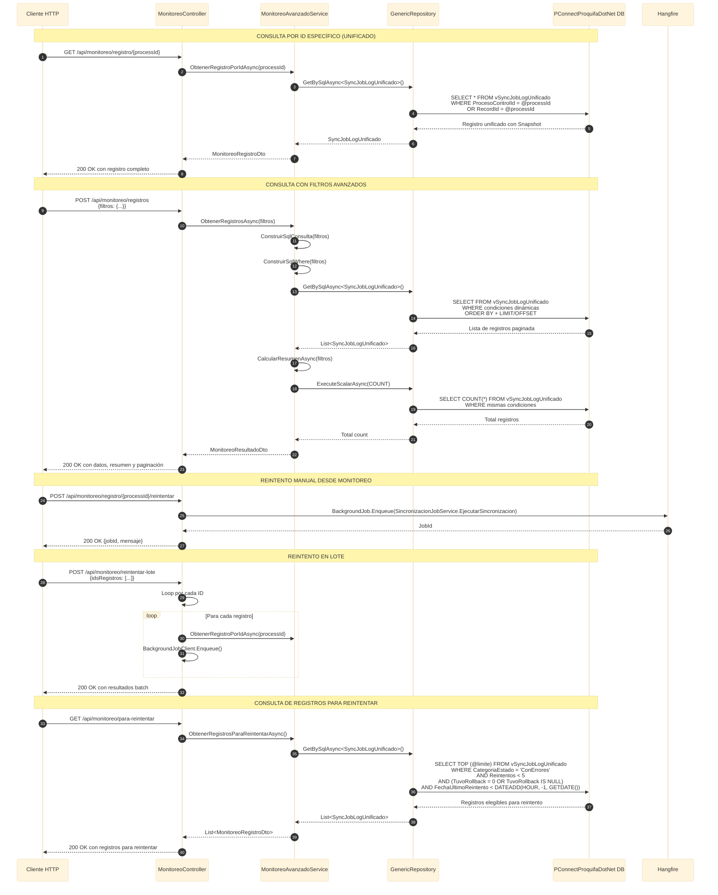
```mermaid
%%{init: {'theme':'base', 'themeVariables': { 'background':'#ffffff'}}}%%
sequenceDiagram
    autonumber
    participant Client as Cliente HTTP
    participant MonitorController as MonitoreoController
    participant MonitorService as MonitoreoAvanzadoService
    participant ControlRepo as GenericRepository
    participant DBControl as PConnectProquifaDotNet DB

    Note over Client,DBControl: CONSULTA POR ID ESPECÍFICO (UNIFICADO)
    Client->>MonitorController: GET /api/monitoreo/registro/{processId}
    MonitorController->>MonitorService: ObtenerRegistroPorIdAsync(processId)
    
    MonitorService->>ControlRepo: GetBySqlAsync<SyncJobLogUnificado>()
    ControlRepo->>DBControl: SELECT * FROM vSyncJobLogUnificado<br/>WHERE ProcesoControlId = @processId<br/>OR RecordId = @processId
    DBControl-->>ControlRepo: Registro unificado con Snapshot
    ControlRepo-->>MonitorService: SyncJobLogUnificado
    MonitorService-->>MonitorController: MonitoreoRegistroDto
    MonitorController-->>Client: 200 OK con registro completo

    Note over Client,DBControl: CONSULTA CON FILTROS AVANZADOS
    Client->>MonitorController: POST /api/monitoreo/registros<br/>{filtros: {...}}
    MonitorController->>MonitorService: ObtenerRegistrosAsync(filtros)
    
    MonitorService->>MonitorService: ConstruirSqlConsulta(filtros)
    MonitorService->>MonitorService: ConstruirSqlWhere(filtros)
    MonitorService->>ControlRepo: GetBySqlAsync<SyncJobLogUnificado>()
    ControlRepo->>DBControl: SELECT FROM vSyncJobLogUnificado<br/>WHERE condiciones dinámicas<br/>ORDER BY + LIMIT/OFFSET
    DBControl-->>ControlRepo: Lista de registros paginada
    ControlRepo-->>MonitorService: List<SyncJobLogUnificado>
    
    MonitorService->>MonitorService: CalcularResumenAsync(filtros)
    MonitorService->>ControlRepo: ExecuteScalarAsync(COUNT)
    ControlRepo->>DBControl: SELECT COUNT(*) FROM vSyncJobLogUnificado<br/>WHERE mismas condiciones
    DBControl-->>ControlRepo: Total registros
    ControlRepo-->>MonitorService: Total count
    
    MonitorService-->>MonitorController: MonitoreoResultadoDto
    MonitorController-->>Client: 200 OK con datos, resumen y paginación

    Note over Client,DBControl: REINTENTO MANUAL DESDE MONITOREO
    Client->>MonitorController: POST /api/monitoreo/registro/{processId}/reintentar
    MonitorController->>Hangfire: BackgroundJob.Enqueue(SincronizacionJobService.EjecutarSincronizacion)
    Hangfire-->>MonitorController: JobId
    MonitorController-->>Client: 200 OK {jobId, mensaje}

    Note over Client,DBControl: REINTENTO EN LOTE
    Client->>MonitorController: POST /api/monitoreo/reintentar-lote<br/>{idsRegistros: [...]}
    MonitorController->>MonitorController: Loop por cada ID
    loop Para cada registro
        MonitorController->>MonitorService: ObtenerRegistroPorIdAsync(processId)
        MonitorController->>MonitorController: BackgroundJobClient.Enqueue()
    end
    MonitorController-->>Client: 200 OK con resultados batch

    Note over Client,DBControl: CONSULTA DE REGISTROS PARA REINTENTAR
    Client->>MonitorController: GET /api/monitoreo/para-reintentar
    MonitorController->>MonitorService: ObtenerRegistrosParaReintentarAsync()
    MonitorService->>ControlRepo: GetBySqlAsync<SyncJobLogUnificado>()
    ControlRepo->>DBControl: SELECT TOP (@limite) FROM vSyncJobLogUnificado<br/>WHERE CategoriaEstado = 'ConErrores'<br/>AND Reintentos < 5<br/>AND (TuvoRollback = 0 OR TuvoRollback IS NULL)<br/>AND FechaUltimoReintento < DATEADD(HOUR, -1, GETDATE())
    DBControl-->>ControlRepo: Registros elegibles para reintento
    ControlRepo-->>MonitorService: List<SyncJobLogUnificado>
    MonitorService-->>MonitorController: List<MonitoreoRegistroDto>
    MonitorController-->>Client: 200 OK con registros para reintentar

```

---

## 18. Flujo de Notificaciones por Correo (NUEVO)

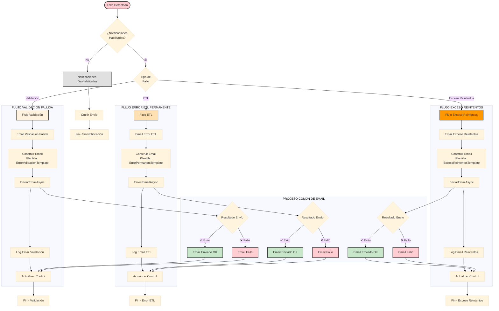
```mermaid
%%{init: {'theme':'base', 'themeVariables': { 'background':'#ffffff'}}}%%
graph TB
    Start([Fallo Detectado]) --> ConfigEnabled{¿Notificaciones<br/>Habilitadas?}
    ConfigEnabled -->|Sí| ErrorType{Tipo de<br/>Fallo}
    ConfigEnabled -->|No| Disabled[Notificaciones Deshabilitadas]

    
    ErrorType -->|Validación| ValidationStart[Flujo Validación]
    ErrorType -->|ETL| EtlStart[Flujo ETL]
    ErrorType -->|Exceso Reintentos| RetryStart[Flujo Exceso Reintentos]
    
    subgraph "FLUJO VALIDACIÓN FALLIDA"
        ValidationStart --> ValidationEmail[Email Validación Fallida]
        ValidationEmail --> BuildEmail1[Construir Email<br/>Plantilla: ErrorValidacionTemplate]
        BuildEmail1 --> SendEmail1[EnviarEmailAsync]
        SendEmail1 --> LogValidation[Log Email Validación]
        LogValidation --> UpdateValidation[Actualizar Control]
    end
    
    subgraph "FLUJO ERROR ETL PERMANENTE"
        EtlStart --> EtlEmail[Email Error ETL]
        EtlEmail --> BuildEmail2[Construir Email<br/>Plantilla: ErrorPermanentTemplate]
        BuildEmail2 --> SendEmail2[EnviarEmailAsync]
        SendEmail2 --> LogEtl[Log Email ETL]
        LogEtl --> UpdateEtl[Actualizar Control]
    end
    
    subgraph "FLUJO EXCESO REINTENTOS"
        RetryStart --> RetryEmail[Email Exceso Reintentos]
        RetryEmail --> BuildEmail3[Construir Email<br/>Plantilla: ExcesoReintentosTemplate]
        BuildEmail3 --> SendEmail3[EnviarEmailAsync]
        SendEmail3 --> LogRetry[Log Email Reintentos]
        LogRetry --> UpdateRetry[Actualizar Control]
    end
    
    subgraph "PROCESO COMÚN DE EMAIL"
        SendEmail1 --> EmailResult1{Resultado Envío}
        SendEmail2 --> EmailResult2{Resultado Envío}
        SendEmail3 --> EmailResult3{Resultado Envío}
        
        EmailResult1 -->|✅ Éxito| SuccessEmail1[Email Enviado OK]
        EmailResult1 -->|❌ Falló| FailEmail1[Email Falló]
        
        EmailResult2 -->|✅ Éxito| SuccessEmail2[Email Enviado OK]
        EmailResult2 -->|❌ Falló| FailEmail2[Email Falló]
        
        EmailResult3 -->|✅ Éxito| SuccessEmail3[Email Enviado OK]
        EmailResult3 -->|❌ Falló| FailEmail3[Email Falló]
        
        SuccessEmail1 --> UpdateValidation
        FailEmail1 --> UpdateValidation
        
        SuccessEmail2 --> UpdateEtl
        FailEmail2 --> UpdateEtl
        
        SuccessEmail3 --> UpdateRetry
        FailEmail3 --> UpdateRetry
    end
    
    UpdateValidation --> EndValidation[Fin - Validación]
    UpdateEtl --> EndEtl[Fin - Error ETL]
    UpdateRetry --> EndRetry[Fin - Exceso Reintentos]
    
    Disabled --> Skip[Omitir Envío]
    Skip --> EndSkip[Fin - Sin Notificación]


    style Start fill:#ffcdd2,stroke:#333,stroke-width:2px
    style ValidationStart fill:#fff3e0,stroke:#333,stroke-width:2px
    style EtlStart fill:#ffe0b2,stroke:#333,stroke-width:2px
    style RetryStart fill:#ff9800,stroke:#333,stroke-width:2px
    style SuccessEmail1 fill:#c8e6c9,stroke:#333,stroke-width:2px
    style SuccessEmail2 fill:#c8e6c9,stroke:#333,stroke-width:2px
    style SuccessEmail3 fill:#c8e6c9,stroke:#333,stroke-width:2px
    style FailEmail1 fill:#ffcdd2,stroke:#333,stroke-width:2px
    style FailEmail2 fill:#ffcdd2,stroke:#333,stroke-width:2px
    style FailEmail3 fill:#ffcdd2,stroke:#333,stroke-width:2px
    style Disabled fill:#e0e0e0,stroke:#333,stroke-width:2px
```

---

## 14. Flujo de Notificaciones por Correo (NUEVO)

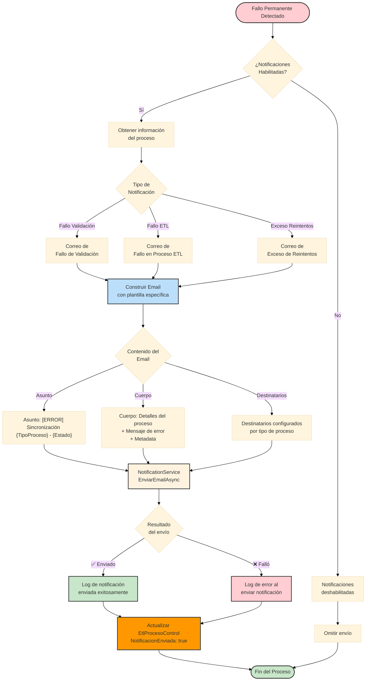
```mermaid
%%{init: {'theme':'base', 'themeVariables': { 'background':'#ffffff'}}}%%
graph TB
    Start([Fallo Permanente Detectado]) --> ConfigEnabled{¿Notificaciones<br/>Habilitadas?}
    ConfigEnabled -->|Sí| GetProcessInfo[Obtener información<br/>del proceso]
    ConfigEnabled -->|No| Disabled[Notificaciones<br>deshabilitadas]

    
    GetProcessInfo --> EmailType{Tipo de<br/>Notificación}
    
    EmailType --> |Fallo Validación| ValidationEmail[Correo de<br>Fallo de Validación]
    EmailType --> |Fallo ETL| EtlEmail[Correo de<br>Fallo en Proceso ETL]
    EmailType --> |Exceso Reintentos| RetryEmail[Correo de<br>Exceso de Reintentos]
    
    ValidationEmail --> BuildEmail[Construir Email<br/>con plantilla específica]
    EtlEmail --> BuildEmail
    RetryEmail --> BuildEmail
    
    BuildEmail --> EmailContent{Contenido del<br>Email}
    
    EmailContent --> |Asunto| Subject["Asunto: [ERROR] Sincronización {TipoProceso} - {Estado}"]
    EmailContent --> |Cuerpo| Body[Cuerpo: Detalles del proceso<br/>+ Mensaje de error<br/>+ Metadata]
    EmailContent --> |Destinatarios| Recipients[Destinatarios configurados<br/>por tipo de proceso]
    
    Subject --> SendEmail[NotificationService<br/>EnviarEmailAsync]
    Body --> SendEmail
    Recipients --> SendEmail
    
    SendEmail --> EmailResult{Resultado<br/>del envío}
    
    EmailResult --> |✅ Enviado| LogSuccess[Log de notificación<br/>enviada exitosamente]
    EmailResult --> |❌ Falló| LogFailure[Log de error al<br/>enviar notificación]
    
    LogSuccess --> UpdateControl[Actualizar EtlProcesoControl<br/>NotificacionEnviada: true]
    LogFailure --> UpdateControl
    
    UpdateControl --> End([Fin del Proceso])
    
    Disabled --> Skip[Omitir envío]
    Skip --> End


    style Start fill:#ffcdd2,stroke:#333,stroke-width:2px
    style End fill:#c8e6c9,stroke:#333,stroke-width:2px
    style BuildEmail fill:#bbdefb,stroke:#333,stroke-width:2px
    style SendEmail fill:#fff3e0,stroke:#333,stroke-width:2px
    style LogSuccess fill:#c8e6c9,stroke:#333,stroke-width:2px
    style LogFailure fill:#ffcdd2,stroke:#333,stroke-width:2px
    style UpdateControl fill:#ff9800,stroke:#333,stroke-width:2px
```

---

## 2. Flujo ETL Individual con Tabla de Control Genérica

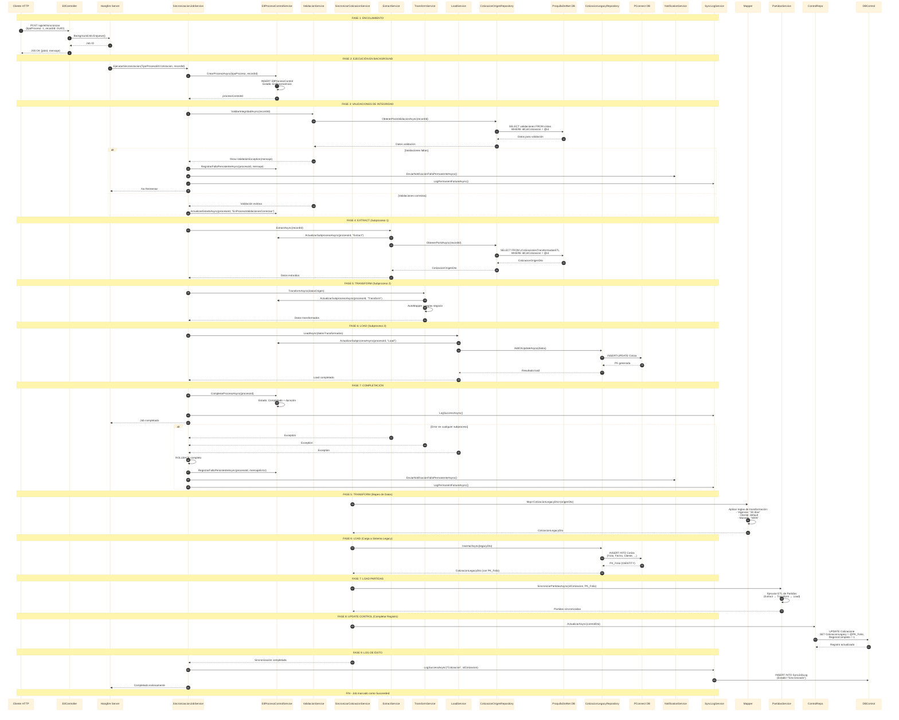
```mermaid
%%{init: {'theme':'base', 'themeVariables': { 'background':'#ffffff'}}}%%
sequenceDiagram
    autonumber
    participant Client as Cliente HTTP
    participant Controller as EtlController
    participant Hangfire as Hangfire Server
    participant JobService as SincronizacionJobService
    participant ControlService as EtlProcesoControlService
    participant ValidationService as ValidacionService
    participant SyncService as SincronizarCotizacionService
    participant SubprocessExtract as ExtractService
    participant SubprocessTransform as TransformService
    participant SubprocessLoad as LoadService
    participant OrigenRepo as CotizacionOrigenRepository
    participant DBOrigen as ProquifaDotNet DB
    participant LegacyRepo as CotizacionLegacyRepository
    participant DBLegacy as PConnect DB
    participant NotificationService as NotificationService
    participant SyncLog as SyncLogService

    Note over Client,SyncLog: FASE 1: ENCOLAMIENTO
    Client->>Controller: POST /api/etl/sincronizar<br/>{tipoProceso: 1, recordId: GUID}
    Controller->>Hangfire: BackgroundJob.Enqueue()
    Hangfire-->>Controller: Job ID
    Controller-->>Client: 200 OK {jobId, mensaje}

Note over Client,SyncLog: FASE 2: EJECUCIÓN EN BACKGROUND
    Hangfire->>JobService: EjecutarSincronizacion(TipoProcesoEtl.Cotizacion, recordId)
    JobService->>ControlService: CrearProcesoAsync(tipoProceso, recordId)
    ControlService->>ControlService: INSERT EtlProcesoControl<br/>Estado: EnProcesoInicio
    ControlService-->>JobService: procesoControlId

    Note over Client,SyncLog: FASE 3: VALIDACIONES DE INTEGRIDAD
    JobService->>ValidationService: ValidarIntegridadAsync(recordId)
    ValidationService->>OrigenRepo: ObtenerParaValidacionAsync(recordId)
    OrigenRepo->>DBOrigen: SELECT validaciones FROM vistas<br/>WHERE IdCotCotizacion = @id
    DBOrigen-->>OrigenRepo: Datos para validación
    OrigenRepo-->>ValidationService: Datos validación

    alt Validaciones fallan
        ValidationService-->>JobService: throw ValidationException(mensaje)
        JobService->>ControlService: RegistrarFalloPersistenteAsync(procesoId, mensaje)
        JobService->>NotificationService: EnviarNotificacionFalloPermanenteAsync()
        JobService->>SyncLog: LogPermanentFailureAsync()
        JobService-->>Hangfire: No Reintentar
    else Validaciones correctas
        ValidationService-->>JobService: Validación exitosa
        JobService->>ControlService: ActualizarEstadoAsync(procesoId, "EnProcesoValidacionesCorrectas")
    end

    Note over Client,SyncLog: FASE 4: EXTRACT (Subproceso 1)
    JobService->>SubprocessExtract: ExtractAsync(recordId)
    SubprocessExtract->>ControlService: ActualizarSubprocesoAsync(procesoId, "Extract")
    SubprocessExtract->>OrigenRepo: ObtenerPorIdAsync(recordId)
    OrigenRepo->>DBOrigen: SELECT FROM vCotizacionesTransformadasETL<br/>WHERE IdCotCotizacion = @id
    DBOrigen-->>OrigenRepo: CotizacionOrigenDto
    OrigenRepo-->>SubprocessExtract: CotizacionOrigenDto
    SubprocessExtract-->>JobService: Datos extraídos

    Note over Client,SyncLog: FASE 5: TRANSFORM (Subproceso 2)
    JobService->>SubprocessTransform: TransformAsync(datosOrigen)
    SubprocessTransform->>ControlService: ActualizarSubprocesoAsync(procesoId, "Transform")
    SubprocessTransform->>SubprocessTransform: AutoMapper + reglas negocio
    SubprocessTransform-->>JobService: Datos transformados

    Note over Client,SyncLog: FASE 6: LOAD (Subproceso 3)
    JobService->>SubprocessLoad: LoadAsync(datosTransformados)
    SubprocessLoad->>ControlService: ActualizarSubprocesoAsync(procesoId, "Load")
    SubprocessLoad->>LegacyRepo: AddOrUpdateAsync(datos)
    LegacyRepo->>DBLegacy: INSERT/UPDATE Cotiza
    DBLegacy-->>LegacyRepo: PK generada
    LegacyRepo-->>SubprocessLoad: Resultado load
    SubprocessLoad-->>JobService: Load completado

    Note over Client,SyncLog: FASE 7: COMPLETACIÓN
    JobService->>ControlService: CompletarProcesoAsync(procesoId)
    ControlService->>ControlService: Estado: Completado + duración
    JobService->>SyncLog: LogSuccessAsync()
    JobService-->>Hangfire: Job completado

    alt Error en cualquier subproceso
        SubprocessExtract-->>JobService: Exception
        SubprocessTransform-->>JobService: Exception
        SubprocessLoad-->>JobService: Exception
        JobService->>JobService: ROLLBACK completo
        JobService->>ControlService: RegistrarFalloPersistenteAsync(procesoId, mensajeError)
        JobService->>NotificationService: EnviarNotificacionFalloPermanenteAsync()
        JobService->>SyncLog: LogPermanentFailureAsync()
    end

    Note over Client,SyncLog: FASE 5: TRANSFORM (Mapeo de Datos)
    SyncService->>Mapper: Map<CotizacionLegacyDto>(origenDto)
    Mapper->>Mapper: Aplicar reglas de transformación:<br/>- Vigencia: "30 días"<br/>- Cliente: default<br/>- Moneda: "MXN"
    Mapper-->>SyncService: CotizacionLegacyDto

    Note over Client,SyncLog: FASE 6: LOAD (Carga a Sistema Legacy)
    SyncService->>LegacyRepo: InsertarAsync(legacyDto)
    LegacyRepo->>DBLegacy: INSERT INTO Cotiza<br/>(Folio, Fecha, Cliente, ...)
    DBLegacy-->>LegacyRepo: PK_Folio (IDENTITY)
    LegacyRepo-->>SyncService: CotizacionLegacyDto (con PK_Folio)

    Note over Client,SyncLog: FASE 7: LOAD PARTIDAS
    SyncService->>PartidasService: SincronizarPartidasAsync(idCotizacion, PK_Folio)
    PartidasService->>PartidasService: Ejecutar ETL de Partidas<br/>(Extract → Transform → Load)
    PartidasService-->>SyncService: Partidas sincronizadas

    Note over Client,SyncLog: FASE 8: UPDATE CONTROL (Completar Registro)
    SyncService->>ControlRepo: ActualizarAsync(controlDto)
    ControlRepo->>DBControl: UPDATE Cotizacione<br/>SET CotizacionLegacy = @PK_Folio,<br/>    RegistroCompleto = 1
    DBControl-->>ControlRepo: Registro actualizado

    Note over Client,SyncLog: FASE 9: LOG DE ÉXITO
    SyncService-->>JobService: Sincronización completada
    JobService->>SyncLog: LogSuccessAsync("Cotizacion", idCotizacion)
    SyncLog->>DBControl: INSERT INTO SyncJobLog<br/>(Estado="Sincronizado")

    JobService-->>Hangfire: Completado exitosamente

    Note over Client,SyncLog: FIN - Job marcado como Succeeded
```

---

## 3. Flujo de Sincronización Masiva

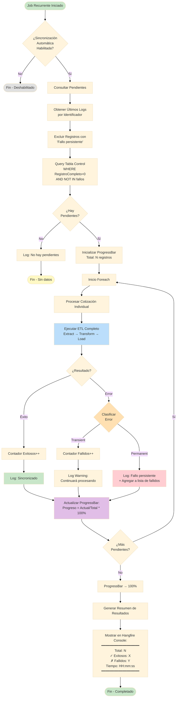
```mermaid
%%{init: {'theme':'base', 'themeVariables': { 'background':'#ffffff'}}}%%
flowchart TD
    Start([Job Recurrente Iniciado]) --> GetConfig{¿Sincronización<br/>Automática<br/>Habilitada?}

    GetConfig -->|No| EndDisabled([Fin - Deshabilitado])
    GetConfig -->|Sí| QueryPendientes[Consultar Pendientes]

    QueryPendientes --> GetLogs[Obtener Últimos Logs<br/>por Identificador]
    GetLogs --> ExcludePersistent[Excluir Registros con<br/>'Fallo persistente']
    ExcludePersistent --> QueryControl[Query Tabla Control<br/>WHERE RegistroCompleto=0<br/>AND NOT IN fallos]

    QueryControl --> CheckCount{¿Hay<br/>Pendientes?}

    CheckCount -->|No|LogEmpty[Log: No hay pendientes]
    LogEmpty --> EndEmpty([Fin - Sin datos])

    CheckCount -->|Sí|InitProgress[Inicializar ProgressBar<br/>Total: N registros]

    InitProgress --> ForEachStart[Inicio Foreach]
    ForEachStart --> ProcessOne[Procesar Cotización Individual]

    ProcessOne --> ExecuteETL[Ejecutar ETL Completo<br/>Extract → Transform → Load]

    ExecuteETL --> CheckResult{¿Resultado?}

    CheckResult -->|Éxito|IncrementSuccess[Contador Exitosos++]
    CheckResult -->|Error|ClassifyError{Clasificar<br/>Error}

    IncrementSuccess --> LogSuccessItem[Log: Sincronizado]
    LogSuccessItem --> UpdateProgress

    ClassifyError -->|Transient|IncrementFailed[Contador Fallidos++]
    ClassifyError -->|Permanent|LogPermanentItem[Log: Fallo persistente<br/>+ Agregar a lista de fallidos]

    IncrementFailed --> LogWarningItem[Log Warning:<br/>Continuará procesando]
    LogWarningItem --> UpdateProgress
    LogPermanentItem --> UpdateProgress

    UpdateProgress[Actualizar ProgressBar:<br/>Progreso = Actual/Total * 100%] --> CheckMore{¿Más<br/>Pendientes?}

    CheckMore -->|Sí|ForEachStart
    CheckMore -->|No|CompleteProgress[ProgressBar → 100%]

    CompleteProgress --> GenerateSummary[Generar Resumen de Resultados]

    GenerateSummary --> DisplayResults[Mostrar en Hangfire Console:<br/>━━━━━━━━━━━━━━━━━━<br/>Total: N<br/>✓ Exitosos: X<br/>✗ Fallidos: Y<br/>Tiempo: HH:mm:ss<br/>━━━━━━━━━━━━━━━━━━]

    DisplayResults --> EndSuccess([Fin - Completado])

    style Start fill:#c8e6c9
    style EndSuccess fill:#c8e6c9
    style EndEmpty fill:#fff9c4
    style EndDisabled fill:#e0e0e0
    style ExecuteETL fill:#bbdefb
    style ClassifyError fill:#ffe0b2
    style LogPermanentItem fill:#ffcdd2
    style LogSuccessItem fill:#c8e6c9
    style UpdateProgress fill:#e1bee7
```

---

## 4. Flujo de Manejo de Errores con Notificaciones

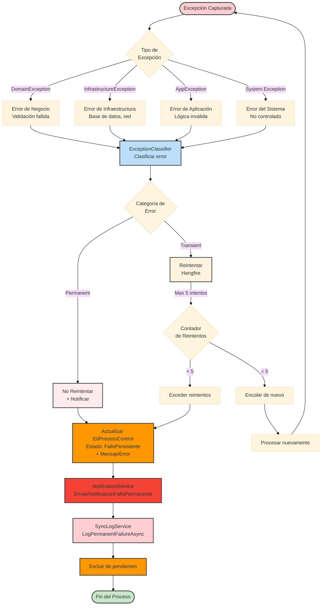
```mermaid
%%{init: {'theme':'base', 'themeVariables': { 'background':'#ffffff'}}}%%
graph TB
    Start([Excepción Capturada]) --> ExceptionType{Tipo de<br/>Excepción}

    ExceptionType --> |DomainException| Domain[Error de Negocio<br/>Validación fallida]
    ExceptionType --> |InfrastructureException| Infra[Error de Infraestructura<br/>Base de datos, red]
    ExceptionType --> |AppException| App[Error de Aplicación<br/>Lógica inválida]
    ExceptionType --> |System.Exception| System[Error del Sistema<br/>No controlado]

    Domain --> Classification[ExceptionClassifier<br/>Clasificar error]
    Infra --> Classification
    App --> Classification
    System --> Classification

    Classification --> ErrorCategory{Categoría de<br/>Error}

    ErrorCategory --> |Transient| Retry[Reintentar<br/>Hangfire]
    ErrorCategory --> |Permanent| NoRetry[No Reintentar<br/>+ Notificar]

    Retry --> |Max 5 intentos| RetryCount{Contador<br/>de Reintentos}
    RetryCount --> |< 5| HangfireQueue[Encolar de nuevo]
    RetryCount --> |= 5| MaxRetries[Exceder reintentos]

    NoRetry --> UpdateControl[Actualizar EtlProcesoControl<br/>Estado: FalloPersistente<br/>+ MensajeError]
    MaxRetries --> UpdateControl

    UpdateControl --> EmailNotification[NotificationService<br/>EnviarNotificacionFalloPermanente]
    EmailNotification --> LogFailure[SyncLogService<br/>LogPermanentFailureAsync]

    LogFailure --> Exclude[Excluir de pendientes]
    Exclude --> End([Fin del Proceso])

    HangfireQueue --> ProcessAgain[Procesar nuevamente]
    ProcessAgain --> Start

    style Start fill:#ffcdd2,stroke:#333,stroke-width:2px
    style End fill:#c8e6c9,stroke:#333,stroke-width:2px
    style Classification fill:#bbdefb,stroke:#333,stroke-width:2px
    style Retry fill:#fff3e0,stroke:#333,stroke-width:2px
    style NoRetry fill:#ffebee,stroke:#333,stroke-width:2px
    style UpdateControl fill:#ff9800,stroke:#333,stroke-width:2px
    style EmailNotification fill:#f44336,stroke:#333,stroke-width:2px
    style LogFailure fill:#ffcdd2,stroke:#333,stroke-width:2px
    style Exclude fill:#ff9800,stroke:#333,stroke-width:2px
```

---

## 5. Flujo de Clasificación de Excepciones

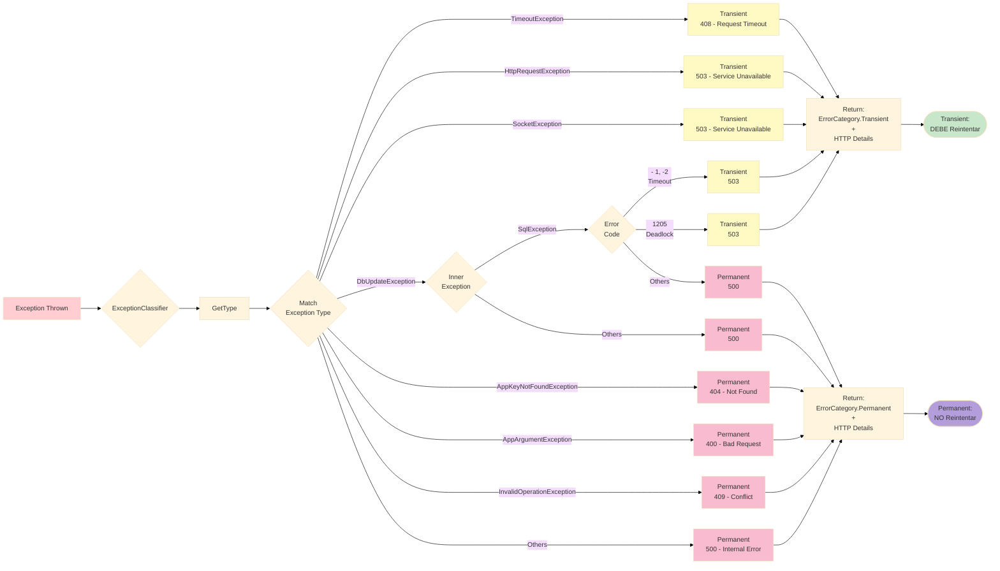
```mermaid
%%{init: {'theme':'base', 'themeVariables': { 'background':'#ffffff'}}}%%
flowchart LR
    Exception[Exception Thrown] --> Classifier{ExceptionClassifier}

    Classifier --> GetType[GetType]

    GetType --> Match1{Match<br/>Exception Type}

    Match1 -->|TimeoutException| T1[Transient<br/>408 - Request Timeout]
    Match1 -->|HttpRequestException| T2[Transient<br/>503 - Service Unavailable]
    Match1 -->|SocketException| T3[Transient<br/>503 - Service Unavailable]

    Match1 -->|DbUpdateException| CheckDbInner{Inner<br/>Exception}

    CheckDbInner -->|SqlException| CheckCode{Error<br/>Code}
    CheckCode -->|- 1, -2<br/>Timeout| T4[Transient<br/>503]
    CheckCode -->|1205<br/>Deadlock| T5[Transient<br/>503]
    CheckCode -->|Others| P1[Permanent<br/>500]

    CheckDbInner -->|Others| P2[Permanent<br/>500]

    Match1 -->|AppKeyNotFoundException| P3[Permanent<br/>404 - Not Found]
    Match1 -->|AppArgumentException| P4[Permanent<br/>400 - Bad Request]
    Match1 -->|InvalidOperationException| P5[Permanent<br/>409 - Conflict]
    Match1 -->|Others| P6[Permanent<br/>500 - Internal Error]

    T1 --> ReturnT[Return:<br/>ErrorCategory.Transient<br/>+<br/>HTTP Details]
    T2 --> ReturnT
    T3 --> ReturnT
    T4 --> ReturnT
    T5 --> ReturnT

    P1 --> ReturnP[Return:<br/>ErrorCategory.Permanent<br/>+<br/>HTTP Details]
    P2 --> ReturnP
    P3 --> ReturnP
    P4 --> ReturnP
    P5 --> ReturnP
    P6 --> ReturnP

    ReturnT --> EndT([Transient:<br/>DEBE Reintentar])
    ReturnP --> EndP([Permanent:<br/>NO Reintentar])

    style Exception fill:#ffcdd2
    style T1 fill:#fff9c4
    style T2 fill:#fff9c4
    style T3 fill:#fff9c4
    style T4 fill:#fff9c4
    style T5 fill:#fff9c4
    style P1 fill:#f8bbd0
    style P2 fill:#f8bbd0
    style P3 fill:#f8bbd0
    style P4 fill:#f8bbd0
    style P5 fill:#f8bbd0
    style P6 fill:#f8bbd0
    style EndT fill:#c8e6c9
    style EndP fill:#b39ddb
```

---

## 6. Flujo de Logs de Sincronización

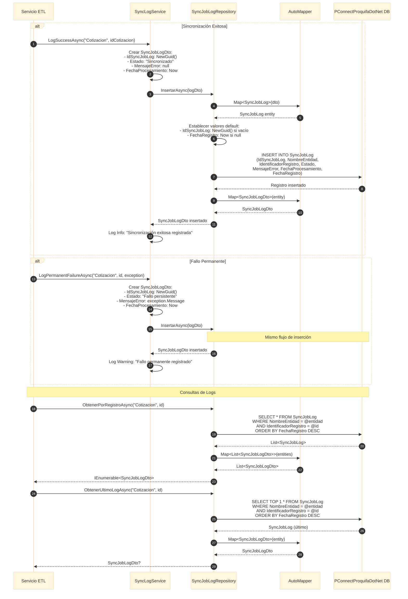
```mermaid
%%{init: {'theme':'base', 'themeVariables': { 'background':'#ffffff'}}}%%
sequenceDiagram
    autonumber
    participant Service as Servicio ETL
    participant SyncLog as SyncLogService
    participant Repo as SyncJobLogRepository
    participant Mapper as AutoMapper
    participant DB as PConnectProquifaDotNet DB

    alt Sincronización Exitosa
        Service->>SyncLog: LogSuccessAsync("Cotizacion", idCotizacion)
        SyncLog->>SyncLog: Crear SyncJobLogDto:<br/>- IdSyncJobLog: NewGuid()<br/>- Estado: "Sincronizado"<br/>- MensajeError: null<br/>- FechaProcesamiento: Now
        SyncLog->>Repo: InsertarAsync(logDto)
        Repo->>Mapper: Map<SyncJobLog>(dto)
        Mapper-->>Repo: SyncJobLog entity
        Repo->>Repo: Establecer valores default:<br/>- IdSyncJobLog: NewGuid() si vacío<br/>- FechaRegistro: Now si null
        Repo->>DB: INSERT INTO SyncJobLog<br/>(IdSyncJobLog, NombreEntidad,<br/>IdentificadorRegistro, Estado,<br/>MensajeError, FechaProcesamiento,<br/>FechaRegistro)
        DB-->>Repo: Registro insertado
        Repo->>Mapper: Map<SyncJobLogDto>(entity)
        Mapper-->>Repo: SyncJobLogDto
        Repo-->>SyncLog: SyncJobLogDto insertado
        SyncLog->>SyncLog: Log Info: "Sincronización exitosa registrada"
    end

    alt Fallo Permanente
        Service->>SyncLog: LogPermanentFailureAsync("Cotizacion", id, exception)
        SyncLog->>SyncLog: Crear SyncJobLogDto:<br/>- IdSyncJobLog: NewGuid()<br/>- Estado: "Fallo persistente"<br/>- MensajeError: exception.Message<br/>- FechaProcesamiento: Now
        SyncLog->>Repo: InsertarAsync(logDto)
        Note over Repo,DB: Mismo flujo de inserción
        Repo-->>SyncLog: SyncJobLogDto insertado
        SyncLog->>SyncLog: Log Warning: "Fallo permanente registrado"
    end

    Note over Service,DB: Consultas de Logs

    Service->>Repo: ObtenerPorRegistroAsync("Cotizacion", id)
    Repo->>DB: SELECT * FROM SyncJobLog<br/>WHERE NombreEntidad = @entidad<br/>AND IdentificadorRegistro = @id<br/>ORDER BY FechaRegistro DESC
    DB-->>Repo: List<SyncJobLog>
    Repo->>Mapper: Map<List<SyncJobLogDto>>(entities)
    Mapper-->>Repo: List<SyncJobLogDto>
    Repo-->>Service: IEnumerable<SyncJobLogDto>

    Service->>Repo: ObtenerUltimoLogAsync("Cotizacion", id)
    Repo->>DB: SELECT TOP 1 * FROM SyncJobLog<br/>WHERE NombreEntidad = @entidad<br/>AND IdentificadorRegistro = @id<br/>ORDER BY FechaRegistro DESC
    DB-->>Repo: SyncJobLog (último)
    Repo->>Mapper: Map<SyncJobLogDto>(entity)
    Mapper-->>Repo: SyncJobLogDto
    Repo-->>Service: SyncJobLogDto?
```

---

## 9. Flujo de Reintentos Automáticos (COMPLETO)

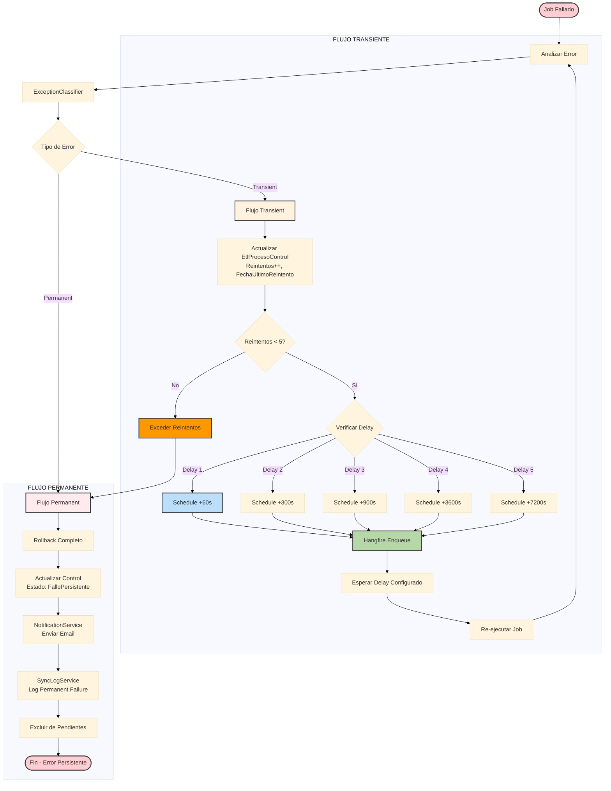
```mermaid
%%{init: {'theme':'base', 'themeVariables': { 'background':'#ffffff'}}}%%
graph TB
    Start([Job Fallado]) --> CheckError[Analizar Error]
    CheckError --> Classify[ExceptionClassifier]
    
    Classify --> ErrorType{Tipo de Error}
    ErrorType -->|Transient| TransientFlow[Flujo Transient]
    ErrorType -->|Permanent| PermanentFlow[Flujo Permanent]
    
    subgraph "FLUJO TRANSIENTE"
        TransientFlow --> UpdateControl[Actualizar EtlProcesoControl<br/>Reintentos++, FechaUltimoReintento]
        UpdateControl --> RetryCount{Reintentos < 5?}
        RetryCount -->|Sí| CheckDelay{Verificar Delay}
        RetryCount -->|No| Exceeded[Exceder Reintentos]
        
        CheckDelay -->|Delay 1| Schedule1[Schedule +60s]
        CheckDelay -->|Delay 2| Schedule2[Schedule +300s]
        CheckDelay -->|Delay 3| Schedule3[Schedule +900s]
        CheckDelay -->|Delay 4| Schedule4[Schedule +3600s]
        CheckDelay -->|Delay 5| Schedule5[Schedule +7200s]
        
        Schedule1 --> Hangfire1[Hangfire.Enqueue]
        Schedule2 --> Hangfire1
        Schedule3 --> Hangfire1
        Schedule4 --> Hangfire1
        Schedule5 --> Hangfire1
        
        Hangfire1 --> Wait1[Esperar Delay Configurado]
        Wait1 --> Reexecute[Re-ejecutar Job]
        Reexecute --> CheckError
    end
    
    subgraph "FLUJO PERMANENTE"
        PermanentFlow --> Rollback[Rollback Completo]
        Rollback --> UpdatePerm[Actualizar Control<br/>Estado: FalloPersistente]
        UpdatePerm --> Email[NotificationService<br/>Enviar Email]
        Email --> LogPermanent[SyncLogService<br/>Log Permanent Failure]
        LogPermanent --> Exclude[Excluir de Pendientes]
        Exclude --> EndPerm([Fin - Error Persistente])
    end
    
    Exceeded --> PermanentFlow
    
    style Start fill:#ffcdd2,stroke:#333,stroke-width:2px
    style EndPerm fill:#ffcdd2,stroke:#333,stroke-width:2px
    style TransientFlow fill:#fff3e0,stroke:#333,stroke-width:2px
    style PermanentFlow fill:#ffebee,stroke:#333,stroke-width:2px
    style Exceeded fill:#ff9800,stroke:#333,stroke-width:2px
    style Schedule1 fill:#bbdefb,stroke:#333,stroke-width:2px
    style Hangfire1 fill:#b6d7a8,stroke:#333,stroke-width:2px
```

---

## 10. Secuencia Detallada de Reintentos (NUEVO)

```mermaid
%%{init: {'theme':'base', 'themeVariables': { 'background':'#ffffff'}}}%%
sequenceDiagram
    participant API as API Endpoint
    participant Hangfire as Hangfire Server
    participant Job as SincronizacionJobService
    participant Control as EtlProcesoControlService
    participant Monitor as MonitoreoService
    participant User as Usuario Dashboard
    
    Note over API,User: ESCENARIO 1: PRIMERA EJECUCIÓN
    User->>API: POST /api/etl/sincronizar
    API->>Hangfire: BackgroundJob.Enqueue()
    Hangfire-->>API: JobId
    API-->>User: 202 Accepted
    
    Note over API,User: ESCENARIO 2: ERROR TRANSIENTE
    Hangfire->>Job: EjecutarSincronizacion()
    Job->>Job: Error durante ETL (Timeout)
    Job->>Control: RegistrarIntentoFallido()
    Job-->>Hangfire: Job Failed
    
    Note over API,User: ESCENARIO 3: REINTENTO AUTOMÁTICO
    Hangfire->>Hangfire: Esperar delay (60s)
    Hangfire->>Job: ReintentarSincronizacion()
    Job->>Monitor: ObtenerEstadoActual()
    Monitor-->>Job: Registro con reintentos++
    Job->>Job: Re-ejecutar ETL
    
    Note over API,User: ESCENARIO 4: ERROR PERMANENTE
    Job->>Job: FK Violation
    Job->>Control: ActualizarEstado(FalloPersistente)
    Job->>Job: EnviarNotificacionEmail()
    Job-->>Hangfire: Job Failed (Permanent)
    
    Note over API,User: ESCENARIO 5: REINTENTO MANUAL
    User->>Monitor: GET /api/monitoreo/registros
    Monitor-->>User: Lista de errores
    User->>Monitor: POST /api/monitoreo/registro/{id}/reintentar
    Monitor->>Hangfire: BackgroundJob.Enqueue()
    Hangfire->>Job: EjecutarSincronizacion() - Manual
    
    Note over API,User: ESCENARIO 6: REINTENTO PROGRAMADO
    Note over Hangfire: Job recurrente cada 30 min
    Hangfire->>Job: ProcesarPendientesAutomaticos()
    Job->>Monitor: ObtenerRegistrosParaReintentar()
    Monitor-->>Job: Lista de registros
    loop Para cada registro
        Job->>Hangfire: BackgroundJob.Enqueue()
    end
    
    style API fill:#fff9c4,stroke:#333,stroke-width:2px
    style Hangfire fill:#b6d7a8,stroke:#333,stroke-width:2px
    style Job fill:#bbdefb,stroke:#333,stroke-width:2px
    style Control fill:#f9cb9c,stroke:#333,stroke-width:2px
    style Monitor fill:#e1bee7,stroke:#333,stroke-width:2px
    style User fill:#e3f2fd,stroke:#333,stroke-width:2px
```

---

## 11. Estados y Transiciones del Proceso (NUEVO)

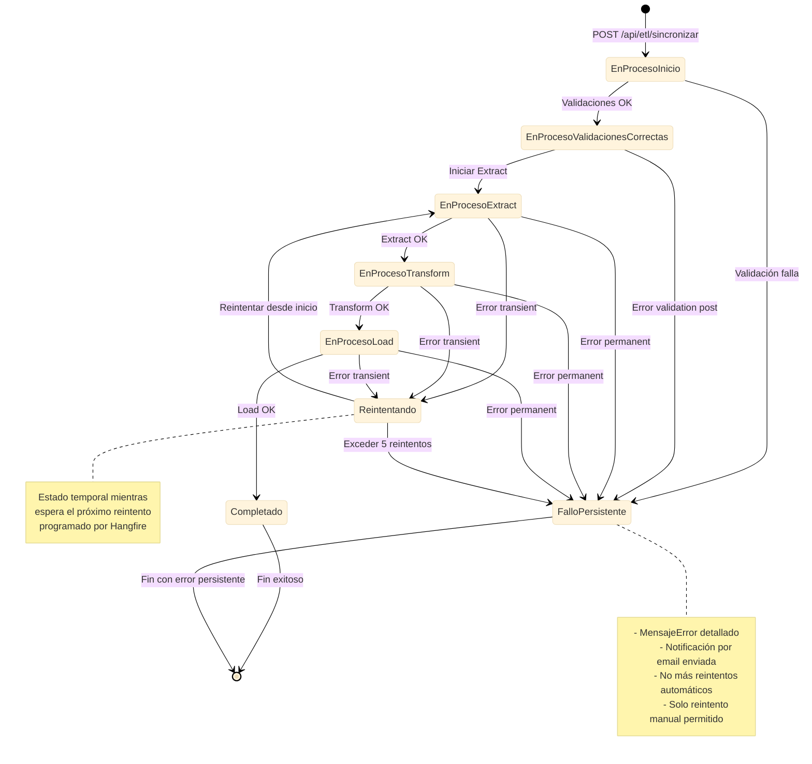
```mermaid
%%{init: {'theme':'base', 'themeVariables': { 'background':'#ffffff'}}}%%
stateDiagram-v2
    [*] --> EnProcesoInicio: POST /api/etl/sincronizar
    
    EnProcesoInicio --> EnProcesoValidacionesCorrectas: Validaciones OK
    EnProcesoInicio --> FalloPersistente: Validación falla
    
    EnProcesoValidacionesCorrectas --> EnProcesoExtract: Iniciar Extract
    EnProcesoValidacionesCorrectas --> FalloPersistente: Error validation post
    
    EnProcesoExtract --> EnProcesoTransform: Extract OK
    EnProcesoExtract --> Reintentando: Error transient
    EnProcesoExtract --> FalloPersistente: Error permanent
    
    EnProcesoTransform --> EnProcesoLoad: Transform OK
    EnProcesoTransform --> Reintentando: Error transient
    EnProcesoTransform --> FalloPersistente: Error permanent
    
    EnProcesoLoad --> Completado: Load OK
    EnProcesoLoad --> Reintentando: Error transient
    EnProcesoLoad --> FalloPersistente: Error permanent
    
    Reintentando --> EnProcesoExtract: Reintentar desde inicio
    Reintentando --> FalloPersistente: Exceder 5 reintentos
    
    Completado --> [*]: Fin exitoso
    FalloPersistente --> [*]: Fin con error persistente
    
    note right of Reintentando
        Estado temporal mientras
        espera el próximo reintento
        programado por Hangfire
    end note
    
    note right of FalloPersistente
        - MensajeError detallado
        - Notificación por email enviada
        - No más reintentos automáticos
        - Solo reintento manual permitido
    end note
```

---

## 12. Mecanismos de Reintento (NUEVO)

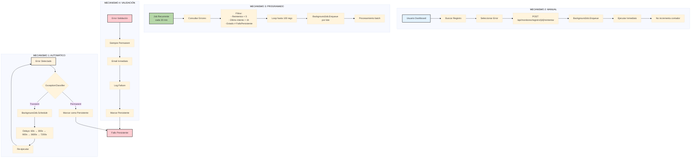
```mermaid
%%{init: {'theme':'base', 'themeVariables': { 'background':'#ffffff'}}}%%
graph TB
    subgraph "MECANISMO 1: AUTOMÁTICO"
        AutoStart[Error Detectado] --> AutoClassify{ExceptionClassifier}
        AutoClassify -->|Transient| AutoRetry[BackgroundJob.Schedule]
        AutoClassify -->|Permanent| AutoPermanent[Marcar como Persistente]
        
        AutoRetry --> AutoDelay[Delays: 60s → 300s → 900s → 3600s → 7200s]
        AutoDelay --> AutoExecute[Re-ejecutar]
        AutoExecute --> AutoStart
    end
    
    subgraph "MECANISMO 2: MANUAL"
        ManualStart[Usuario Dashboard] --> ManualSearch[Buscar Registro]
        ManualSearch --> ManualSelect[Seleccionar Error]
        ManualSelect --> ManualRetry["POST /api/monitoreo/registro/{id}/reintentar"]
        ManualRetry --> ManualEnqueue[BackgroundJob.Enqueue]
        ManualEnqueue --> ManualExecute[Ejecutar Inmediato]
        ManualExecute --> ManualEnd[No incrementa contador]
    end
    
    subgraph "MECANISMO 3: PROGRAMADO"
        ScheduledStart[Job Recurrente<br/>cada 30 min] --> ScheduledQuery[Consultar Errores]
        ScheduledQuery --> ScheduledFilter[Filtrar:<br/>- Reintentos < 5<br/>- Último intento > 1h<br/>- Estado ≠ FalloPersistente]
        ScheduledFilter --> ScheduledLoop[Loop hasta 100 regs]
        ScheduledLoop --> ScheduledEnqueue[BackgroundJob.Enqueue por lote]
        ScheduledEnqueue --> ScheduledEnd[Procesamiento batch]
    end
    
    subgraph "MECANISMO 4: VALIDACIÓN"
        ValidationStart[Error Validación] --> ValidationClassify[Siempre Permanent]
        ValidationClassify --> ValidationEmail[Email Inmediato]
        ValidationEmail --> ValidationLog[Log Failure]
        ValidationLog --> ValidationEnd[Marcar Persistente]
    end
    
    AutoPermanent --> End[Fallo Persistente]
    ValidationEnd --> End
    
    style AutoStart fill:#fff3e0,stroke:#333,stroke-width:2px
    style ManualStart fill:#e3f2fd,stroke:#333,stroke-width:2px
    style ScheduledStart fill:#b6d7a8,stroke:#333,stroke-width:2px
    style ValidationStart fill:#ffcdd2,stroke:#333,stroke-width:2px
    style End fill:#ffcdd2,stroke:#333,stroke-width:2px
```

---

## 13. Flujo de Hangfire Jobs

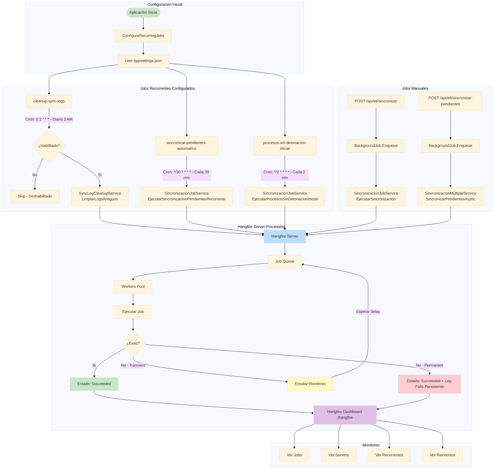
```mermaid
%%{init: {'theme':'base', 'themeVariables': { 'background':'#ffffff'}}}%%
graph TB
    subgraph "Configuración Inicial"
        Start([Aplicación Inicia]) --> ConfigJobs[ConfigureRecurringJobs]
        ConfigJobs --> ReadConfig[Leer appsettings.json]
    end

    subgraph "Jobs Recurrentes Configurados"
        ReadConfig --> Job1[cleanup-sync-logs]
        ReadConfig --> Job2[sincronizar-pendientes-automatico]
        ReadConfig --> Job3[procesos-sin-detonacion-inicial]

        Job1 -->|"Cron: 0 2 * * * - Diario 2 AM"| Job1Config{¿Habilitado?}
        Job1Config -->|No| Job1Skip[Skip - Deshabilitado]
        Job1Config -->|Sí| Job1Execute[SyncLogCleanupService<br/>LimpiarLogsAntiguos]

        Job2 -->|"Cron: */30 * * * * - Cada 30 min"| Job2Execute[SincronizacionJobService<br/>EjecutarSincronizacionPendientesRecurrente]

        Job3 -->|"Cron: */2 * * * * - Cada 2 min"| Job3Execute[SincronizacionJobService<br/>EjecutarProcesosSinDetonacionInicial]
    end

    subgraph "Jobs Manuales"
        ManualAPI[POST /api/etl/sincronizar] --> EnqueueManual[BackgroundJob.Enqueue]
        EnqueueManual --> ManualExecute[SincronizacionJobService<br/>EjecutarSincronizacion]

        MassAPI[POST /api/etl/sincronizar-pendientes] --> EnqueueMass[BackgroundJob.Enqueue]
        EnqueueMass --> MassExecute[SincronizacionMultipleService<br/>SincronizarPendientesAsync]
    end

    subgraph "Hangfire Server Processing"
        Job1Execute --> HServer[Hangfire Server]
        Job2Execute --> HServer
        Job3Execute --> HServer
        ManualExecute --> HServer
        MassExecute --> HServer

        HServer --> Queue[Job Queue]
        Queue --> Workers[Workers Pool]
        Workers --> Execute[Ejecutar Job]

        Execute --> Success{¿Éxito?}
        Success -->|Sí| MarkSuccess[Estado: Succeeded]
        Success -->|No - Transient| Retry[Encolar Reintento]
        Success -->|No - Permanent| MarkFailed[Estado: Succeeded + Log Fallo Persistente]

        Retry -->|Esperar delay| Queue
        MarkSuccess --> Dashboard
        MarkFailed --> Dashboard
    end

    subgraph "Monitoreo"
        Dashboard[Hangfire Dashboard /hangfire]
        Dashboard --> ViewJobs[Ver Jobs]
        Dashboard --> ViewServers[Ver Servers]
        Dashboard --> ViewRecurring[Ver Recurrentes]
        Dashboard --> ViewRetries[Ver Reintentos]
    end

    style Start fill:#c8e6c9
    style HServer fill:#bbdefb
    style Dashboard fill:#e1bee7
    style MarkSuccess fill:#c8e6c9
    style MarkFailed fill:#ffcdd2
    style Retry fill:#fff9c4
```

---

## 8. Flujo de Consulta de Pendientes


```mermaid
%%{init: {'theme':'base', 'themeVariables': { 'background':'#ffffff'}}}%%
flowchart TD
    Start([Consulta Iniciada]) --> CallRepo[CotizacionControlRepository<br/>ObtenerPendientesSincronizacionAsync]

    CallRepo --> Step1[PASO 1: Obtener Fallos Persistentes]

    Step1 --> QueryLogs[Query SyncJobLog:<br/>Agrupar por IdentificadorRegistro]

    QueryLogs --> GroupBy[GroupBy: IdentificadorRegistro]
    GroupBy --> OrderDesc[OrderByDescending: FechaRegistro]
    OrderDesc --> SelectFirst[Select: IdentificadorRegistro + UltimoEstado]
    SelectFirst --> ToList1[ToListAsync - Traer a memoria]

    ToList1 --> FilterMemory[Filtrar en memoria:<br/>WHERE UltimoEstado = 'Fallo persistente']

    FilterMemory --> ListFailures[Lista de GUIDs con<br/>fallo persistente]

    ListFailures --> Step2[PASO 2: Query Tabla Control]

    Step2 --> QueryControl[Query Cotizacione]

    QueryControl --> Where1{WHERE<br/>RegistroCompleto = 0<br/>OR<br/>CotizacionLegacy IS NULL}

    Where1 --> Where2{AND NOT IN<br/>fallosPersistentes}

    Where2 --> SelectControl[SELECT * FROM Cotizaciones]

    SelectControl --> ToList2[ToListAsync]

    ToList2 --> MapDTO[AutoMapper:<br/>Cotizacione → CotizacionControlDto]

    MapDTO --> LogCount[Log: Encontrados N registros pendientes]

    LogCount --> Return[Return IEnumerable<CotizacionControlDto>]

    Return --> End([Fin - Lista de Pendientes])

    subgraph "Ejemplo de Datos"
        Example1[SyncJobLog:<br/>ID1 → 'Sincronizado'<br/>ID2 → 'Fallo persistente'<br/>ID3 → 'Sincronizado']
        Example2[Cotizacione:<br/>ID1 → RegistroCompleto=1 ✗ Excluir<br/>ID2 → RegistroCompleto=0 ✗ Fallo persistente<br/>ID3 → RegistroCompleto=0 ✓ Incluir<br/>ID4 → RegistroCompleto=0 ✓ Incluir]
        Example3[Resultado:<br/>ID3, ID4]
    end

    style Start fill:#c8e6c9
    style End fill:#c8e6c9
    style Step1 fill:#e1f5fe
    style Step2 fill:#e1f5fe
    style Return fill:#c8e6c9
```

---

## 9. Flujo de Reintentos Automáticos

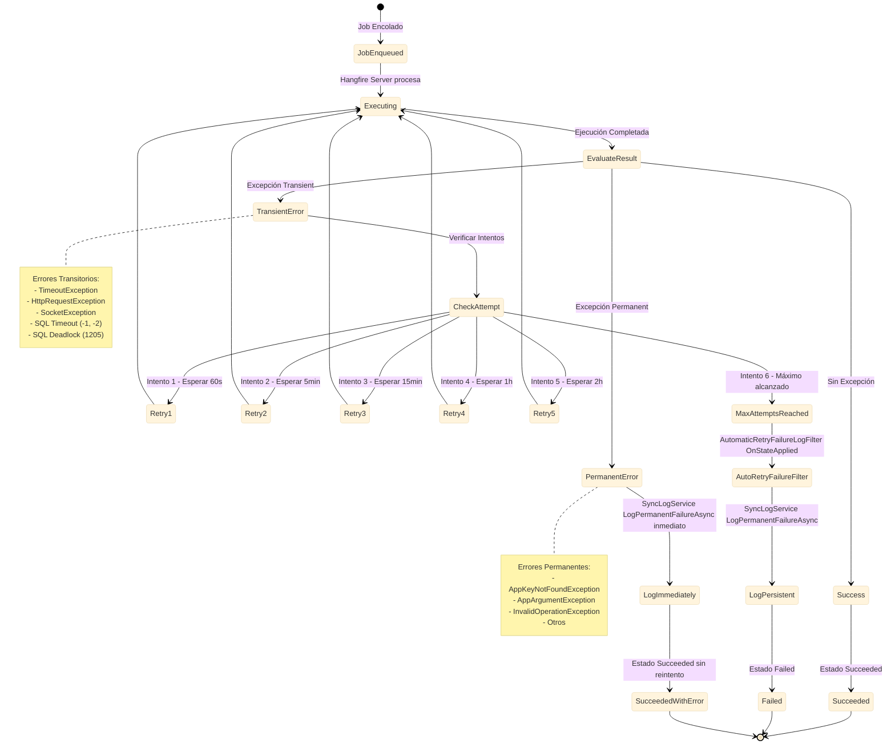
```mermaid
%%{init: {'theme':'base', 'themeVariables': { 'background':'#ffffff'}}}%%
stateDiagram-v2
    [*] --> JobEnqueued: Job Encolado

    JobEnqueued --> Executing: Hangfire Server procesa

    Executing --> EvaluateResult: Ejecución Completada

    EvaluateResult --> Success: Sin Excepción
    EvaluateResult --> TransientError: Excepción Transient
    EvaluateResult --> PermanentError: Excepción Permanent

    Success --> Succeeded: Estado Succeeded
    Succeeded --> [*]

    TransientError --> CheckAttempt: Verificar Intentos

    CheckAttempt --> Retry1: Intento 1 - Esperar 60s
    CheckAttempt --> Retry2: Intento 2 - Esperar 5min
    CheckAttempt --> Retry3: Intento 3 - Esperar 15min
    CheckAttempt --> Retry4: Intento 4 - Esperar 1h
    CheckAttempt --> Retry5: Intento 5 - Esperar 2h
    CheckAttempt --> MaxAttemptsReached: Intento 6 - Máximo alcanzado

    Retry1 --> Executing
    Retry2 --> Executing
    Retry3 --> Executing
    Retry4 --> Executing
    Retry5 --> Executing

    MaxAttemptsReached --> AutoRetryFailureFilter: AutomaticRetryFailureLogFilter OnStateApplied
    AutoRetryFailureFilter --> LogPersistent: SyncLogService LogPermanentFailureAsync
    LogPersistent --> Failed: Estado Failed
    Failed --> [*]

    PermanentError --> LogImmediately: SyncLogService LogPermanentFailureAsync inmediato
    LogImmediately --> SucceededWithError: Estado Succeeded sin reintento
    SucceededWithError --> [*]

    note right of TransientError
        Errores Transitorios:
        - TimeoutException
        - HttpRequestException
        - SocketException
        - SQL Timeout (-1, -2)
        - SQL Deadlock (1205)
    end note

    note right of PermanentError
        Errores Permanentes:
        - AppKeyNotFoundException
        - AppArgumentException
        - InvalidOperationException
        - Otros
    end note
```

---

## 14. Flujo de Limpieza de Logs

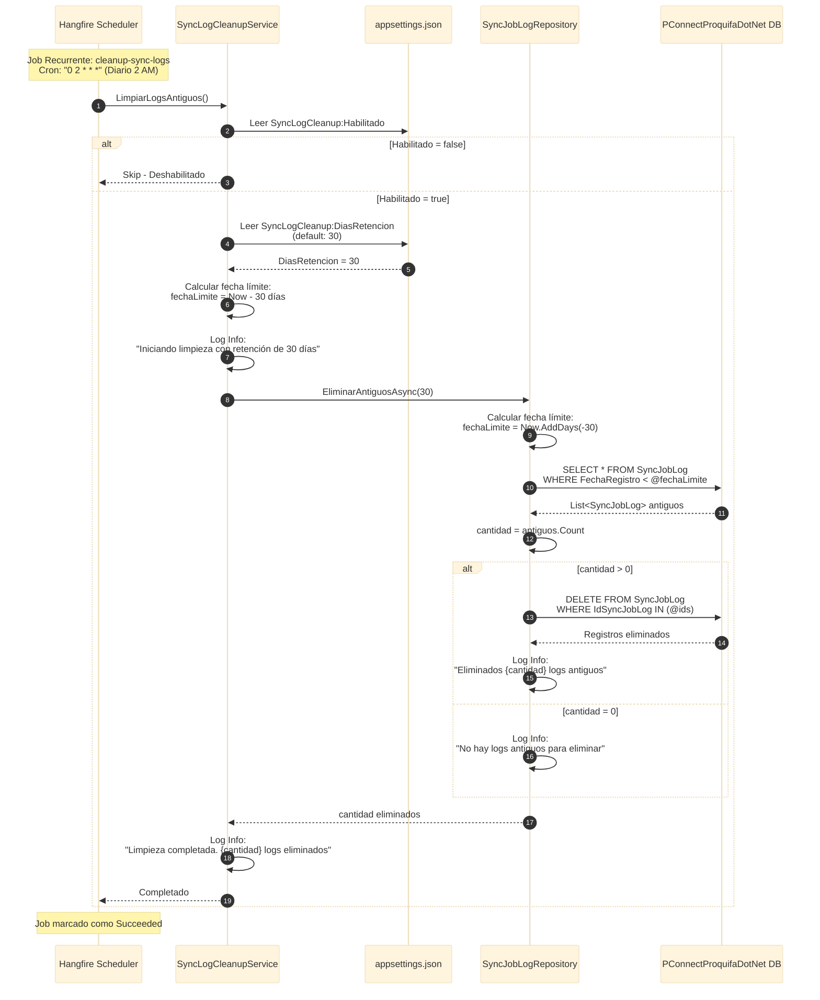
```mermaid
%%{init: {'theme':'base', 'themeVariables': { 'background':'#ffffff'}}}%%
sequenceDiagram
    autonumber
    participant Hangfire as Hangfire Scheduler
    participant CleanupService as SyncLogCleanupService
    participant Config as appsettings.json
    participant Repo as SyncJobLogRepository
    participant DB as PConnectProquifaDotNet DB

    Note over Hangfire: Job Recurrente: cleanup-sync-logs<br/>Cron: "0 2 * * *" (Diario 2 AM)

    Hangfire->>CleanupService: LimpiarLogsAntiguos()

    CleanupService->>Config: Leer SyncLogCleanup:Habilitado

    alt Habilitado = false
        CleanupService-->>Hangfire: Skip - Deshabilitado
    else Habilitado = true
        CleanupService->>Config: Leer SyncLogCleanup:DiasRetencion<br/>(default: 30)
        Config-->>CleanupService: DiasRetencion = 30

        CleanupService->>CleanupService: Calcular fecha límite:<br/>fechaLimite = Now - 30 días

        CleanupService->>CleanupService: Log Info:<br/>"Iniciando limpieza con retención de 30 días"

        CleanupService->>Repo: EliminarAntiguosAsync(30)

        Repo->>Repo: Calcular fecha límite:<br/>fechaLimite = Now.AddDays(-30)

        Repo->>DB: SELECT * FROM SyncJobLog<br/>WHERE FechaRegistro < @fechaLimite

        DB-->>Repo: List<SyncJobLog> antiguos

        Repo->>Repo: cantidad = antiguos.Count

        alt cantidad > 0
            Repo->>DB: DELETE FROM SyncJobLog<br/>WHERE IdSyncJobLog IN (@ids)
            DB-->>Repo: Registros eliminados
            Repo->>Repo: Log Info:<br/>"Eliminados {cantidad} logs antiguos"
        else cantidad = 0
            Repo->>Repo: Log Info:<br/>"No hay logs antiguos para eliminar"
        end

        Repo-->>CleanupService: cantidad eliminados

        CleanupService->>CleanupService: Log Info:<br/>"Limpieza completada. {cantidad} logs eliminados"

        CleanupService-->>Hangfire: Completado
    end

    Note over Hangfire: Job marcado como Succeeded
```

---

## 15. Arquitectura de Capas

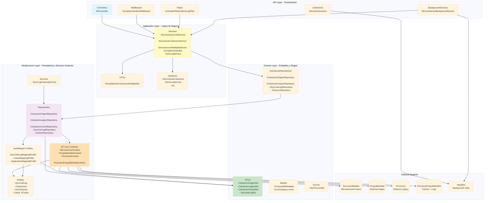
```mermaid
%%{init: {'theme':'base', 'themeVariables': { 'background':'#ffffff'}}}%%
graph TB
    subgraph "API Layer - Presentación"
        Controllers[Controllers<br/>EtlController]
        Middleware[Middleware<br/>ExceptionHandlerMiddleware]
        Filters[Filters<br/>AutomaticRetryFailureLogFilter]
        Extensions[Extensions<br/>ServiceExtensions]
        BgServices[BackgroundServices<br/>SincronizacionBackgroundService]
    end

    subgraph "Application Layer - Lógica de Negocio"
        AppServices[Services<br/>- SincronizacionJobService<br/>- SincronizarCotizacionService<br/>- SincronizacionMultipleService<br/>- ExceptionClassifier<br/>- SyncLogService]
        AppDTOs[DTOs<br/>- ResultadoSincronizacionMultipleDto]
        AppInterfaces[Interfaces<br/>- ISincronizarCotizacion<br/>- ISyncLogService<br/>- etc.]
    end

    subgraph "Domain Layer - Entidades y Reglas"
        DomainDTOs[DTOs<br/>- CotizacionOrigenDto<br/>- CotizacionLegacyDto<br/>- CotizacionControlDto<br/>- SyncJobLogDto]
        DomainInterfaces[Interfaces/Repositories<br/>- ICotizacionOrigenRepository<br/>- ICotizacionLegacyRepository<br/>- ISyncJobLogRepository<br/>- IGenericRepository]
        DomainModels[Models<br/>- ProcesoEtlMetadata<br/>- ErrorCategory enum]
        DomainEnums[Enums<br/>- TipoProcesoEtl]
    end

    subgraph "Infrastructure Layer - Persistencia y Servicios Externos"
        Repositories[Repositories<br/>- CotizacionOrigenRepository<br/>- CotizacionLegacyRepository<br/>- CotizacionControlRepository<br/>- SyncJobLogRepository<br/>- GenericRepository]

        Contexts[EF Core Contexts<br/>- MicroservicioContext<br/>- ProquifaDotNetContext<br/>- PConnectContext<br/>- PConnectProquifaDotNetContext]

        Entities[Entities<br/>- SyncJobLog<br/>- Cotizacione<br/>- cotCotizacion<br/>- Cotiza, PCotiza]

        Mappers[AutoMapper Profiles<br/>- SyncJobLogMappingProfile<br/>- CotizaMappingProfile<br/>- ApplicationMappingProfile]

        InfraServices[Services<br/>- SyncLogCleanupService]
    end

    subgraph "External Systems"
        DB1[(DocumentBuilder<br/>MicroservicioContext)]
        DB2[(ProquifaDotNet<br/>Sistema Origen)]
        DB3[(PConnect<br/>Sistema Legacy)]
        DB4[(PConnectProquifaDotNet<br/>Control + Logs)]

        Hangfire[Hangfire<br/>Background Jobs]
    end

    Controllers --> AppServices
    Middleware --> AppServices
    Filters --> AppServices
    BgServices --> AppServices

    AppServices --> AppInterfaces
    AppServices --> AppDTOs
    AppServices --> DomainInterfaces

    DomainInterfaces --> Repositories

    Repositories --> Contexts
    Repositories --> Mappers
    Repositories --> DomainDTOs

    Contexts --> Entities
    Contexts --> DB1
    Contexts --> DB2
    Contexts --> DB3
    Contexts --> DB4

    Extensions --> Hangfire
    BgServices --> Hangfire

    Mappers --> Entities
    Mappers --> DomainDTOs

    InfraServices --> Repositories

    style Controllers fill:#e1f5fe
    style AppServices fill:#fff9c4
    style DomainDTOs fill:#c8e6c9
    style Repositories fill:#f3e5f5
    style Contexts fill:#ffe0b2
```

---

## 16. Flujo de Datos entre Bases de Datos

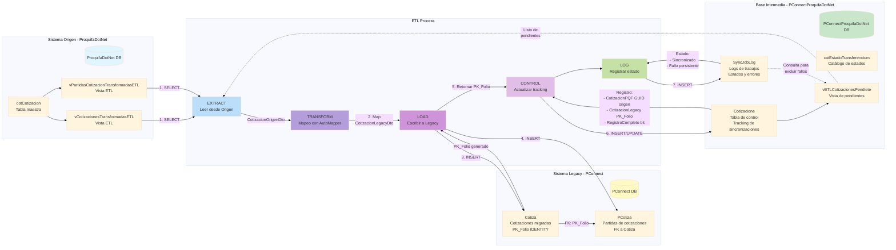
```mermaid
%%{init: {'theme':'base', 'themeVariables': { 'background':'#ffffff'}}}%%
flowchart LR
    subgraph "Sistema Origen - ProquifaDotNet"
        OriginDB[(ProquifaDotNet DB)]
        OriginTable1[cotCotizacion<br/>Tabla maestra]
        OriginView1[vCotizacionesTransformadasETL<br/>Vista ETL]
        OriginView2[vPartidasCotizacionTransformadasETL<br/>Vista ETL]

        OriginTable1 --> OriginView1
        OriginTable1 --> OriginView2
    end

    subgraph "Base Intermedia - PConnectProquifaDotNet"
        ControlDB[(PConnectProquifaDotNet DB)]
        ControlTable1[Cotizacione<br/>Tabla de control<br/>Tracking de sincronizaciones]
        ControlTable2[SyncJobLog<br/>Logs de trabajos<br/>Estados y errores]
        ControlTable3[catEstadoTransferencium<br/>Catálogo de estados]
        ControlView1[vETLCotizacionesPendiete<br/>Vista de pendientes]

        ControlTable1 --> ControlView1
    end

    subgraph "Sistema Legacy - PConnect"
        LegacyDB[(PConnect DB)]
        LegacyTable1[Cotiza<br/>Cotizaciones migradas<br/>PK_Folio IDENTITY]
        LegacyTable2[PCotiza<br/>Partidas de cotizaciones<br/>FK a Cotiza]

        LegacyTable1 -->|FK: PK_Folio| LegacyTable2
    end

    subgraph "ETL Process"
        Extract[EXTRACT<br/>Leer desde Origen]
        Transform[TRANSFORM<br/>Mapeo con AutoMapper]
        Load[LOAD<br/>Escribir a Legacy]
        Control[CONTROL<br/>Actualizar tracking]
        Log[LOG<br/>Registrar estado]
    end

    OriginView1 -->|1. SELECT| Extract
    OriginView2 -->|1. SELECT| Extract

    Extract -->|CotizacionOrigenDto| Transform

    Transform -->|2. Map<br/>CotizacionLegacyDto| Load

    Load -->|3. INSERT| LegacyTable1
    LegacyTable1 -->|PK_Folio generado| Load

    Load -->|4. INSERT| LegacyTable2

    Load -->|5. Retornar PK_Folio| Control

    Control -->|6. INSERT/UPDATE| ControlTable1
    ControlTable1 -->|Registro:<br/>- CotizacionPQF GUID origen<br/>- CotizacionLegacy PK_Folio<br/>- RegistroCompleto bit| Control

    Control --> Log
    Log -->|7. INSERT| ControlTable2
    ControlTable2 -->|Estado:<br/>- Sincronizado<br/>- Fallo persistente| Log

    ControlTable2 -.->|Consulta para<br/>excluir fallos| ControlView1
    ControlView1 -.->|Lista de<br/>pendientes| Extract

    style OriginDB fill:#e1f5fe
    style ControlDB fill:#c8e6c9
    style LegacyDB fill:#fff9c4
    style Extract fill:#bbdefb
    style Transform fill:#b39ddb
    style Load fill:#ce93d8
    style Control fill:#e1bee7
    style Log fill:#c5e1a5
```

---

## 📊 Leyenda de Colores

| Color | Significado |
|-------|-------------|
| 🟢 Verde (`#c8e6c9`) | Proceso exitoso, estado completado |
| 🟡 Amarillo (`#fff9c4`) | Proceso transitorio, reintentos |
| 🔵 Azul (`#bbdefb`, `#e1f5fe`) | Procesos ETL, lecturas |
| 🟣 Morado (`#b39ddb`, `#e1bee7`) | Transformaciones, mapeos |
| 🔴 Rojo (`#ffcdd2`, `#f8bbd0`) | Errores, fallos permanentes |
| ⚪ Gris (`#e0e0e0`) | Deshabilitado, omitido |
| 🟠 Naranja (`#ffe0b2`) | Decisiones, clasificaciones |

---

## 🎯 Casos de Uso Comunes

### 1. Sincronizar una Cotización Específica
```
POST /api/etl/sincronizar
Body: { "tipoProceso": 1, "recordId": "guid-de-cotizacion" }
→ Ver Diagrama 2 (Flujo ETL Individual)
```

### 2. Sincronizar Todas las Pendientes
```
POST /api/etl/sincronizar-pendientes
→ Ver Diagrama 3 (Flujo de Sincronización Masiva)
```

### 3. Consultar Pendientes sin Fallos Persistentes
```
CotizacionControlRepository.ObtenerPendientesSincronizacionAsync()
→ Ver Diagrama 8 (Flujo de Consulta de Pendientes)
```

### 4. Revisar Logs de un Registro
```
SyncJobLogRepository.ObtenerPorRegistroAsync("Cotizacion", guid)
→ Ver Diagrama 6 (Flujo de Logs)
```

### 5. Limpiar Logs Antiguos
```
Ejecuta automáticamente diario a las 2 AM
→ Ver Diagrama 10 (Flujo de Limpieza de Logs)
```

---

## 📝 Notas Adicionales

- **Todos los diagramas** están en formato Mermaid y pueden visualizarse en:
  - GitHub
  - VS Code (con extensión Mermaid Preview)
  - Editores Markdown compatibles
  - https://mermaid.live/

- **Fondo Blanco**: Todos los diagramas están configurados con tema base y fondo blanco (`background: #ffffff`) para asegurar correcta visualización independientemente del tema del visor (claro/oscuro)

- **Interactividad**: Los diagramas Mermaid pueden ser editados y regenerados según necesidades específicas

- **Actualización**: Estos diagramas reflejan el estado actual del código al 2025-12-03

---

**Versión**: 1.1
**Fecha**: 2025-12-03
**Cambios v1.1**:
- Agregado origen de peticiones desde APIs externas del ecosistema ProquifaNet 2 en diagrama 1
- Configuración de fondo blanco en todos los diagramas para mejor visualización
