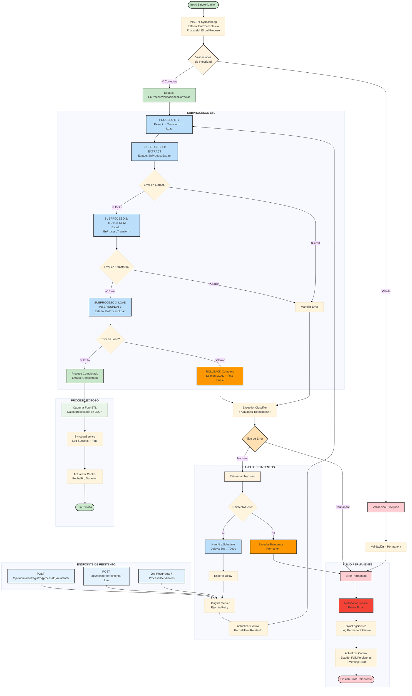
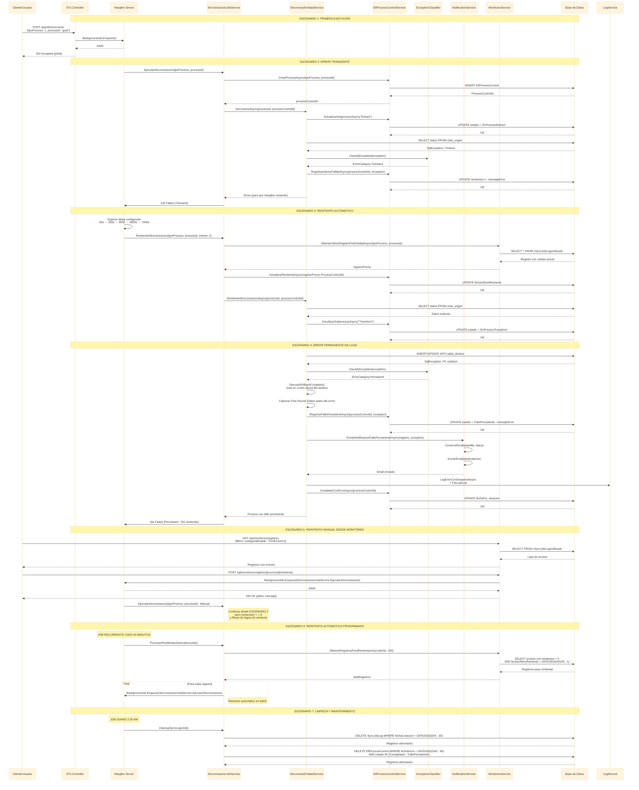
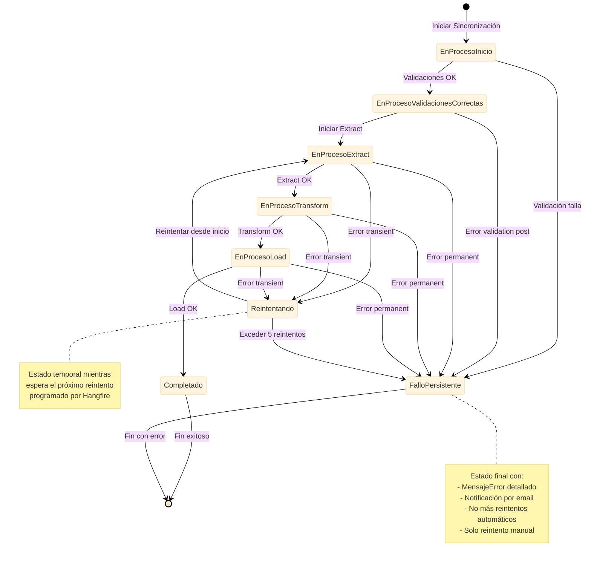

# Diagrama Completo de Manejo de Errores y Flujos de Reintento

**Propósito**: Visualización detallada de todos los flujos de error, clasificación y mecanismos de reintento
**Fecha**: 2025-12-19
**Versión**: 2.0

---

## 🔄 Diagrama Unificado de Manejo de Errores y Reintentos



---

## 🔄 Secuencia Detallada de Reintentos Automáticos



---

## 📊 Estados del Proceso y Transiciones



---

## 🎯 Configuración de Reintentos por Tipo de Error

### Configuración en appsettings.json

```json
{
  "Sincronizacion": {
    "Reintentos": {
      "MaximoReintentos": 5,
      "DelaysSegundos": [60, 300, 900, 3600, 7200],
      "EstrategiaBackoff": "Exponential"
    },
    "ClasificacionErrores": {
      "Transient": [
        "TimeoutException",
        "SqlException:-2",
        "SqlException:1205",
        "HttpRequestException",
        "SocketException",
        "TaskCanceledException"
      ],
      "Permanent": [
        "ValidationException",
        "DomainException",
        "InvalidOperationException",
        "SqlException:547",
        "SqlException:2627",
        "SqlException:2601"
      ]
    },
    "Notificaciones": {
      "Email": {
        "Habilitado": true,
        "DestinatariosPorDefecto": [
          "admin@empresa.com",
          "soporte@empresa.com"
        ],
        "Plantillas": {
          "Validacion": "ErrorValidacionTemplate",
          "ErrorPermanent": "ErrorPermanentTemplate",
          "ExcesoReintentos": "ExcesoReintentosTemplate"
        }
      }
    }
  },
  "Hangfire": {
    "JobsRecurrentes": {
      "ProcesarPendientes": "0 */30 * * * *",
      "ProcesarSinDetonacion": "0 */2 * * * *",
      "CleanupLogs": "0 0 2 * * *"
    }
  }
}
```

---

## 🔧 Mecanismos de Reintento

### 1. Reintento Automático (Hangfire)
- **Disparador**: Error clasificado como Transient
- **Scheduling**: `BackgroundJob.Schedule` con delays configurados
- **Seguimiento**: Actualiza contador y timestamp en EtlProcesoControl
- **Límite**: Máximo 5 reintentos por registro

### 2. Reintento Manual (Monitoreo)
- **Disparador**: Usuario desde endpoint de monitoreo
- **Scheduling**: `BackgroundJob.Enqueue` inmediato
- **Seguimiento**: No incrementa contador de reintentos automáticos
- **Límite**: Ilimitado (control manual)

### 3. Reintento Programado (Batch)
- **Disparador**: Job recurrente cada 30 minutos
- **Scheduling**: Procesa hasta 100 registros por batch
- **Criterios**: 
  - Estado "ConErrores"
  - Reintentos < 5
  - Último reintento hace más de 1 hora
  - No ser "FalloPersistente" (a menos que sea timeout)

### 4. Reintento desde Validación
- **Disparador**: Error en validaciones iniciales
- **Comportamiento**: Directamente a fallo persistente
- **Notificación**: Email inmediato
- **Motivo**: Las validaciones fallidas no se resuelven solas

---

## 📧 Plantillas de Notificación

### Template 1: Validación Fallida
```
Asunto: [ERROR] Fallo de Validación - {TipoProcesoNombre} - {Folio}

Hola Equipo,

Se ha detectado un fallo en las validaciones de sincronización:

📋 Detalles del Registro:
- Tipo Proceso: {TipoProcesoNombre}
- Process ID: {ProcessId}
- ID Registro: {RecordId}
- Folio: {Folio}
- Fecha Inicio: {FechaInicio}

❌ Error de Validación:
{MensajeError}

🔍 Acción Requerida:
Por favor, corrija los datos de origen y reintente manualmente desde el dashboard de monitoreo.

📊 Monitoreo: {UrlDashboard}/registro/{ProcesoControlId}
```

### Template 2: Error Persistente
```
Asunto: [CRÍTICO] Error Persistente - {TipoProcesoNombre} - {Folio}

Hola Equipo,

Se ha producido un error persistente en la sincronización después de múltiples reintentos:

📋 Detalles del Registro:
- Tipo Proceso: {TipoProcesoNombre}
- Process ID: {ProcessId}
- ID Registro: {RecordId}
- Folio: {Folio}
- Reintentos: {Reintentos}/5
- Último Intento: {FechaUltimoReintento}

❌ Error Persistente:
{MensajeError}

🔄 Estado Actual: FalloPersistente

🔍 Investigación Requerida:
1. Verificar integridad de datos en sistema origen
2. Revisar restricciones en sistema destino
3. Considerar corrección manual si es necesario

📊 Monitoreo: {UrlDashboard}/registro/{ProcessId}
🔄 Reintentar Manual: {UrlApi}/api/monitoreo/registro/{ProcessId}/reintentar
```

### Template 3: Exceso de Reintentos
```
Asunto: [ALERTA] Exceso de Reintentos - {TipoProcesoNombre} - {Folio}

Hola Equipo,

Se ha excedido el límite de reintentos automáticos para un registro:

📋 Detalles del Registro:
- Tipo Proceso: {TipoProcesoNombre}
- Process ID: {ProcessId}
- ID Registro: {RecordId}
- Folio: {Folio}
- Reintentos: {Reintentos} (límite: 5)
- Primer Intento: {FechaInicio}
- Último Intento: {FechaUltimoReintento}

⚠️ Posibles Causas:
- Problema persistente en conectividad
- Datos corruptos o inconsistentes
- Recursos del sistema saturados

🔍 Acción Recomendada:
Investigar la causa raíz antes de reintentar manualmente.

📊 Análisis: {UrlDashboard}/registros?recordId={RecordId}
🔄 Reintento Manual: {UrlApi}/api/monitoreo/registro/{ProcesoControlId}/reintentar
```

---

## 🎯 Dashboard de Monitoreo Integrado

### Sección de Reintentos
```javascript
// Componente React/Vue para mostrar estado de reintentos
const ReintentosDashboard = {
  computed: {
    registrosConErrores() {
      return this.registros.filter(r => r.CategoriaEstado === 'ConErrores');
    },
    puedenReintentar() {
      return this.registrosConErrores.filter(r => r.Reintentos < 5);
    },
    excedieronReintentos() {
      return this.registrosConErrores.filter(r => r.Reintentos >= 5);
    }
  },
  methods: {
    async reintentarRegistro(idRegistro) {
      const response = await fetch(`/api/monitoreo/registro/${idRegistro}/reintentar`, {
        method: 'POST'
      });
      return response.json();
    },
    async reintentarLote(idsRegistros) {
      const response = await fetch('/api/monitoreo/reintentar-lote', {
        method: 'POST',
        headers: { 'Content-Type': 'application/json' },
        body: JSON.stringify({ idsRegistros })
      });
      return response.json();
    }
  }
};
```

### Indicadores Clave
- **Registros para Reintentar**: Errores transient con reintentos < 5
- **Excedieron Reintentos**: Errores con 5+ reintentos
- **Fallos Persistentes**: Errores permanentes (requieren acción manual)
- **Tasa de Éxito Global**: Completados / Total
- **Tiempo Promedio de Reintento**: Duración promedio de procesos que necesitaron reintentos

---

## 🔍 Troubleshooting Guide

### Casos Comunes y Soluciones

1. **Timeout en Extract**
   - **Causa**: Vista muy grande o red lenta
   - **Solución**: Optimizar vista, agregar índices, aumentar timeout
   - **Reintento**: Automático (Transient)

2. **FK Violation en Load**
   - **Causa**: Datos de referencia faltantes
   - **Solución**: Corregir datos de origen, revisar secuencia de carga
   - **Reintento**: Manual (Persistent)

3. **Deadlock en Transform**
   - **Causa**: Concurrencia alta en misma tabla
   - **Solución**: Reducir concurrencia, optimizar transacciones
   - **Reintento**: Automático (Transient)

4. **Validation Exception**
   - **Causa**: Datos inválidos o inconsistentes
   - **Solución**: Corregir datos origen, revisar reglas de validación
   - **Reintento**: Manual (Permanent)

Este diseño completo proporciona un sistema robusto de manejo de errores y reintentos que asegura la resiliencia del proceso ETL mientras mantiene visibilidad completa del estado de sincronización.