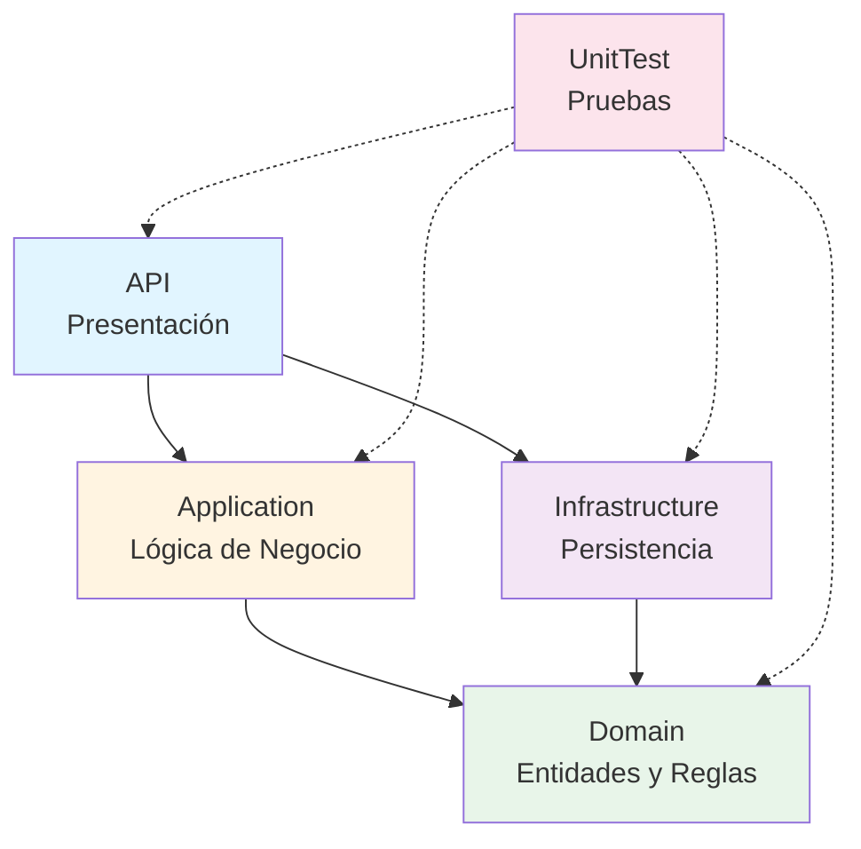
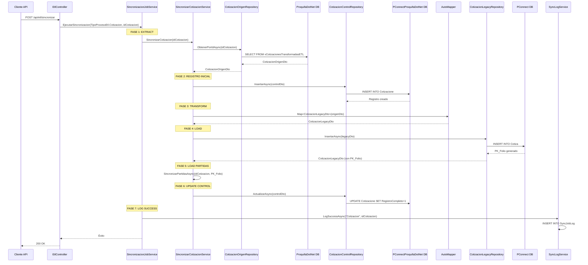
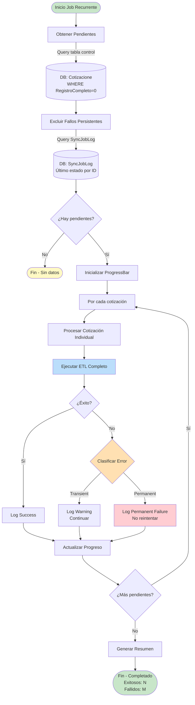
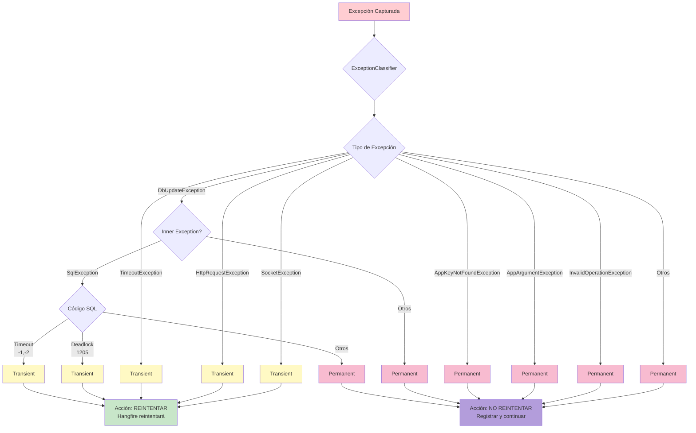
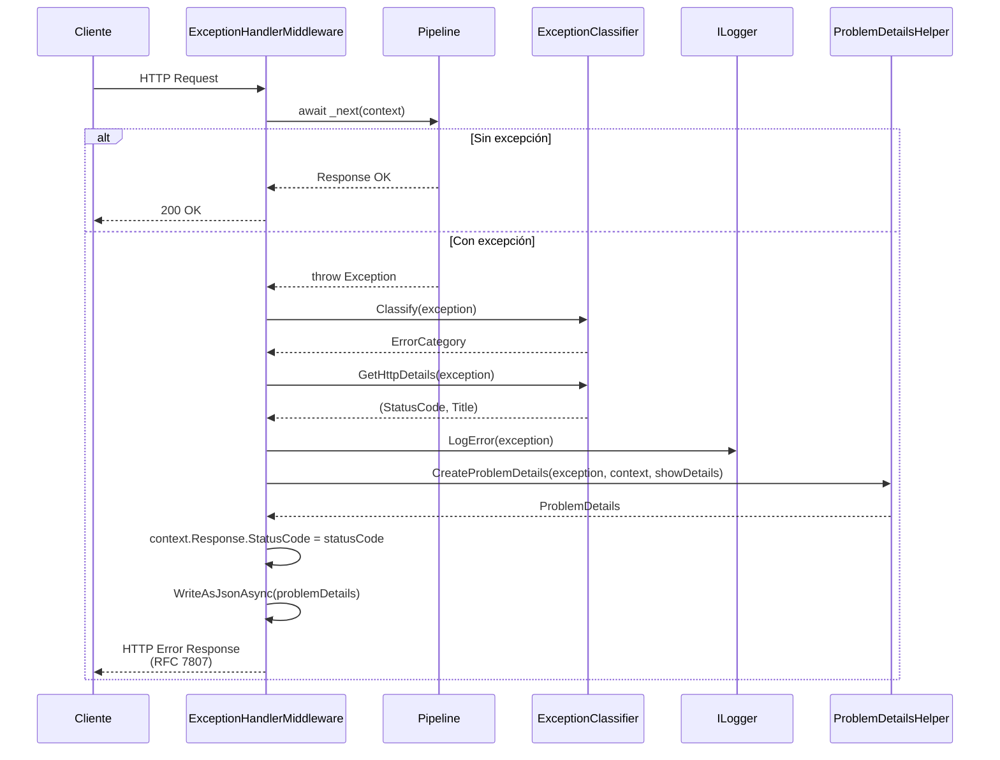
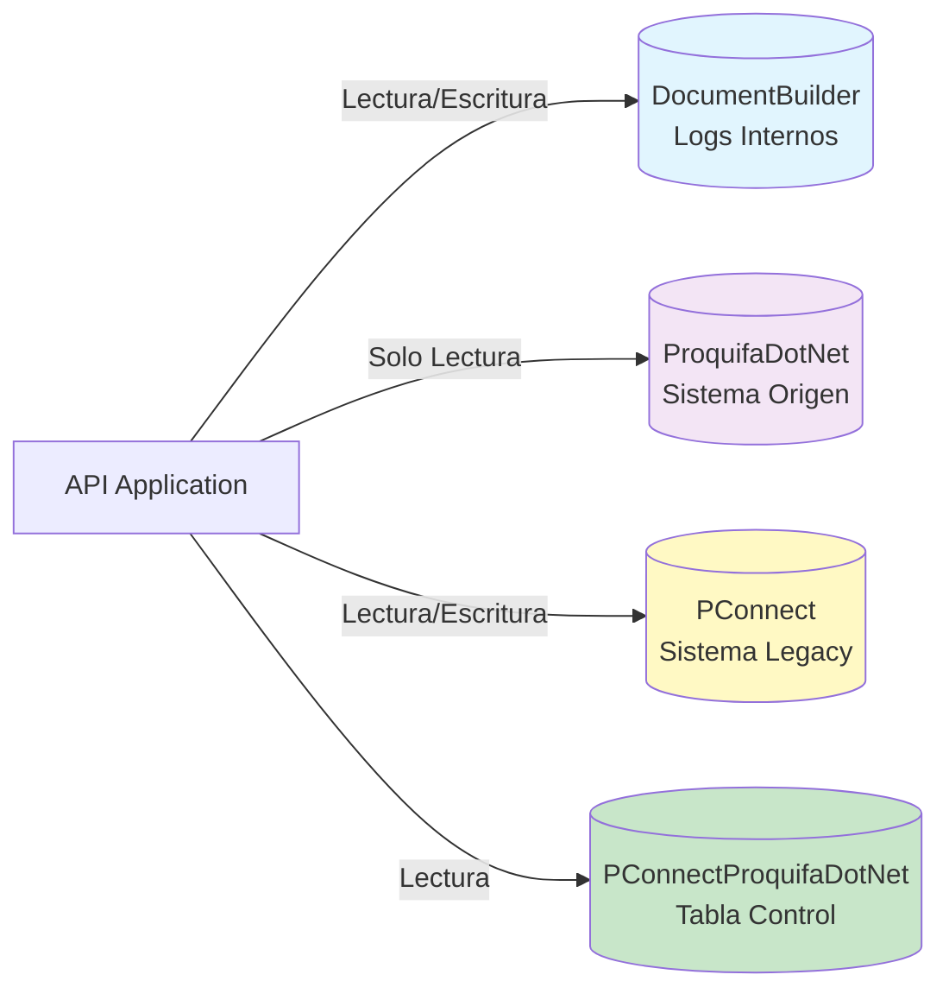

# Documentación Técnica - SincronizadorPqfLegacy

> **Sistema ETL de Sincronización de Cotizaciones**
> Sincronización automática entre ProquifaDotNet (sistema moderno) y PConnect (sistema legacy)

---

## 📋 Tabla de Contenidos

1. [Arquitectura General](#1-arquitectura-general)
2. [Inventario de Proyectos](#2-inventario-de-proyectos)
3. [Dependencias](#3-dependencias)
4. [Flujos de Datos](#4-flujos-de-datos)
5. [Funcionalidades Clave](#5-funcionalidades-clave)
6. [Configuración](#6-configuración)
7. [Patrones y Prácticas](#7-patrones-y-prácticas)
8. [Bases de Datos](#8-bases-de-datos)
9. [Testing](#9-testing)
10. [Despliegue y Operación](#10-despliegue-y-operación)

---

## 1. Arquitectura General

### 1.1 Estructura de Capas (Clean Architecture)

```
┌──────────────────────────────────────────────────────────┐
│                    API (Presentación)                    │
│        Controllers, Middleware, Extensions, Filters       │
└──────────────────────┬───────────────────────────────────┘
                       │
       ┌───────────────┴────────────────┐
       │                                │
┌──────▼─────────────┐      ┌──────────▼──────────────┐
│   Application      │      │   Infrastructure        │
│                    │      │                         │
│ • Services         │      │ • Repositories          │
│ • DTOs             │      │ • EF Core Contexts      │
│ • Interfaces       │      │ • AutoMapper Profiles   │
│ • Exceptions       │      │ • External Services     │
└──────┬─────────────┘      └──────────┬──────────────┘
       │                                │
       └───────────────┬────────────────┘
                       │
            ┌──────────▼──────────┐
            │       Domain        │
            │                     │
            │ • Entities          │
            │ • Value Objects     │
            │ • Domain Rules      │
            │ • Interfaces        │
            │ • Enums             │
            └─────────────────────┘
```

### 1.2 Principios Arquitectónicos

#### Clean Architecture
- **Independencia de frameworks**: El dominio no depende de frameworks externos
- **Testeable**: La lógica de negocio es testeable sin UI, BD o servicios externos
- **Independencia de UI**: La UI puede cambiar sin afectar el resto
- **Independencia de BD**: Podemos cambiar SQL Server por otro sin afectar lógica
- **Independencia de servicios externos**: La lógica de negocio no conoce el mundo exterior

#### Separation of Concerns
- **API**: Maneja HTTP, routing, autenticación, serialización
- **Application**: Orquesta casos de uso, lógica de aplicación
- **Domain**: Reglas de negocio puras, entidades, value objects
- **Infrastructure**: Implementaciones concretas, persistencia, I/O

### 1.3 Patrones de Diseño Implementados

| Patrón | Ubicación | Propósito |
|--------|-----------|-----------|
| **Repository** | `Infrastructure/Repository` | Abstracción de acceso a datos |
| **Unit of Work** | `Infrastructure/Persistence` | Coordinación transaccional |
| **Dependency Injection** | `API/Program.cs`, `Extensions` | Inversión de control |
| **DTO (Data Transfer Object)** | `Application/DTOs`, `Domain/DTOs` | Transferencia de datos entre capas |
| **Factory** | `Application/Factorys` | Creación de objetos complejos |
| **Strategy** | `Application/Services/ExceptionClassifier.cs` | Clasificación de excepciones |
| **ETL (Extract-Transform-Load)** | `Application/Services` | Proceso de sincronización |
| **Background Processing** | `API/BackgroundServices` | Tareas asíncronas |
| **Middleware Pipeline** | `API/ExceptionMiddleware` | Procesamiento de requests |

---

## 2. Inventario de Proyectos

### 2.1 Solución General

**Archivo**: `SincronizadorPqfLegacy.sln`
**Framework**: .NET 10.0
**Lenguaje**: C# 14.0
**Proyectos**: 5 (4 de código fuente + 1 de testing)

```
SincronizadorPqfLegacy.sln
├── src/
│   ├── SincronizadorPqfLegacy.API
│   ├── SincronizadorPqfLegacy.Application
│   ├── SincronizadorPqfLegacy.Domain
│   └── SincronizadorPqfLegacy.Infrastructure
└── test/
    └── Microservicio.UnitTest
```

---

### 2.2 API - Capa de Presentación

**Proyecto**: `SincronizadorPqfLegacy.API`
**Tipo**: ASP.NET Core Web API
**Framework**: `Microsoft.NET.Sdk.Web`

#### 📁 Estructura de Carpetas

```
API/
├── BackgroundServices/          # Servicios en segundo plano
│   └── SincronizacionBackgroundService.cs
├── Controllers/                 # Controladores REST
│   └── EtlController.cs
├── ExceptionMiddleware/         # Middleware de manejo de errores
│   └── ExceptionHandlerMiddleware.cs
├── Extensions/                  # Métodos de extensión
│   └── ServiceExtensions.cs
├── Filters/                     # Filtros de Hangfire
│   └── AutomaticRetryFailureLogFilter.cs
├── Logs/                        # Archivos de log (Serilog)
├── Model/                       # Modelos de API
├── Resources/                   # Recursos estáticos
├── Program.cs                   # Punto de entrada
└── appsettings.json            # Configuración
```

#### 🎯 Responsabilidades

- ✅ Exponer endpoints HTTP REST
- ✅ Manejo de autenticación y autorización
- ✅ Validación de requests (FluentValidation)
- ✅ Serialización/deserialización JSON
- ✅ Documentación API (Swagger/OpenAPI)
- ✅ Configuración de inyección de dependencias
- ✅ Orquestación de trabajos en segundo plano (Hangfire)
- ✅ Logging estructurado (Serilog)
- ✅ Manejo global de excepciones

#### 📦 Paquetes NuGet Principales

```xml
<PackageReference Include="Hangfire.AspNetCore" Version="1.8.22" />
<PackageReference Include="Hangfire.Console" Version="1.4.3" />
<PackageReference Include="Microsoft.EntityFrameworkCore.Design" Version="8.0.8" />
<PackageReference Include="Swashbuckle.AspNetCore" Version="6.6.2" />
```

---

### 2.3 Application - Capa de Lógica de Negocio

**Proyecto**: `SincronizadorPqfLegacy.Application`
**Tipo**: Class Library
**Framework**: `Microsoft.NET.Sdk`

#### 📁 Estructura de Carpetas

```
Application/
├── DTOs/                        # Data Transfer Objects
│   └── ResultadoSincronizacionMultipleDto.cs
├── Exceptions/                  # Excepciones de aplicación
│   ├── AppException.cs
│   ├── AppArgumentException.cs
│   ├── AppArgumentNullException.cs
│   ├── AppFileNotFoundException.cs
│   └── AppKeyNotFoundException.cs
├── Factorys/                    # Factories
│   └── ProblemDetailsHelper.cs
├── Interfaces/                  # Contratos de servicios
│   ├── ISincronizarCotizacion.cs
│   ├── ISincronizarPartidasService.cs
│   ├── ISincronizacionMultipleService.cs
│   ├── ISyncLogService.cs
│   └── ISincronizacionJobService.cs
└── Services/                    # Implementaciones
    ├── ExceptionClassifier.cs
    ├── ProcesoEtlMetadataService.cs
    ├── SincronizacionJobService.cs
    ├── SincronizacionMultipleService.cs
    ├── SincronizarCotizacionService.cs
    ├── SincronizarPartidasService.cs
    ├── SyncLogCleanupService.cs
    └── SyncLogService.cs
```

#### 🎯 Responsabilidades

- ✅ Orquestación de casos de uso
- ✅ Lógica de aplicación (no reglas de dominio puras)
- ✅ Coordinación entre repositorios
- ✅ Transformación de datos (DTOs)
- ✅ Validaciones de aplicación (FluentValidation)
- ✅ Manejo de transacciones
- ✅ Clasificación de errores
- ✅ Integración con Hangfire

#### 📦 Paquetes NuGet Principales

```xml
<PackageReference Include="AutoMapper" Version="15.1.0" />
<PackageReference Include="FluentValidation" Version="12.0.0" />
<PackageReference Include="FluentValidation.AspNetCore" Version="11.3.1" />
<PackageReference Include="Hangfire.Console" Version="1.4.3" />
<PackageReference Include="Hangfire.Core" Version="1.8.22" />
<PackageReference Include="Serilog" Version="4.3.0" />
<PackageReference Include="Newtonsoft.Json" Version="13.0.3" />
```

---

### 2.4 Domain - Capa de Dominio

**Proyecto**: `SincronizadorPqfLegacy.Domain`
**Tipo**: Class Library
**Framework**: `Microsoft.NET.Sdk`

#### 📁 Estructura de Carpetas

```
Domain/
├── DTOs/                        # DTOs de dominio
│   ├── CotizacionControlDto.cs
│   ├── CotizacionLegacyDto.cs
│   ├── CotizacionOrigenDto.cs
│   ├── PartidaCotizacionLegacyDto.cs
│   └── PartidaCotizacionOrigenDto.cs
├── Enums/                       # Enumeraciones
│   └── TipoProcesoEtl.cs
├── Exceptions/                  # Excepciones de dominio
│   ├── DomainException.cs
│   ├── DomainArgumentNullException.cs
│   ├── InfrastructureException.cs
│   └── InfrastructureNotImplementedException.cs
├── Interfaces/                  # Interfaces de repositorio
│   ├── IGenericRepository.cs
│   ├── IUnitOfWork.cs
│   ├── IExceptionClassifier.cs
│   ├── ICotizacionOrigenRepository.cs
│   ├── ICotizacionLegacyRepository.cs
│   ├── ICotizacionControlRepository.cs
│   ├── IPartidaCotizacionOrigenRepository.cs
│   └── IPartidaCotizacionLegacyRepository.cs
└── Models/                      # Entidades de dominio
    ├── ErrorCategory.cs
    ├── ProcesoEtlMetadata.cs
    └── SyncJobLog.cs
```

#### 🎯 Responsabilidades

- ✅ Definir entidades de dominio
- ✅ Reglas de negocio puras
- ✅ Validaciones de dominio
- ✅ Interfaces de repositorio (contratos)
- ✅ Enumeraciones y value objects
- ✅ Excepciones específicas de dominio
- ✅ Sin dependencias de frameworks (puro C#)

#### 📦 Paquetes NuGet Principales

```xml
<PackageReference Include="Microsoft.EntityFrameworkCore" Version="8.0.8" />
<PackageReference Include="Microsoft.EntityFrameworkCore.SqlServer" Version="8.0.8" />
<PackageReference Include="Serilog.AspNetCore" Version="9.0.0" />
<PackageReference Include="Serilog.Settings.Configuration" Version="9.0.0" />
<PackageReference Include="Serilog.Sinks.Console" Version="6.0.0" />
<PackageReference Include="Serilog.Sinks.File" Version="7.0.0" />
```

---

### 2.5 Infrastructure - Capa de Infraestructura

**Proyecto**: `SincronizadorPqfLegacy.Infrastructure`
**Tipo**: Class Library
**Framework**: `Microsoft.NET.Sdk`

#### 📁 Estructura de Carpetas

```
Infrastructure/
├── Mappers/                     # Perfiles de AutoMapper
│   ├── ApplicationMappingProfile.cs
│   ├── CotizaMappingProfile.cs
│   └── RepositoryMappingProfile.cs
├── Persistence/                 # Persistencia de datos
│   ├── Context/
│   │   └── MicroservicioContext.cs
│   ├── PConnect/               # BD Legacy (destino)
│   │   ├── Entities/
│   │   │   ├── Cotiza.cs
│   │   │   └── PCotiza.cs
│   │   └── PConnectContext.cs
│   ├── PConnectProquifaDotNet/ # BD Intermedia
│   │   ├── Entities/
│   │   │   ├── Cotizacione.cs
│   │   │   ├── catEstadoTransferencium.cs
│   │   │   └── vETLCotizacionesPendiete.cs
│   │   └── PConnectProquifaDotNetContext.cs
│   ├── ProquifaDotNet/         # BD Origen
│   │   ├── Entities/
│   │   │   ├── cotCotizacion.cs
│   │   │   ├── vCotizacionesTransformadasETL.cs
│   │   │   └── vPartidasCotizacionTransformadasETL.cs
│   │   └── ProquifaDotNetContext.cs
│   └── UnitOfWork.cs
├── Repository/                  # Implementaciones de repositorios
│   ├── GenericRepository.cs
│   ├── CotizacionControlRepository.cs
│   ├── CotizacionLegacyRepository.cs
│   ├── CotizacionOrigenRepository.cs
│   ├── PartidaCotizacionLegacyRepository.cs
│   ├── PartidaCotizacionOrigenRepository.cs
│   └── SyncJobLogRepository.cs
└── Services/                    # Servicios de infraestructura
```

#### 🎯 Responsabilidades

- ✅ Implementación de repositorios
- ✅ Contextos de Entity Framework Core
- ✅ Mapeo de entidades (EF Core Configurations)
- ✅ Integración con bases de datos externas
- ✅ Implementación de Unit of Work
- ✅ Perfiles de AutoMapper
- ✅ Servicios de infraestructura (email, storage, etc.)

#### 📦 Paquetes NuGet Principales

```xml
<PackageReference Include="AutoMapper" Version="15.0.1" />
<PackageReference Include="Hangfire.SqlServer" Version="1.8.22" />
<PackageReference Include="Microsoft.EntityFrameworkCore.Design" Version="8.0.8" />
<PackageReference Include="Microsoft.EntityFrameworkCore.SqlServer" Version="8.0.8" />
<PackageReference Include="Microsoft.EntityFrameworkCore.Tools" Version="8.0.8" />
```

---

### 2.6 UnitTest - Capa de Testing

**Proyecto**: `Microservicio.UnitTest`
**Tipo**: MSTest Test Project
**Framework**: `Microsoft.NET.Sdk`

#### 🎯 Responsabilidades

- ✅ Pruebas unitarias de servicios
- ✅ Pruebas de repositorios (con BD en memoria)
- ✅ Pruebas de lógica de negocio
- ✅ Cobertura de código (code coverage)

#### 📦 Paquetes NuGet Principales

```xml
<PackageReference Include="Microsoft.NET.Test.Sdk" Version="17.12.0" />
<PackageReference Include="Microsoft.Testing.Extensions.CodeCoverage" Version="17.12.6" />
<PackageReference Include="Microsoft.Testing.Extensions.TrxReport" Version="1.4.3" />
<PackageReference Include="MSTest" Version="3.6.4" />
```

---

## 3. Dependencias

### 3.1 Diagrama de Dependencias entre Proyectos



### 3.2 Reglas de Dependencia (Clean Architecture)

| Capa | Puede Depender De | NO Puede Depender De |
|------|-------------------|----------------------|
| **Domain** | Nada (núcleo puro) | Application, Infrastructure, API |
| **Application** | Domain | Infrastructure, API |
| **Infrastructure** | Domain | Application, API |
| **API** | Application, Infrastructure, Domain | Nada (capa más externa) |

### 3.3 Paquetes NuGet Consolidados

#### Core Frameworks
- **Microsoft.EntityFrameworkCore** `8.0.8`
- **Microsoft.EntityFrameworkCore.SqlServer** `8.0.8`
- **Microsoft.EntityFrameworkCore.Tools** `8.0.8`
- **Microsoft.EntityFrameworkCore.Design** `8.0.8`

#### Background Processing
- **Hangfire.AspNetCore** `1.8.22`
- **Hangfire.Core** `1.8.22`
- **Hangfire.SqlServer** `1.8.22`
- **Hangfire.Console** `1.4.3`

#### Logging
- **Serilog** `4.3.0`
- **Serilog.AspNetCore** `9.0.0`
- **Serilog.Settings.Configuration** `9.0.0`
- **Serilog.Sinks.Console** `6.0.0`
- **Serilog.Sinks.File** `7.0.0`
- **Serilog.Enrichers.Thread** `4.0.0`

#### Validation & Mapping
- **AutoMapper** `15.0.1` / `15.1.0`
- **FluentValidation** `12.0.0`
- **FluentValidation.AspNetCore** `11.3.1`
- **FluentValidation.DependencyInjectionExtensions** `12.0.0`

#### Documentation
- **Swashbuckle.AspNetCore** `6.6.2`

#### Utilities
- **Newtonsoft.Json** `13.0.3`

#### Testing
- **Microsoft.NET.Test.Sdk** `17.12.0`
- **MSTest** `3.6.4`
- **Microsoft.Testing.Extensions.CodeCoverage** `17.12.6`

---

## 4. Flujos de Datos

### 4.1 Flujo ETL Completo (Extract-Transform-Load)



### 4.2 Flujo de Sincronización Masiva (Pendientes)



### 4.3 Flujo de Clasificación de Errores



### 4.4 Flujo de Manejo de Excepciones HTTP



---

## 5. Funcionalidades Clave

### 5.1 Endpoints API (EtlController)

#### 📍 POST /api/etl/sincronizar

**Descripción**: Encola un trabajo de sincronización ETL individual

**Request Body**:
```json
{
  "tipoProceso": 1,  // TipoProcesoEtl.Cotizacion
  "recordId": "3fa85f64-5717-4562-b3fc-2c963f66afa6"
}
```

**Response** (200 OK):
```json
{
  "mensaje": "Job de sincronización encolado exitosamente",
  "jobId": "12345",
  "tipoProceso": "Cotizacion",
  "recordId": "3fa85f64-5717-4562-b3fc-2c963f66afa6"
}
```

**Ejemplo cURL**:
```bash
curl -X POST "https://localhost:5001/api/etl/sincronizar" \
  -H "Content-Type: application/json" \
  -d '{
    "tipoProceso": 1,
    "recordId": "3fa85f64-5717-4562-b3fc-2c963f66afa6"
  }'
```

---

#### 📍 POST /api/etl/sincronizar-pendientes

**Descripción**: Sincroniza todas las cotizaciones pendientes (operación masiva)

**Request**: No requiere body

**Response** (200 OK):
```json
{
  "mensaje": "Sincronización de pendientes completada",
  "totalPendientes": 150,
  "exitosos": 145,
  "fallidos": 5,
  "tiempoTotal": "00:05:23",
  "foliosFallidos": ["FOL-001", "FOL-002"]
}
```

**Ejemplo cURL**:
```bash
curl -X POST "https://localhost:5001/api/etl/sincronizar-pendientes"
```

---

#### 📍 GET /api/etl/catalogo

**Descripción**: Obtiene el catálogo completo de procesos ETL disponibles

**Response** (200 OK):
```json
[
  {
    "clave": "Cotizacion",
    "nombre": "Sincronización de Cotizaciones",
    "descripcion": "Sincroniza cotizaciones desde ProquifaDotNet hacia PConnect",
    "requiereParametrosAdicionales": false,
    "ejemploParametros": null,
    "ejemploLlamada": "POST /api/etl/sincronizar { \"tipoProceso\": 1, \"recordId\": \"guid\" }"
  },
  {
    "clave": "Pedido",
    "nombre": "Sincronización de Pedidos",
    "descripcion": "Sincroniza pedidos (próximamente)",
    "requiereParametrosAdicionales": false,
    "ejemploParametros": null,
    "ejemploLlamada": "POST /api/etl/sincronizar { \"tipoProceso\": 2, \"recordId\": \"guid\" }"
  }
]
```

---

#### 📍 GET /api/etl/catalogo/diccionario

**Descripción**: Catálogo en formato diccionario (clave-valor)

**Response** (200 OK):
```json
{
  "Cotizacion": {
    "nombre": "Sincronización de Cotizaciones",
    "descripcion": "..."
  },
  "Pedido": {
    "nombre": "Sincronización de Pedidos",
    "descripcion": "..."
  }
}
```

---

#### 📍 GET /api/etl/catalogo/{tipoProceso}

**Descripción**: Metadatos de un proceso ETL específico

**Parámetros**:
- `tipoProceso` (int): 1=Cotizacion, 2=Pedido

**Response** (200 OK):
```json
{
  "clave": "Cotizacion",
  "nombre": "Sincronización de Cotizaciones",
  "descripcion": "Sincroniza cotizaciones desde ProquifaDotNet hacia PConnect",
  "requiereParametrosAdicionales": false,
  "ejemploParametros": null,
  "ejemploLlamada": "POST /api/etl/sincronizar { \"tipoProceso\": 1, \"recordId\": \"guid\" }"
}
```

---

### 5.2 Servicios Principales

#### 🔧 SincronizacionJobService

**Ubicación**: `Application/Services/SincronizacionJobService.cs`

**Propósito**: Wrapper genérico para ejecutar jobs ETL con Hangfire

**Métodos Principales**:

```csharp
// Ejecuta un job de sincronización individual
Task EjecutarSincronizacion(
    TipoProcesoEtl tipoProceso,
    Guid recordId,
    PerformContext? context = null
)

// Job recurrente: sincroniza todos los pendientes
Task EjecutarSincronizacionPendientesRecurrente(
    PerformContext? context = null
)

// Job recurrente: procesos sin detonación inicial (placeholder)
Task EjecutarProcesosSinDetonacionInicial(
    PerformContext? context = null
)
```

**Características**:
- ✅ Clasificación de errores (transient vs permanent)
- ✅ Reintentos automáticos para errores transitorios
- ✅ Registro de fallos permanentes sin reintentar
- ✅ Barra de progreso en Hangfire Console
- ✅ Logging con colores (verde=éxito, rojo=error)

---

#### 🔧 SincronizarCotizacionService

**Ubicación**: `Application/Services/SincronizarCotizacionService.cs`

**Propósito**: Implementa el patrón ETL completo para cotizaciones

**Flujo**:

```
1. EXTRACT
   └─> Obtener cotización desde ProquifaDotNet
   └─> CotizacionOrigenRepository.ObtenerPorIdAsync()

2. REGISTRO INICIAL
   └─> Insertar en tabla de control (PConnectProquifaDotNet)
   └─> CotizacionControlRepository.InsertarAsync()

3. TRANSFORM
   └─> Mapeo con AutoMapper
   └─> CotizacionOrigenDto → CotizacionLegacyDto
   └─> Aplicar reglas de negocio

4. LOAD
   └─> Insertar/actualizar en PConnect
   └─> CotizacionLegacyRepository.InsertarAsync/ActualizarAsync()

5. LOAD PARTIDAS
   └─> Sincronizar partidas de la cotización
   └─> SincronizarPartidasService.SincronizarPartidasAsync()

6. UPDATE CONTROL
   └─> Actualizar tabla de control con PK_Folio
   └─> Marcar RegistroCompleto = true
```

---

#### 🔧 SincronizacionMultipleService

**Ubicación**: `Application/Services/SincronizacionMultipleService.cs`

**Propósito**: Sincronización masiva con resiliencia

**Métodos Principales**:

```csharp
// Sincroniza cotizaciones pendientes con contexto Hangfire
Task<List<Guid>> SincronizarCotizacionesPendientes(
    PerformContext? context = null
)

// Sincroniza pendientes y devuelve DTO con estadísticas
Task<ResultadoSincronizacionMultipleDto> SincronizarPendientesAsync(
    PerformContext? context = null
)
```

**Características**:
- ✅ Procesamiento batch con resiliencia
- ✅ No detiene el proceso si falla una cotización
- ✅ Tracking de progreso (barra + contador)
- ✅ Estadísticas detalladas (exitosos, fallidos, tiempo)
- ✅ Lista de folios fallidos para revisión

---

#### 🔧 ExceptionClassifier

**Ubicación**: `Application/Services/ExceptionClassifier.cs`

**Propósito**: Clasificación inteligente de excepciones

**Lógica de Clasificación**:

| Tipo de Excepción | Categoría | HTTP Status | Reintentar |
|-------------------|-----------|-------------|------------|
| `TimeoutException` | Transient | 408 | ✅ Sí |
| `HttpRequestException` | Transient | 503 | ✅ Sí |
| `SocketException` | Transient | 503 | ✅ Sí |
| `SqlException` (código -1, -2) | Transient | 503 | ✅ Sí |
| `SqlException` (código 1205) | Transient | 503 | ✅ Sí (deadlock) |
| `AppKeyNotFoundException` | Permanent | 404 | ❌ No |
| `AppArgumentException` | Permanent | 400 | ❌ No |
| `InvalidOperationException` | Permanent | 409 | ❌ No |
| Otros | Permanent | 500 | ❌ No |

**Métodos**:
```csharp
ErrorCategory Classify(Exception exception)
(int StatusCode, string Title) GetHttpDetails(Exception exception)
```

---

#### 🔧 SyncLogService

**Ubicación**: `Application/Services/SyncLogService.cs`

**Propósito**: Registro de logs de sincronización

**Métodos**:
```csharp
// Registra un éxito
Task LogSuccessAsync(string nombreEntidad, Guid identificadorRegistro)

// Registra un fallo permanente
Task LogPermanentFailureAsync(
    string nombreEntidad,
    Guid identificadorRegistro,
    Exception exception
)
```

**Estados**:
- `"Sincronizado"` - Proceso exitoso
- `"Fallo persistente"` - Error permanente, no reintentar

---

### 5.3 Repositorios Principales

#### 📦 GenericRepository<T>

**Ubicación**: `Infrastructure/Repository/GenericRepository.cs`

**Métodos CRUD**:

```csharp
// Agregar o actualizar (upsert inteligente)
Task<T> AddOrUpdate(T entity, Expression<Func<T, bool>> predicate)

// Eliminar por ID
Task<bool> Delete(Guid id)

// Obtener por ID
Task<T?> GetById(Guid id)

// Query con tracking opcional
IQueryable<T> Query(bool asNoTracking = true)

// Verificar existencia
Task<bool> Exists(Expression<Func<T, bool>> predicate)
```

**Características**:
- ✅ CRUD genérico reutilizable
- ✅ Upsert automático (detecta si existe)
- ✅ AsNoTracking por defecto para queries (mejor performance)
- ✅ Validaciones de modelo con EF Core
- ✅ Logging estructurado

---

#### 📦 CotizacionControlRepository

**Ubicación**: `Infrastructure/Repository/CotizacionControlRepository.cs`

**Métodos**:

```csharp
// Obtiene cotizaciones pendientes de sincronizar
// Excluye las que tienen "Fallo persistente" en SyncJobLog
Task<IEnumerable<CotizacionControlDto>> ObtenerPendientesSincronizacionAsync()

// Inserta nuevo registro de control
Task<CotizacionControlDto> InsertarAsync(CotizacionControlDto cotizacion)

// Actualiza registro existente
Task<CotizacionControlDto> ActualizarAsync(CotizacionControlDto cotizacion)

// Obtiene por ID de cotización PQF
Task<CotizacionControlDto?> ObtenerPorIdAsync(Guid idCotizacion)
```

**Lógica de Pendientes**:
```sql
-- Paso 1: Obtener fallos persistentes
SELECT IdentificadorRegistro
FROM (
  SELECT IdentificadorRegistro, Estado,
         ROW_NUMBER() OVER (PARTITION BY IdentificadorRegistro ORDER BY FechaRegistro DESC) as rn
  FROM SyncJobLog
) WHERE rn = 1 AND Estado = 'Fallo persistente'

-- Paso 2: Excluir de pendientes
SELECT * FROM Cotizacione
WHERE (RegistroCompleto = 0 OR CotizacionLegacy IS NULL)
  AND CotizacionPQF NOT IN (fallos persistentes)
```

---

### 5.4 AutoMapper - Reglas de Mapeo

#### CotizaMappingProfile

**Mapeo**: `CotizacionOrigenDto` → `CotizacionLegacyDto`

**Reglas de Transformación**:

```csharp
CreateMap<CotizacionOrigenDto, CotizacionLegacyDto>()
    // Ignorar PK (IDENTITY)
    .ForMember(dest => dest.PKFolio, opt => opt.Ignore())

    // Campos null
    .ForMember(dest => dest.ObservaC, opt => opt.MapFrom(src => (string?)null))
    .ForMember(dest => dest.Confirmo, opt => opt.MapFrom(src => (string?)null))
    .ForMember(dest => dest.CanceladaDesde, opt => opt.MapFrom(src => (DateTime?)null))
    .ForMember(dest => dest.Lugar, opt => opt.MapFrom(src => (string?)null))
    .ForMember(dest => dest.Orden, opt => opt.MapFrom(src => (string?)null))

    // Post-mapeo
    .AfterMap((src, dest) =>
    {
        // Vigencia por defecto
        dest.Vigencia = string.IsNullOrWhiteSpace(dest.Vigencia)
            ? "30 días"
            : dest.Vigencia;

        // Cliente por defecto
        dest.Cliente = string.IsNullOrWhiteSpace(dest.Cliente)
            ? "CLIENTE NO ESPECIFICADO"
            : dest.Cliente;

        // Moneda por defecto
        dest.Moneda = string.IsNullOrWhiteSpace(dest.Moneda)
            ? "MXN"
            : dest.Moneda;

        // Estado por defecto
        dest.Estado = string.IsNullOrWhiteSpace(dest.Estado)
            ? "Finalizada"
            : dest.Estado;
    });
```

---

## 6. Configuración

### 6.1 appsettings.json

**Ubicación**: `API/appsettings.json`

#### ConnectionStrings

```json
{
  "ConnectionStrings": {
    "DocumentBuilder": "Server=SERVER;Database=DocumentBuilder;TrustServerCertificate=true;User Id=sa;Password=***;",
    "PConnectProquifaDotNet": "Server=SERVER;Database=PConnectProquifaDotNet;TrustServerCertificate=true;User Id=sa;Password=***;",
    "ProquifaDotNet": "Server=SERVER;Database=ProquifaDotNet;TrustServerCertificate=true;User Id=sa;Password=***;",
    "PConnect": "Server=SERVER;Database=PConnect;TrustServerCertificate=true;User Id=sa;Password=***;"
  }
}
```

**Mapeo de Conexiones**:

| ConnectionString | Base de Datos | Contexto EF | Propósito |
|------------------|---------------|-------------|-----------|
| `DocumentBuilder` | DocumentBuilder | MicroservicioContext | Logs internos (SyncJobLog) |
| `ProquifaDotNet` | ProquifaDotNet | ProquifaDotNetContext | Sistema origen (lectura) |
| `PConnect` | PConnect | PConnectContext | Sistema legacy (escritura) |
| `PConnectProquifaDotNet` | PConnectProquifaDotNet | PConnectProquifaDotNetContext | Tabla de control |

---

#### Serilog (Logging)

```json
{
  "Serilog": {
    "Using": ["Serilog.Sinks.Console", "Serilog.Sinks.File"],
    "MinimumLevel": {
      "Default": "Information",
      "Override": {
        "Microsoft": "Warning",
        "Microsoft.Hosting.Lifetime": "Information",
        "System": "Warning",
        "Hangfire": "Information"
      }
    },
    "WriteTo": [
      {
        "Name": "Console",
        "Args": {
          "outputTemplate": "{Timestamp:yyyy-MM-dd HH:mm:ss.fff zzz} [{Level:u3}] [{TraceId}] {Message:lj}{NewLine}{Exception}"
        }
      },
      {
        "Name": "File",
        "Args": {
          "path": "Logs/log-.txt",
          "rollingInterval": "Day",
          "outputTemplate": "{Timestamp:yyyy-MM-dd HH:mm:ss.fff zzz} [{Level:u3}] [{TraceId}] {Message:lj}{NewLine}{Exception}"
        }
      }
    ],
    "Enrich": ["FromLogContext", "WithMachineName"]
  }
}
```

**Características**:
- ✅ Logging a Console y File
- ✅ Rolling diario de archivos
- ✅ Formato estructurado con timestamp, level, traceId
- ✅ Niveles configurables por namespace
- ✅ Enriquecimiento con contexto y nombre de máquina

---

#### EnvironmentSettings

```json
{
  "EnvironmentSettings": {
    "ShowSwagger": true,
    "ShowDetailsExceptions": true
  }
}
```

- `ShowSwagger`: Habilita/deshabilita UI de Swagger
- `ShowDetailsExceptions`: Incluye stack traces en respuestas de error

---

#### SincronizacionAutomatica

```json
{
  "SincronizacionAutomatica": {
    "Habilitado": false,
    "IntervaloMinutos": 60,
    "CronExpression": "*/30 * * * *",
    "SinDetonacionCron": "*/2 * * * *"
  }
}
```

- `Habilitado`: Activa/desactiva sincronización automática
- `IntervaloMinutos`: Intervalo para BackgroundService (no usado actualmente)
- `CronExpression`: Cron para job recurrente de pendientes (cada 30 min)
- `SinDetonacionCron`: Cron para job de procesos sin detonación (cada 2 min)

---

#### SyncLogCleanup

```json
{
  "SyncLogCleanup": {
    "Habilitado": false,
    "DiasRetencion": 30,
    "CronExpression": "0 2 * * *"
  }
}
```

- `Habilitado`: Activa limpieza automática de logs antiguos
- `DiasRetencion`: Días a mantener registros en SyncJobLog
- `CronExpression`: Cron para limpieza (2 AM diario)

---

#### Hangfire

```json
{
  "Hangfire": {
    "RetryAttempts": 5,
    "RetryDelays": [60, 300, 900, 3600, 7200]
  }
}
```

- `RetryAttempts`: Número máximo de reintentos
- `RetryDelays`: Delays en segundos entre reintentos (1min, 5min, 15min, 1h, 2h)

**Comportamiento de Reintentos**:
```
Intento 1 → Fallo → Esperar 1 minuto → Intento 2
Intento 2 → Fallo → Esperar 5 minutos → Intento 3
Intento 3 → Fallo → Esperar 15 minutos → Intento 4
Intento 4 → Fallo → Esperar 1 hora → Intento 5
Intento 5 → Fallo → Esperar 2 horas → Intento 6
Intento 6 → Fallo → Marcar como Fallo Persistente
```

---

### 6.2 Variables de Entorno

#### Desarrollo (appsettings.Development.json)

```json
{
  "Logging": {
    "LogLevel": {
      "Default": "Debug",
      "Microsoft.AspNetCore": "Warning"
    }
  }
}
```

#### Producción

**Recomendaciones**:
- ConnectionStrings desde Azure Key Vault / AWS Secrets Manager
- `ShowDetailsExceptions: false` (no exponer stack traces)
- `Serilog.MinimumLevel.Default: Warning` (reducir logs)
- HTTPS obligatorio
- CORS configurado estrictamente

---

### 6.3 Configuración de Hangfire

#### Dashboard

```csharp
// Program.cs
app.UseHangfireDashboard("/hangfire", new DashboardOptions
{
    // TODO: Agregar autenticación en producción
    // Authorization = new[] { new HangfireAuthorizationFilter() }
});
```

**URL**: `https://localhost:5001/hangfire`

**Características**:
- ✅ Visualización de jobs en tiempo real
- ✅ Historial de ejecuciones
- ✅ Reintento manual de jobs fallidos
- ✅ Logs con colores (Hangfire.Console)
- ✅ Barras de progreso en vivo
- ⚠️ **Sin autenticación por defecto** (agregar en producción)

---

## 7. Patrones y Prácticas

### 7.1 Inyección de Dependencias

#### Registro de Servicios (Program.cs)

```csharp
var builder = WebApplication.CreateBuilder(args);

// Configuraciones por categoría (Extension Methods)
builder.ConfigureSerilog();
builder.Services.ConfigureSwagger();
builder.Services.ConfigureDatabases(builder.Configuration);
builder.Services.ConfigureApplicationServices();
builder.Services.ConfigureETLServices();
builder.Services.ConfigureProblemDetails();
builder.Services.ConfigureHangfire(builder.Configuration);

// Controladores
builder.Services.AddControllers();
```

#### ConfigureApplicationServices

```csharp
public static IServiceCollection ConfigureApplicationServices(this IServiceCollection services)
{
    // AutoMapper
    services.AddAutoMapper(typeof(ApplicationMappingProfile).Assembly);

    // FluentValidation
    services.AddValidatorsFromAssembly(typeof(ApplicationMappingProfile).Assembly);

    // Generic Repository
    services.AddScoped(typeof(IGenericRepository<>), typeof(GenericRepository<>));

    // Unit of Work
    services.AddScoped<IUnitOfWork, UnitOfWork>();

    // Exception Classifier
    services.AddScoped<IExceptionClassifier, ExceptionClassifier>();

    // Repositorios específicos
    services.AddScoped<ICotizacionOrigenRepository, CotizacionOrigenRepository>();
    services.AddScoped<ICotizacionLegacyRepository, CotizacionLegacyRepository>();
    services.AddScoped<ICotizacionControlRepository, CotizacionControlRepository>();
    services.AddScoped<IPartidaCotizacionOrigenRepository, PartidaCotizacionOrigenRepository>();
    services.AddScoped<IPartidaCotizacionLegacyRepository, PartidaCotizacionLegacyRepository>();

    return services;
}
```

#### ConfigureETLServices

```csharp
public static IServiceCollection ConfigureETLServices(this IServiceCollection services)
{
    // Servicios ETL
    services.AddScoped<ISincronizarCotizacion, SincronizarCotizacionService>();
    services.AddScoped<ISincronizarPartidasService, SincronizarPartidasService>();
    services.AddScoped<ISincronizacionMultipleService, SincronizacionMultipleService>();
    services.AddScoped<ISincronizacionJobService, SincronizacionJobService>();
    services.AddScoped<ISyncLogService, SyncLogService>();
    services.AddSingleton<IProcesoEtlMetadataService, ProcesoEtlMetadataService>();

    return services;
}
```

---

### 7.2 Manejo de Errores

#### Middleware de Excepciones

```csharp
// ExceptionHandlerMiddleware.cs
public async Task InvokeAsync(HttpContext context)
{
    try
    {
        await _next(context);
    }
    catch (Exception exception)
    {
        // 1. Clasificar error
        var category = _exceptionClassifier.Classify(exception);
        var (statusCode, title) = _exceptionClassifier.GetHttpDetails(exception);

        // 2. Log
        _logger.LogError(exception, "Excepción no controlada");

        // 3. Crear ProblemDetails (RFC 7807)
        var problemDetails = ProblemDetailsHelper.CreateProblemDetails(
            exception,
            context,
            _showDetailsExceptions
        );

        // 4. Responder
        context.Response.StatusCode = statusCode;
        await context.Response.WriteAsJsonAsync(problemDetails);
    }
}
```

#### ProblemDetails (RFC 7807)

**Formato de Respuesta de Error**:

```json
{
  "type": "https://httpstatuses.com/500",
  "title": "Internal Server Error",
  "status": 500,
  "detail": "Error al procesar la solicitud",
  "instance": "/api/etl/sincronizar",
  "traceId": "0HN4J3K5L6M7N8O9P",
  "errors": {
    "recordId": ["El campo recordId es requerido"]
  }
}
```

---

### 7.3 Logging Estructurado

#### Niveles de Log

```csharp
// Debug - Información detallada de desarrollo
_logger.LogDebug("Buscando registro: {Id}", id);

// Information - Flujo general de la aplicación
_logger.LogInformation("Sincronización iniciada: {Total} pendientes", total);

// Warning - Situaciones anormales pero manejables
_logger.LogWarning(ex, "Error transitorio: {Message}", ex.Message);

// Error - Errores que requieren atención
_logger.LogError(ex, "Error al sincronizar: {Id}", id);

// Critical - Errores críticos que requieren acción inmediata
_logger.LogCritical(ex, "Base de datos no disponible");
```

#### Contexto en Logs

```csharp
// Enriquecimiento automático
using (_logger.BeginScope(new Dictionary<string, object>
{
    ["UserId"] = userId,
    ["CotizacionId"] = cotizacionId,
    ["Operation"] = "ETL"
}))
{
    _logger.LogInformation("Procesando cotización");
    // Los logs dentro tendrán el contexto automáticamente
}
```

---

### 7.4 Validaciones

#### FluentValidation (Ejemplo)

```csharp
public class SincronizarRequestValidator : AbstractValidator<SincronizarRequest>
{
    public SincronizarRequestValidator()
    {
        RuleFor(x => x.TipoProceso)
            .IsInEnum()
            .WithMessage("El tipo de proceso no es válido");

        RuleFor(x => x.RecordId)
            .NotEmpty()
            .WithMessage("El ID del registro es requerido");
    }
}
```

#### Validaciones de Dominio

```csharp
// En repositorios
if (entity == null)
    throw new AppArgumentNullException(nameof(entity));

if (!_context.Model.FindEntityType(typeof(T))!.FindPrimaryKey()!.Properties.Any())
    throw new AppException($"Entity {typeof(T).Name} must have a primary key");
```

---

### 7.5 Unit of Work Pattern

```csharp
public interface IUnitOfWork : IDisposable
{
    Task<IDbContextTransaction> BeginTransactionAsync();
    Task CommitAsync();
    Task RollbackAsync();
    Task<int> SaveChangesAsync();
}
```

**Uso**:

```csharp
using var transaction = await _unitOfWork.BeginTransactionAsync();
try
{
    await _cotizacionRepo.InsertarAsync(cotizacion);
    await _partidasRepo.InsertarAsync(partidas);

    await _unitOfWork.SaveChangesAsync();
    await _unitOfWork.CommitAsync();
}
catch
{
    await _unitOfWork.RollbackAsync();
    throw;
}
```

---

### 7.6 Repository Pattern

#### Interfaz Genérica

```csharp
public interface IGenericRepository<T> where T : class
{
    Task<T> AddOrUpdate(T entity, Expression<Func<T, bool>> predicate);
    Task<bool> Delete(Guid id);
    Task<T?> GetById(Guid id);
    IQueryable<T> Query(bool asNoTracking = true);
    Task<bool> Exists(Expression<Func<T, bool>> predicate);
}
```

#### Implementación

```csharp
public async Task<T> AddOrUpdate(T entity, Expression<Func<T, bool>> predicate)
{
    var existingEntity = await _context.Set<T>()
        .FirstOrDefaultAsync(predicate);

    if (existingEntity != null)
    {
        _context.Entry(existingEntity).CurrentValues.SetValues(entity);
        return existingEntity;
    }
    else
    {
        await _context.Set<T>().AddAsync(entity);
        return entity;
    }
}
```

---

## 8. Bases de Datos

### 8.1 Arquitectura Multi-Base de Datos



---

### 8.2 DocumentBuilder (Logs Internos)

**ConnectionString**: `DocumentBuilder`
**Contexto**: `MicroservicioContext`
**Modo**: Lectura/Escritura

#### Tablas

**SyncJobLog**
```sql
CREATE TABLE SyncJobLog (
    IdSyncJobLog UNIQUEIDENTIFIER PRIMARY KEY DEFAULT NEWID(),
    NombreEntidad NVARCHAR(100) NOT NULL,
    IdentificadorRegistro UNIQUEIDENTIFIER NOT NULL,
    Estado NVARCHAR(50) NOT NULL,  -- 'Sincronizado' / 'Fallo persistente'
    MensajeError NVARCHAR(MAX) NULL,
    FechaProcesamiento DATETIME NULL,
    FechaRegistro DATETIME NOT NULL DEFAULT GETDATE()
)
```

**Propósito**:
- Registro de todos los intentos de sincronización
- Tracking de fallos permanentes
- Auditoría de procesos ETL

---

### 8.3 ProquifaDotNet (Sistema Origen)

**ConnectionString**: `ProquifaDotNet`
**Contexto**: `ProquifaDotNetContext`
**Modo**: Solo Lectura

#### Tablas/Vistas

**vCotizacionesTransformadasETL** (Vista)
- Pre-transformación de datos desde tablas originales
- 38 columnas mapeadas
- Join de múltiples tablas (cotCotizacion, catCliente, catContacto, etc.)

**vPartidasCotizacionTransformadasETL** (Vista)
- Partidas de cotizaciones transformadas
- Incluye información de productos y precios

---

### 8.4 PConnect (Sistema Legacy)

**ConnectionString**: `PConnect`
**Contexto**: `PConnectContext`
**Modo**: Lectura/Escritura

#### Tablas

**Cotiza** (Cabecera de Cotizaciones)
```sql
CREATE TABLE Cotiza (
    PK_Folio INT IDENTITY(1,1) PRIMARY KEY,
    Folio NVARCHAR(50),
    Clave NVARCHAR(50),
    Fecha DATETIME,
    Cliente NVARCHAR(200),
    Contacto NVARCHAR(200),
    Vendedor NVARCHAR(100),
    Moneda NVARCHAR(10),
    TipoCambio DECIMAL(18,4),
    Vigencia NVARCHAR(50),
    Estado NVARCHAR(50),
    -- ... más columnas
)
```

**PCotiza** (Partidas de Cotizaciones)
```sql
CREATE TABLE PCotiza (
    PK_Folio INT,
    Partida INT,
    Codigo NVARCHAR(50),
    Descripcion NVARCHAR(MAX),
    Cantidad DECIMAL(18,4),
    Precio DECIMAL(18,4),
    -- ... más columnas
    FOREIGN KEY (PK_Folio) REFERENCES Cotiza(PK_Folio)
)
```

---

### 8.5 PConnectProquifaDotNet (Tabla Control)

**ConnectionString**: `PConnectProquifaDotNet`
**Contexto**: `PConnectProquifaDotNetContext`
**Modo**: Lectura

#### Tablas

**Cotizacione** (Tabla de Control)
```sql
CREATE TABLE Cotizacione (
    CotizacionPQF UNIQUEIDENTIFIER PRIMARY KEY,  -- ID de ProquifaDotNet
    Folio NVARCHAR(50),
    CotizacionLegacy INT NULL,  -- PK_Folio de PConnect
    RegistroCompleto BIT DEFAULT 0,
    FechaRegistro DATETIME,
    FechaUltimaActualizacion DATETIME,
    Insertado BIT,
    Actualizado BIT,
    IdMapeoProquifaLegacy INT NULL
)
```

**Propósito**:
- Tracking de sincronizaciones
- Mapeo entre IDs de ProquifaDotNet y PConnect
- Estado de completitud de registros

---

### 8.6 Migraciones de Entity Framework

#### Crear Migración

```bash
# DocumentBuilder
dotnet ef migrations add MigrationName --context MicroservicioContext --project Infrastructure --startup-project API

# PConnect
dotnet ef migrations add MigrationName --context PConnectContext --project Infrastructure --startup-project API

# PConnectProquifaDotNet
dotnet ef migrations add MigrationName --context PConnectProquifaDotNetContext --project Infrastructure --startup-project API

# ProquifaDotNet (NO - Solo lectura)
```

#### Aplicar Migración

```bash
dotnet ef database update --context MicroservicioContext --project Infrastructure --startup-project API
```

#### Scaffold de Base de Datos Existente

```powershell
# Ver scaffold_databases.ps1
Scaffold-DbContext "Server=..." Microsoft.EntityFrameworkCore.SqlServer `
    -OutputDir Persistence/PConnect/Entities `
    -Context PConnectContext `
    -ContextDir Persistence/PConnect `
    -Force
```

---

## 9. Testing

### 9.1 Estructura de Testing

```
UnitTest/
├── Services/           # Pruebas de servicios
├── Repositories/       # Pruebas de repositorios
├── Mappers/           # Pruebas de AutoMapper
└── Validators/        # Pruebas de FluentValidation
```

### 9.2 Ejemplo de Test

```csharp
[TestClass]
public class SincronizarCotizacionServiceTests
{
    private Mock<ICotizacionOrigenRepository> _origenRepoMock;
    private Mock<ICotizacionControlRepository> _controlRepoMock;
    private Mock<IMapper> _mapperMock;
    private SincronizarCotizacionService _service;

    [TestInitialize]
    public void Setup()
    {
        _origenRepoMock = new Mock<ICotizacionOrigenRepository>();
        _controlRepoMock = new Mock<ICotizacionControlRepository>();
        _mapperMock = new Mock<IMapper>();

        _service = new SincronizarCotizacionService(
            _origenRepoMock.Object,
            _controlRepoMock.Object,
            _mapperMock.Object,
            Mock.Of<ILogger<SincronizarCotizacionService>>()
        );
    }

    [TestMethod]
    public async Task SincronizarCotizacion_ConIdValido_DebeCompletarExitosamente()
    {
        // Arrange
        var idCotizacion = Guid.NewGuid();
        var origenDto = new CotizacionOrigenDto { /* ... */ };

        _origenRepoMock
            .Setup(x => x.ObtenerPorIdAsync(idCotizacion))
            .ReturnsAsync(origenDto);

        // Act
        await _service.SincronizarCotizacion(idCotizacion);

        // Assert
        _origenRepoMock.Verify(x => x.ObtenerPorIdAsync(idCotizacion), Times.Once);
        _controlRepoMock.Verify(x => x.InsertarAsync(It.IsAny<CotizacionControlDto>()), Times.Once);
    }
}
```

### 9.3 Ejecutar Tests

```bash
# Todos los tests
dotnet test

# Con code coverage
dotnet test --collect:"Code Coverage"

# Generar reporte TRX
dotnet test --logger trx

# Filtrar por categoría
dotnet test --filter "TestCategory=Integration"
```

---

## 10. Despliegue y Operación

### 10.1 Requisitos de Producción

#### Sistema
- ✅ .NET 10.0 Runtime
- ✅ Windows Server 2019+ / Linux
- ✅ IIS 10+ / Nginx / Kestrel
- ✅ SQL Server 2017+

#### Configuración
- ✅ HTTPS obligatorio
- ✅ Connection strings en Key Vault
- ✅ `ShowDetailsExceptions: false`
- ✅ CORS configurado estrictamente
- ✅ Autenticación en Hangfire Dashboard
- ✅ Firewall para SQL Server

---

### 10.2 Despliegue en IIS

#### 1. Publicar Aplicación

```bash
dotnet publish API/SincronizadorPqfLegacy.API.csproj `
    -c Release `
    -o C:\inetpub\wwwroot\SincronizadorPqfLegacy
```

#### 2. Configurar Application Pool

```
Name: SincronizadorPqfLegacy
.NET CLR Version: No Managed Code
Managed Pipeline Mode: Integrated
Identity: ApplicationPoolIdentity
```

#### 3. Configurar Site

```
Physical Path: C:\inetpub\wwwroot\SincronizadorPqfLegacy
Bindings: HTTPS (443) con certificado SSL
Application Pool: SincronizadorPqfLegacy
```

#### 4. web.config

```xml
<?xml version="1.0" encoding="utf-8"?>
<configuration>
  <system.webServer>
    <handlers>
      <add name="aspNetCore" path="*" verb="*" modules="AspNetCoreModuleV2" resourceType="Unspecified" />
    </handlers>
    <aspNetCore processPath="dotnet"
                arguments=".\SincronizadorPqfLegacy.API.dll"
                stdoutLogEnabled="true"
                stdoutLogFile=".\logs\stdout"
                hostingModel="inprocess" />
  </system.webServer>
</configuration>
```

---

### 10.3 Docker (Opcional)

#### Dockerfile

```dockerfile
FROM mcr.microsoft.com/dotnet/aspnet:10.0 AS base
WORKDIR /app
EXPOSE 80
EXPOSE 443

FROM mcr.microsoft.com/dotnet/sdk:10.0 AS build
WORKDIR /src
COPY ["API/SincronizadorPqfLegacy.API.csproj", "API/"]
COPY ["Application/SincronizadorPqfLegacy.Application.csproj", "Application/"]
COPY ["Domain/SincronizadorPqfLegacy.Domain.csproj", "Domain/"]
COPY ["Infrastructure/SincronizadorPqfLegacy.Infrastructure.csproj", "Infrastructure/"]
RUN dotnet restore "API/SincronizadorPqfLegacy.API.csproj"
COPY . .
WORKDIR "/src/API"
RUN dotnet build "SincronizadorPqfLegacy.API.csproj" -c Release -o /app/build

FROM build AS publish
RUN dotnet publish "SincronizadorPqfLegacy.API.csproj" -c Release -o /app/publish

FROM base AS final
WORKDIR /app
COPY --from=publish /app/publish .
ENTRYPOINT ["dotnet", "SincronizadorPqfLegacy.API.dll"]
```

#### docker-compose.yml

```yaml
version: '3.8'

services:
  api:
    build:
      context: .
      dockerfile: Dockerfile
    ports:
      - "5000:80"
      - "5001:443"
    environment:
      - ASPNETCORE_ENVIRONMENT=Production
      - ASPNETCORE_URLS=https://+:443;http://+:80
    volumes:
      - ./logs:/app/Logs
    depends_on:
      - sqlserver

  sqlserver:
    image: mcr.microsoft.com/mssql/server:2022-latest
    environment:
      - ACCEPT_EULA=Y
      - SA_PASSWORD=YourStrong@Passw0rd
    ports:
      - "1433:1433"
    volumes:
      - sqldata:/var/opt/mssql

volumes:
  sqldata:
```

---

### 10.4 Monitoreo

#### Health Checks

```csharp
// Program.cs
builder.Services.AddHealthChecks()
    .AddDbContextCheck<MicroservicioContext>()
    .AddDbContextCheck<PConnectContext>()
    .AddDbContextCheck<ProquifaDotNetContext>()
    .AddDbContextCheck<PConnectProquifaDotNetContext>()
    .AddHangfire(options =>
    {
        options.MinimumAvailableServers = 1;
    });

app.MapHealthChecks("/health");
```

#### Métricas de Hangfire

**Dashboard**: `https://your-domain.com/hangfire`

**Métricas Disponibles**:
- Jobs encolados
- Jobs en proceso
- Jobs completados
- Jobs fallidos
- Servidores activos
- Cron jobs activos

---

### 10.5 Troubleshooting

#### Problema: Jobs no se ejecutan

**Solución**:
1. Verificar que Hangfire Server esté corriendo
2. Revisar logs en `/hangfire`
3. Verificar connection string de Hangfire
4. Revisar que `SincronizacionAutomatica.Habilitado = true`

#### Problema: Errores de conexión a BD

**Solución**:
1. Verificar connection strings
2. Revisar firewall de SQL Server
3. Verificar credenciales
4. Revisar logs de Serilog en `Logs/log-*.txt`

#### Problema: Memoria alta

**Solución**:
1. Configurar `AsNoTracking()` en queries de lectura masiva
2. Limitar batch size en sincronización masiva
3. Ajustar `RetryAttempts` de Hangfire
4. Configurar limpieza automática de logs antiguos

---

## 📚 Referencias

### Documentación Oficial
- [.NET 10 Documentation](https://docs.microsoft.com/en-us/dotnet/)
- [Entity Framework Core](https://docs.microsoft.com/en-us/ef/core/)
- [Hangfire Documentation](https://docs.hangfire.io/)
- [Serilog Documentation](https://github.com/serilog/serilog/wiki)
- [AutoMapper Documentation](https://docs.automapper.org/)
- [FluentValidation Documentation](https://docs.fluentvalidation.net/)

### Patrones y Arquitectura
- [Clean Architecture](https://blog.cleancoder.com/uncle-bob/2012/08/13/the-clean-architecture.html)
- [Repository Pattern](https://docs.microsoft.com/en-us/dotnet/architecture/microservices/microservice-ddd-cqrs-patterns/infrastructure-persistence-layer-design)
- [Unit of Work Pattern](https://www.martinfowler.com/eaaCatalog/unitOfWork.html)

---

## 📝 Notas Finales

Esta documentación refleja el estado actual del sistema **SincronizadorPqfLegacy** al 2025-12-02.

**Versión de la Documentación**: 1.0
**Última Actualización**: 2025-12-02
**Autor**: Generado por Claude Code

Para más información o actualizaciones, consultar el repositorio del proyecto o contactar al equipo de desarrollo.
