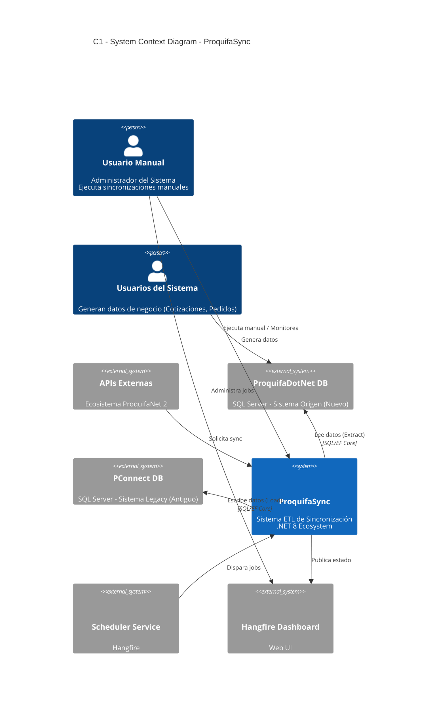
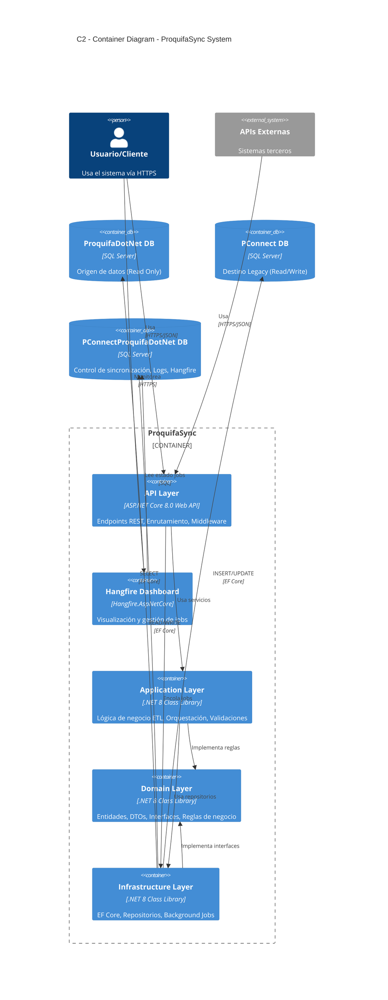
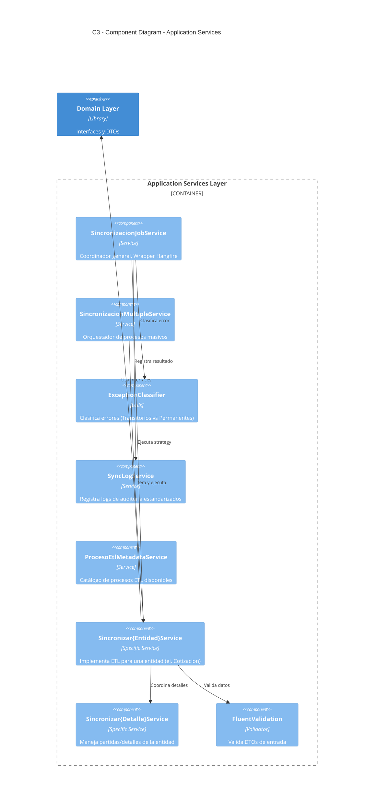
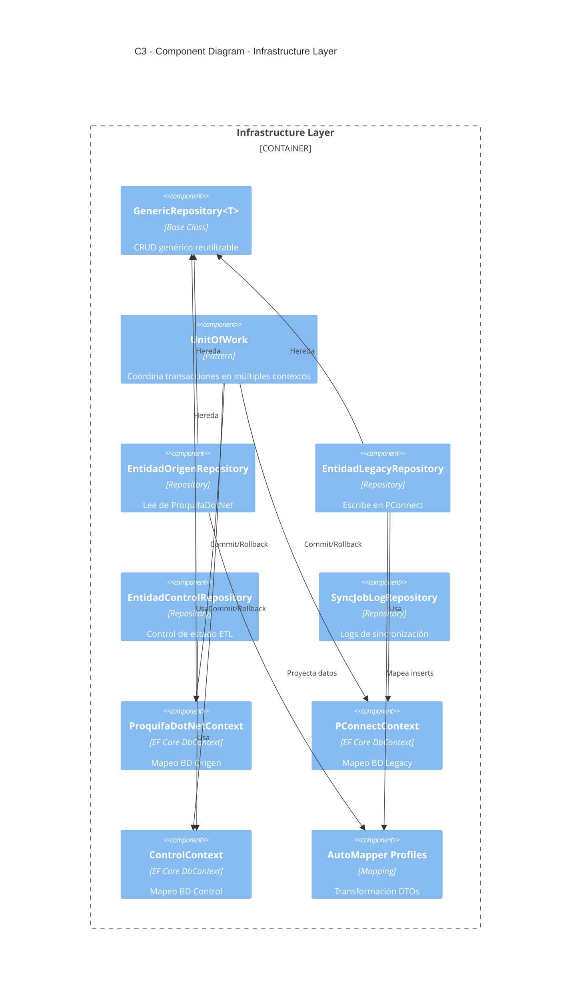
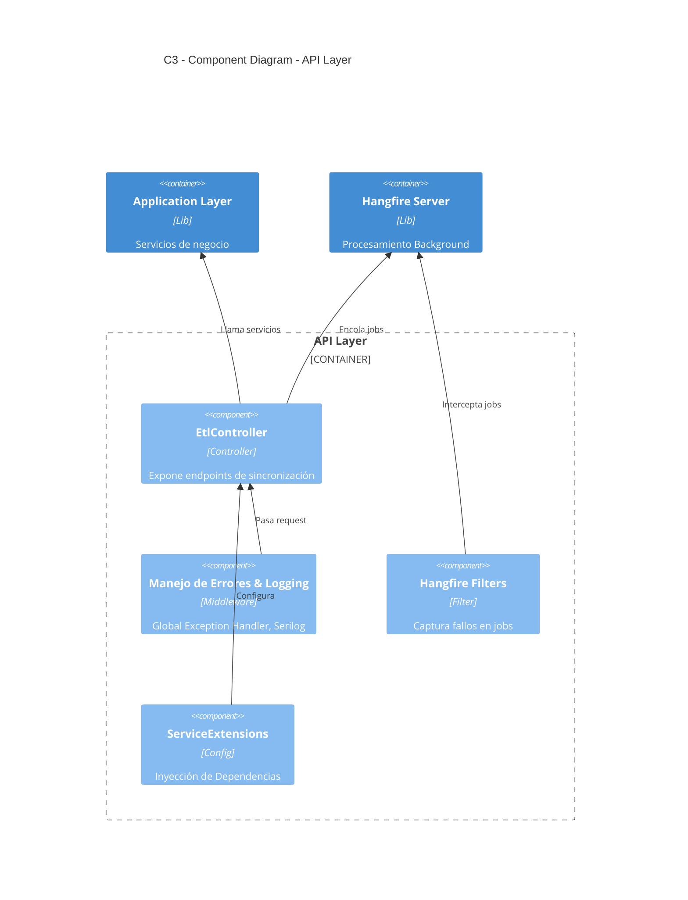
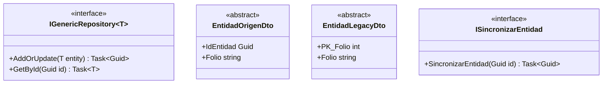
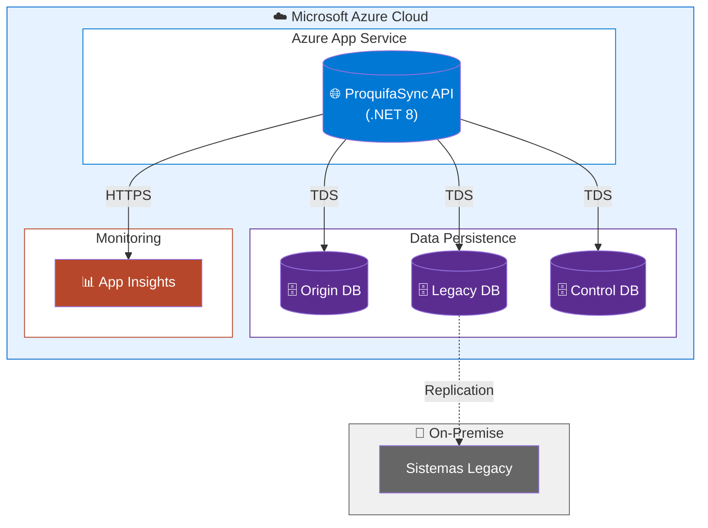

# Exportación de Diagramas para Draw.io (Formato C4 Mejorado)

Este archivo contiene el código Mermaid utilizando la sintaxis específica **C4** para alinearse con el estilo visual de `Proquifa_C4_Ecosistema.drawio`.

## Instrucciones de Importación
1. Abra **Draw.io**.
2. Cree un **nuevo diagrama** o abra uno existente.
3. Para cada "Hoja" o "Nivel":
   - Añada una nueva página en Draw.io.
   - Vaya al menú: **Arrange > Insert > Advanced > Mermaid...**.
   - **Copie y Pegue** el bloque de código correspondiente.
   - Haga click en **Insert**.

> **Nota:** La sintaxis C4 de Mermaid genera automáticamente las cajas azules (Sistemas), grises (Personas) y azules claros (Contenedores) que coinciden con el estándar C4.

---

## Hoja 1: Nivel 1 - Context (C1)

---

## Hoja 2: Nivel 2 - Container (C2)

---

## Hoja 3: Nivel 3 - Component Layer: Application (C3.1)

---

## Hoja 4: Nivel 3 - Component Layer: Infrastructure (C3.2)

---

## Hoja 5: Nivel 3 - Component Layer: API (C3.3)

---

## Hoja 6: Nivel 4 - Code: Domain (UML)

> **Nota:** Para diagramas de clases (Nivel 4), se mantiene la sintaxis UML estándar de Mermaid (`classDiagram`) ya que C4 no cubre este nivel de detalle.

---

## Hoja 7: Vista de Despliegue (Deployment)

