# Modelo C4 - Arquitectura de Software
## SincronizadorPqfLegacy

**Versión**: 2.0
**Fecha**: 2025-12-10
**Modelo**: C4 (Context, Containers, Components, Code)
**Nota**: Arquitectura genérica extensible a múltiples tipos de entidades

---

## Índice

1. [Nivel 1: System Context (Contexto del Sistema)](#nivel-1-system-context)
2. [Nivel 2: Container (Contenedores)](#nivel-2-container)
3. [Nivel 3: Component (Componentes)](#nivel-3-component)
4. [Nivel 4: Code (Código)](#nivel-4-code)
5. [Vistas Suplementarias](#vistas-suplementarias)

---

## Introducción al Modelo C4

El modelo C4 proporciona una forma de visualizar la arquitectura de software en diferentes niveles de zoom:

- **C1 - System Context**: Vista de 10,000 pies - El sistema y su entorno
- **C2 - Container**: Vista de contenedores - Aplicaciones y bases de datos
- **C3 - Component**: Vista de componentes - Módulos dentro de cada contenedor
- **C4 - Code**: Vista de código - Clases y relaciones (opcional)

---

## ⚠️ Nota Importante sobre Ejemplos

Esta arquitectura está diseñada como un **patrón genérico reutilizable** para sincronizar cualquier tipo de entidad de negocio:
- **Cotizaciones** (PoC implementada)
- **Pedidos** (futuro)
- **Facturas** (futuro)
- **Inventario** (futuro)
- **Cualquier otra entidad**

Los ejemplos en este documento usan **"Cotizaciones"** como caso ilustrativo, pero el patrón es **completamente extensible** reemplazando los componentes específicos por los de la nueva entidad.

---

# Nivel 1: System Context

> **Audiencia**: Todos (técnicos y no técnicos)
> **Propósito**: Entender el panorama general del sistema

## Diagrama C1: Contexto del Sistema

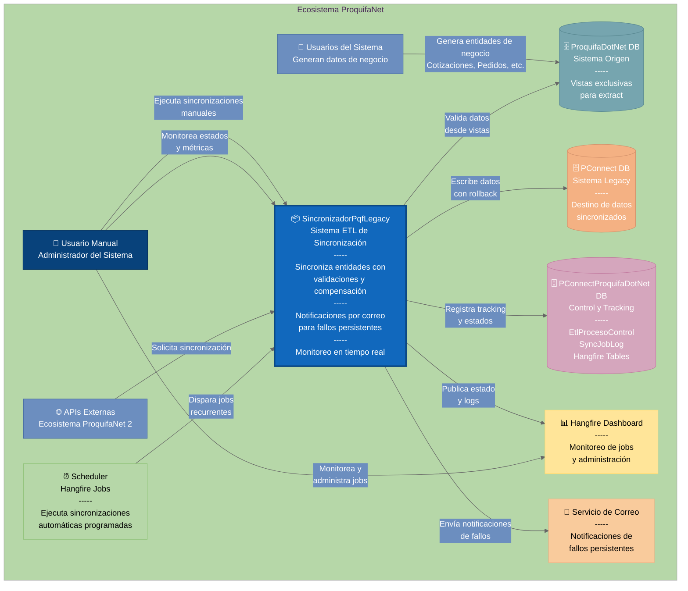

## Descripción del Sistema

### Sistema Principal: SincronizadorPqfLegacy

**Propósito**: Sincronizar entidades de negocio desde el nuevo sistema (ProquifaDotNet) hacia el sistema legacy (PConnect) utilizando un patrón ETL genérico con resiliencia y auditoría completa.

**Entidades Soportadas** (patrón extensible):
- ✅ **Cotizaciones** (PoC implementada)
- 🔄 **Pedidos** (patrón aplicable)
- 🔄 **Facturas** (patrón aplicable)
- 🔄 **Inventario** (patrón aplicable)
- 🔄 **Cualquier entidad** siguiendo el mismo patrón

**Responsabilidades**:
- Extraer datos de ProquifaDotNet mediante vistas ETL optimizadas
- Transformar datos según reglas de negocio específicas por tipo de entidad
- Cargar datos en PConnect con manejo de duplicados
- Registrar auditoría completa en logs
- Gestionar errores con clasificación inteligente (Transient vs Permanent)
- Proporcionar reintentos automáticos para errores transitorios

### Actores Externos

| Actor | Tipo | Descripción | Interacción |
|-------|------|-------------|-------------|
| **Usuario Manual** | Persona | Administrador del sistema | Ejecuta sincronizaciones ad-hoc, monitorea dashboard |
| **Usuarios del Sistema** | Persona | Generan datos de negocio | Crean entidades en ProquifaDotNet |
| **APIs Externas** | Software | Otros sistemas del ecosistema | Solicitan sincronización vía API REST |
| **Scheduler (Hangfire)** | Software | Programador de tareas | Dispara jobs recurrentes automáticos |

### Sistemas Externos

| Sistema | Tipo | Tecnología | Propósito | Acceso |
|---------|------|------------|-----------|--------|
| **ProquifaDotNet DB** | Base de Datos | SQL Server | Sistema origen con datos nuevos | Solo Lectura |
| **PConnect DB** | Base de Datos | SQL Server | Sistema legacy destino | Lectura/Escritura |
| **Hangfire Dashboard** | Interfaz Web | ASP.NET | Monitoreo de jobs | Solo Visualización |

---

# Nivel 2: Container

> **Audiencia**: Arquitectos, desarrolladores senior
> **Propósito**: Entender la estructura de alto nivel del sistema

## Diagrama C2: Contenedores del Sistema

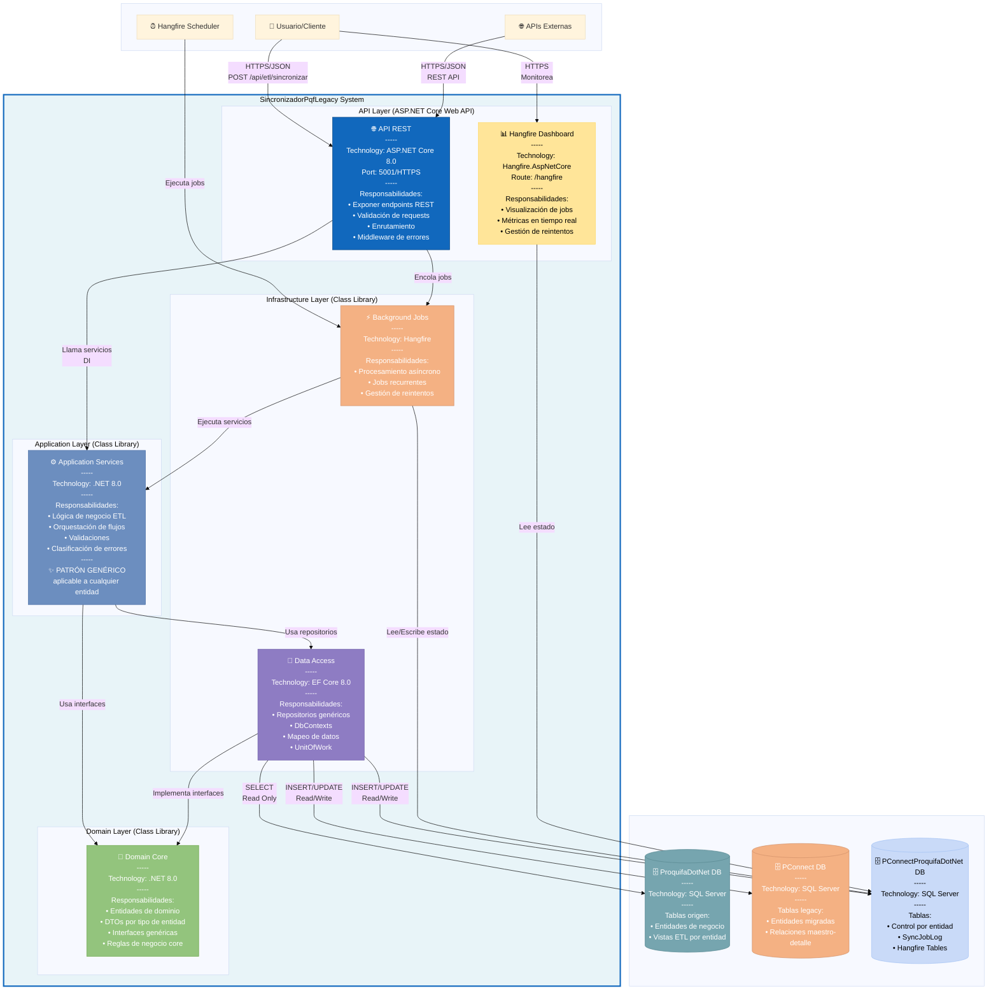

## Descripción de Contenedores

### 1. API REST (ASP.NET Core Web API)

**Tecnología**: ASP.NET Core 8.0, Swagger/OpenAPI
**Puerto**: 5001 (HTTPS)
**Responsabilidades**:
- Exponer endpoints REST para sincronización de **cualquier tipo de entidad**
- Validación de requests (FluentValidation)
- Manejo centralizado de excepciones (Middleware)
- Autenticación/Autorización (futuro)
- Documentación API (Swagger)

**Endpoints Principales** (genéricos):
```http
POST /api/etl/sincronizar              # Sincronización individual de cualquier entidad
POST /api/etl/sincronizar-pendientes   # Sincronización masiva de cualquier entidad
POST /api/etl/monitoreo                # Consulta de estados con filtros genéricos
GET  /api/etl/catalogo                 # Catálogo de procesos ETL disponibles
GET  /api/etl/monitoreo/resumen         # Resumen de estadísticas por estado
```

**Parámetro**: `tipoProceso` (enum) define qué entidad sincronizar:
- `tipoProceso: 1` → Cotización (PoC)
- `tipoProceso: 2` → Pedido (futuro)
- `tipoProceso: 3` → Factura (futuro)
- etc.

**Dependencias**:
- Application Services (inyección de dependencias)
- Background Jobs (Hangfire)
- Serilog (logging)

---

### 2. Hangfire Dashboard

**Tecnología**: Hangfire.AspNetCore 1.8+
**Ruta**: `/hangfire`
**Responsabilidades**:
- Visualización de jobs para **todos los tipos de entidades**
- Métricas en tiempo real agregadas
- Logs de jobs con Hangfire.Console
- Gestión manual de reintentos
- Configuración de jobs recurrentes

**Características**:
- Barras de progreso en tiempo real
- Estadísticas de performance por tipo de proceso
- Historial de ejecuciones

---

### 3. Application Services (Class Library)

**Tecnología**: .NET 8.0
**Patrón**: Service Layer + **Patrón Genérico Reutilizable**
**Responsabilidades**:
- Implementar lógica de negocio ETL **genérica con validaciones**
- Orquestar flujo con subprocesos y compensación para **cualquier entidad**
- Validaciones de integridad previas al ETL
- Clasificación de errores (ExceptionClassifier) - **componente genérico**
- Logging de auditoría con tabla de control genérica
- Notificaciones por correo para fallos persistentes
- Monitoreo en tiempo real con filtros genéricos

**Servicios por Tipo de Entidad** (patrón replicable):

```
📦 Cotizaciones (PoC implementada):
   • SincronizarCotizacionService          - ETL principal
   • CotizacionValidacionService           - Validaciones específicas
   • CotizacionSubprocesoExtractService    - Subproceso Extract
   • CotizacionSubprocesoTransformService  - Subproceso Transform
   • CotizacionSubprocesoLoadService       - Subproceso Load
   • SincronizarPartidasService            - Detalles

🔄 Pedidos (futuro - mismo patrón):
   • SincronizarPedidoService              - ETL principal
   • PedidoValidacionService               - Validaciones específicas
   • PedidoSubprocesoExtractService        - Subproceso Extract
   • PedidoSubprocesoTransformService      - Subproceso Transform
   • PedidoSubprocesoLoadService           - Subproceso Load
   • SincronizarDetallesPedidoService       - Detalles

🔄 Facturas (futuro - mismo patrón):
   • SincronizarFacturaService              - ETL principal
   • FacturaValidacionService              - Validaciones específicas
   • FacturaSubprocesoExtractService       - Subproceso Extract
   • FacturaSubprocesoTransformService     - Subproceso Transform
   • FacturaSubprocesoLoadService          - Subproceso Load
   • SincronizarPartidaFacturaService      - Detalles
```

**Servicios Genéricos** (reutilizables para todas las entidades):
```
✅ SincronizacionMultipleService   - ETL masivo genérico
✅ SincronizacionJobService        - Wrapper Hangfire genérico
✅ ExceptionClassifier             - Clasificación errores genérica
✅ SyncLogService                  - Auditoría genérica
✅ EtlProcesoControlService         - Tracking genérico de estados
✅ NotificationService             - Notificaciones por correo
✅ MonitoreoService                - Consultas con filtros genéricos
✅ ValidacionBaseService            - Validaciones comunes
```

**Dependencias**:
- Domain Core (interfaces, DTOs)
- Data Access (repositorios)
- AutoMapper (transformaciones)

---

### 4. Domain Core (Class Library)

**Tecnología**: .NET 8.0 (sin dependencias externas)
**Patrón**: Domain-Driven Design (DDD) + **Interfaces Genéricas**
**Responsabilidades**:
- Definir entidades de dominio
- DTOs para transferencia de datos **por tipo de entidad**
- Interfaces de repositorios **genéricas**
- Enums (TipoProcesoEtl, ErrorCategory)
- Excepciones de dominio

**Características**:
- **Independiente de frameworks**: Solo C# puro
- **Estable**: No cambia frecuentemente
- **Núcleo del sistema**: Otras capas dependen de él
- **Extensible**: Fácil agregar nuevos tipos de entidad

**Componentes Clave Genéricos**:
```
✅ IGenericRepository<T>       - Contrato CRUD genérico
✅ IUnitOfWork                 - Transacciones
✅ IExceptionClassifier        - Clasificación
✅ ErrorCategory               - Transient vs Permanent
✅ TipoProcesoEtl             - Enum extensible con nuevas entidades
```

**DTOs por Entidad** (patrón):
```
Cotización (PoC):
   • CotizacionOrigenDto
   • CotizacionLegacyDto
   • CotizacionControlDto

Pedido (futuro):
   • PedidoOrigenDto
   • PedidoLegacyDto
   • PedidoControlDto

[Seguir mismo patrón para nuevas entidades]
```

---

### 5. Data Access (Class Library)

**Tecnología**: Entity Framework Core 8.0, AutoMapper
**Patrón**: Repository Pattern, Unit of Work, **Repositorios Genéricos**
**Responsabilidades**:
- Implementar repositorios **genéricos y específicos**
- Gestionar DbContexts (múltiples bases de datos)
- Mapeo de entidades a DTOs (AutoMapper)
- Coordinación transaccional (UnitOfWork)

**DbContexts** (3 bases de datos):
```
• ProquifaDotNetContext           - Origen (R)
• PConnectContext                 - Legacy (R/W)
• PConnectProquifaDotNetContext   - Control (R/W)
```

**Repositorios** (patrón genérico + específicos):
```
✅ GenericRepository<T>              - Base CRUD genérico

Por entidad (patrón replicable):
   Cotización (PoC):
      • CotizacionOrigenRepository
      • CotizacionLegacyRepository
      • CotizacionControlRepository

   Pedido (futuro):
      • PedidoOrigenRepository
      • PedidoLegacyRepository
      • PedidoControlRepository

✅ SyncJobLogRepository              - Logs (genérico para todas)
```

---

### 6. Background Jobs (Hangfire)

**Tecnología**: Hangfire 1.8+, SQL Server Storage
**Responsabilidades**:
- Procesamiento asíncrono de jobs **para cualquier tipo de entidad**
- Jobs recurrentes (CRON) configurables por entidad
- Reintentos automáticos configurables
- Persistencia de estado en BD
- Escalabilidad (múltiples workers)

**Configuración de Reintentos** (aplicable a todas las entidades):
```
Intento 1 → Fallo → 60s   → Intento 2
Intento 2 → Fallo → 5min  → Intento 3
Intento 3 → Fallo → 15min → Intento 4
Intento 4 → Fallo → 1h    → Intento 5
Intento 5 → Fallo → 2h    → Intento 6
Intento 6 → Fallo → Failed
```

**Jobs Recurrentes** (extensibles):
```
✅ Cotizaciones:
   • sincronizar-cotizaciones-automatico   - Cada 30 min

🔄 Pedidos (futuro):
   • sincronizar-pedidos-automatico        - Cada 15 min

🔄 Facturas (futuro):
   • sincronizar-facturas-automatico       - Diario

✅ Comunes:
   • cleanup-sync-logs                     - Diario 2 AM
   • procesos-sin-detonacion-inicial       - Cada 2 min
```

---

### Bases de Datos

#### ProquifaDotNet DB (Origen)
**Acceso**: Solo Lectura
**Propósito**: Sistema origen con datos nuevos de **múltiples entidades**
**Tablas/Vistas Clave** (patrón por entidad):
```
Cotización (PoC):
   • cotCotizacion
   • vCotizacionesTransformadasETL

Pedido (futuro):
   • pedPedido
   • vPedidosTransformadosETL

[Patrón: {entidad} + vista v{Entidad}TransformadosETL]
```

#### PConnect DB (Legacy)
**Acceso**: Lectura/Escritura
**Propósito**: Sistema legacy que recibe **múltiples tipos de entidades** migradas
**Tablas Clave** (patrón maestro-detalle):
```
Cotización (PoC):
   • Cotiza (maestro, PK_Folio IDENTITY)
   • PCotiza (detalle)

Pedido (futuro):
   • Pedido (maestro)
   • DetallePedido (detalle)

[Patrón replicable]
```

#### PConnectProquifaDotNet DB (Control)
**Acceso**: Lectura/Escritura
**Propósito**: Tracking, logs y Hangfire para **todas las entidades**
**Tablas Clave**:
```
✅ Genéricas:
   • SyncJobLog (todas las entidades, NombreEntidad = 'Cotizacion'|'Pedido'|etc.)
   • Tablas Hangfire

Por entidad (tabla de control):
   • Cotizacione (control de Cotizaciones)
   • Pedidoe (futuro - control de Pedidos)
   • [Patrón: {Entidad}e]
```

---

# Nivel 3: Component

> **Audiencia**: Desarrolladores
> **Propósito**: Entender componentes internos de cada contenedor

## Diagrama C3.1: Componentes de Application Layer (Patrón Genérico)

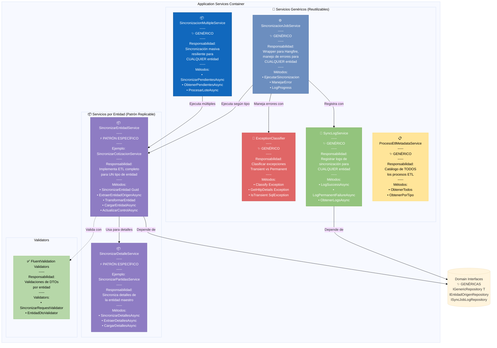

## Nota sobre Componentes por Entidad

Para cada nueva entidad (Pedido, Factura, etc.), se replica el patrón:

### Componentes Específicos a Crear

```
Por cada entidad nueva:

1. Sincronizar{Entidad}Service
   • Implementa ISincronizar{Entidad}
   • Lógica ETL específica de la entidad
   • Usa repositorios específicos

2. Sincronizar{Detalle}Service (si aplica)
   • Para entidades con maestro-detalle
   • Ejemplo: Partidas de Cotización, Items de Pedido

3. {Entidad}DtoValidator
   • Validaciones FluentValidation específicas
```

### Componentes Genéricos a Reutilizar

```
NO duplicar, usar los existentes:

✅ ExceptionClassifier       - Clasificación de errores
✅ SyncLogService            - Logging de sincronización
✅ SincronizacionJobService  - Wrapper Hangfire
✅ SincronizacionMultipleService - Sincronización masiva
✅ ProcesoEtlMetadataService - Catálogo de procesos
```

---

## Diagrama C3.2: Componentes de Infrastructure Layer (Patrón Genérico)

```mermaid
%%{init: {'theme':'base'}}%%
graph TB
    subgraph Infrastructure["Infrastructure Container"]

        subgraph GenericRepos["🌟 Repositorios Genéricos (Reutilizables)"]
            GenericRepo[💾 GenericRepository T<br/>-----<br/>✨ GENÉRICO<br/>-----<br/>Responsabilidad:<br/>CRUD base para<br/>CUALQUIER entidad<br/>-----<br/>Métodos:<br/>• AddOrUpdate T<br/>• Delete Guid<br/>• GetById Guid<br/>• Query Expression]
        end

        subgraph EntityRepos["📦 Repositorios por Entidad (Patrón Replicable)"]
            OrigenRepo[💾 EntidadOrigenRepository<br/>-----<br/>⚡ PATRÓN ESPECÍFICO<br/>-----<br/>Ejemplo: CotizacionOrigenRepository<br/>-----<br/>Responsabilidad:<br/>Acceso a datos origen<br/>de UNA entidad<br/>-----<br/>Métodos:<br/>• ObtenerPorIdAsync<br/>• ObtenerPorFolioAsync]

            LegacyRepo[💾 EntidadLegacyRepository<br/>-----<br/>⚡ PATRÓN ESPECÍFICO<br/>-----<br/>Ejemplo: CotizacionLegacyRepository<br/>-----<br/>Responsabilidad:<br/>Escritura a legacy<br/>de UNA entidad<br/>-----<br/>Métodos:<br/>• InsertarAsync<br/>• ActualizarAsync<br/>• ObtenerPorClaveAsync]

            ControlRepo[💾 EntidadControlRepository<br/>-----<br/>⚡ PATRÓN ESPECÍFICO<br/>-----<br/>Ejemplo: CotizacionControlRepository<br/>-----<br/>Responsabilidad:<br/>Tabla de control<br/>de UNA entidad<br/>-----<br/>Métodos:<br/>• ObtenerPendientesAsync<br/>• ActualizarEstadoAsync<br/>• MarcarCompletoAsync]

            SyncJobLogRepo[💾 SyncJobLogRepository<br/>-----<br/>✨ GENÉRICO<br/>-----<br/>Responsabilidad:<br/>Logs de sincronización<br/>para TODAS las entidades<br/>-----<br/>Métodos:<br/>• InsertarAsync<br/>• ObtenerPorRegistroAsync<br/>• ObtenerUltimoLogAsync]
        end

        subgraph Persistence["Persistence"]
            UOW[🔄 UnitOfWork<br/>-----<br/>✨ GENÉRICO<br/>-----<br/>Responsabilidad:<br/>Coordinación transaccional<br/>para CUALQUIER entidad<br/>-----<br/>Métodos:<br/>• BeginTransactionAsync<br/>• CommitAsync<br/>• RollbackAsync<br/>• SaveChangesAsync]

            OrigenContext[(📊 ProquifaDotNetContext<br/>-----<br/>Technology: EF Core<br/>-----<br/>DbSets por entidad:<br/>• Entidad<br/>• vEntidadTransformadasETL)]

            LegacyContext[(📊 PConnectContext<br/>-----<br/>Technology: EF Core<br/>-----<br/>DbSets por entidad:<br/>• EntidadLegacy<br/>• DetalleLegacy)]

            ControlContext[(📊 PConnectProquifaDotNetContext<br/>-----<br/>Technology: EF Core<br/>-----<br/>DbSets:<br/>• Entidade Control<br/>• SyncJobLog Genérico)]
        end

        subgraph Mappers["AutoMapper Profiles"]
            AppMapping[🔀 ApplicationMappingProfile<br/>-----<br/>✨ GENÉRICO<br/>Mapeos comunes]

            EntityMapping[🔀 EntidadMappingProfile<br/>-----<br/>⚡ ESPECÍFICO<br/>-----<br/>Ejemplo: CotizaMappingProfile<br/>-----<br/>Mapeos:<br/>• EntidadOrigenDto → EntidadLegacyDto<br/>• Reglas de negocio específicas<br/>• Defaults valores]

            SyncLogMapping[🔀 SyncJobLogMappingProfile<br/>-----<br/>✨ GENÉRICO<br/>-----<br/>Mapeos:<br/>• SyncJobLog ↔ SyncJobLogDto]
        end

        OrigenRepo -->|Hereda| GenericRepo
        LegacyRepo -->|Hereda| GenericRepo
        ControlRepo -->|Hereda| GenericRepo
        SyncJobLogRepo -->|Hereda| GenericRepo

        OrigenRepo -->|Lee de| OrigenContext
        LegacyRepo -->|Escribe a| LegacyContext
        ControlRepo -->|Escribe a| ControlContext
        SyncJobLogRepo -->|Escribe a| ControlContext

        UOW -->|Coordina| OrigenContext
        UOW -->|Coordina| LegacyContext
        UOW -->|Coordina| ControlContext

        OrigenRepo -.->|Usa| EntityMapping
        LegacyRepo -.->|Usa| EntityMapping
        SyncJobLogRepo -.->|Usa| SyncLogMapping
    end

    style GenericRepo fill:#e06666,stroke:#c94545,color:#fff
    style OrigenRepo fill:#a4c2f4,stroke:#6d9eeb,color:#000
    style LegacyRepo fill:#f4b183,stroke:#d4926b,color:#fff
    style ControlRepo fill:#b6d7a8,stroke:#93c47d,color:#000
    style SyncJobLogRepo fill:#93c47d,stroke:#6fa84e,color:#fff
    style UOW fill:#e06666,stroke:#c94545,color:#fff
    style AppMapping fill:#c9daf8,stroke:#a4c2f4,color:#000
    style EntityMapping fill:#8e7cc3,stroke:#6d5da7,color:#fff
    style SyncLogMapping fill:#c9daf8,stroke:#a4c2f4,color:#000
```

## Nota sobre Repositorios por Entidad

### Para cada nueva entidad crear:

```
1. {Entidad}OrigenRepository
   • Hereda de GenericRepository<{Entidad}OrigenDto>
   • Lee de vista v{Entidad}TransformadasETL

2. {Entidad}LegacyRepository
   • Hereda de GenericRepository<{Entidad}LegacyDto>
   • Escribe a tabla {EntidadLegacy}

3. {Entidad}ControlRepository
   • Hereda de GenericRepository<{Entidad}ControlDto>
   • Escribe a tabla {Entidad}e (control)

4. {Entidad}MappingProfile (AutoMapper)
   • Mapeo {Entidad}OrigenDto → {Entidad}LegacyDto
   • Reglas de negocio específicas
```

### Componentes genéricos a reutilizar:

```
✅ GenericRepository<T>         - Base CRUD
✅ UnitOfWork                   - Transacciones
✅ SyncJobLogRepository         - Logs
✅ ApplicationMappingProfile    - Mapeos comunes
✅ SyncJobLogMappingProfile     - Mapeo de logs
```

---

## Diagrama C3.3: Componentes de API Layer (Genérico)

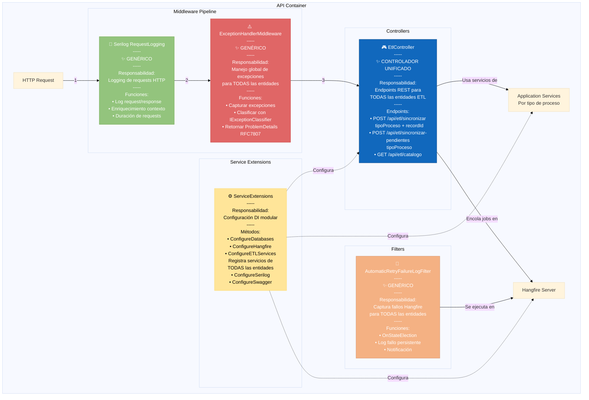

## Nota sobre API

### Un solo controlador para TODAS las entidades

El `EtlController` es **genérico** y maneja **todos los tipos de entidades** mediante el parámetro `tipoProceso`:

```csharp
[HttpPost("sincronizar")]
public async Task<IActionResult> Sincronizar([FromBody] SincronizarRequest request)
{
    // request.tipoProceso determina qué entidad sincronizar:
    // 1 = Cotización, 2 = Pedido, 3 = Factura, etc.

    var jobId = BackgroundJob.Enqueue<ISincronizacionJobService>(
        service => service.EjecutarSincronizacion(
            request.tipoProceso,  // ← Define la entidad
            request.recordId,
            null
        )
    );

    return Accepted(new { jobId });
}
```

**NO se requiere** un controlador por entidad. Todo se maneja mediante enumeración `TipoProcesoEtl`.

---

# Nivel 4: Code

> **Audiencia**: Desarrolladores implementando
> **Propósito**: Entender estructura de clases y relaciones

## Diagrama C4.1: Diagrama de Clases - Domain Core (Genérico)

```mermaid
classDiagram
    class IGenericRepository~T~ {
        <<interface>>
        %% ✨ GENÉRICO
        +AddOrUpdate(T entity) Task~Guid~
        +Delete(Guid id) Task~bool~
        +GetById(Guid id) Task~T~
        +Query(bool asNoTracking) IQueryable~T~
        +Exists(Guid id) Task~bool~
    }

    class IUnitOfWork {
        <<interface>>
        %% ✨ GENÉRICO
        +BeginTransactionAsync() Task
        +CommitAsync() Task
        +RollbackAsync() Task
        +SaveChangesAsync() Task~bool~
        +Dispose() Task
    }

    class IExceptionClassifier {
        <<interface>>
        %% ✨ GENÉRICO
        +Classify(Exception ex) ErrorCategory
        +GetHttpDetails(Exception ex) (int, string)
    }

    class ErrorCategory {
        <<enumeration>>
        %% ✨ GENÉRICO
        Transient
        Permanent
    }

    class TipoProcesoEtl {
        <<enumeration>>
        %% ⚡ EXTENSIBLE
        Cotizacion = 1
        Pedido = 2
        Factura = 3
        Inventario = 4
        ...
    }

    class DomainException {
        <<abstract>>
        %% ✨ GENÉRICO
        +Message string
        +InnerException Exception
        +DomainException(string message)
    }

    class DomainArgumentNullException {
        %% ✨ GENÉRICO
        +DomainArgumentNullException(string paramName)
    }

    class InfrastructureException {
        %% ✨ GENÉRICO
        +InfrastructureException(string message)
    }

    class EntidadOrigenDto {
        <<abstract>>
        %% ⚡ PATRÓN BASE
        %% Ejemplo: CotizacionOrigenDto
        +IdEntidad Guid
        +Folio string
        +Fecha DateTime
        %% +[Propiedades específicas]
    }

    class EntidadLegacyDto {
        <<abstract>>
        %% ⚡ PATRÓN BASE
        %% Ejemplo: CotizacionLegacyDto
        +PK_Folio int
        +Folio string
        +Fecha DateTime
        %% +[Propiedades específicas]
    }

    class EntidadControlDto {
        <<abstract>>
        %% ⚡ PATRÓN BASE
        %% Ejemplo: CotizacionControlDto
        +EntidadPQF Guid
        +Folio string
        +EntidadLegacy int?
        +RegistroCompleto bool
        +FechaRegistro DateTime
    }

    class SyncJobLogDto {
        %% ✨ GENÉRICO para TODAS
        +IdSyncJobLog Guid
        +NombreEntidad string
        +IdentificadorRegistro Guid
        +Estado string
        +MensajeError string
        +FechaProcesamiento DateTime
    }

    IExceptionClassifier ..> ErrorCategory : uses
    DomainArgumentNullException --|> DomainException
    InfrastructureException --|> DomainException
```

## Nota sobre DTOs por Entidad

Para cada entidad nueva, crear DTOs siguiendo el patrón:

```csharp
// PATRÓN ORIGEN
public class {Entidad}OrigenDto
{
    public Guid Id{Entidad} { get; set; }
    public string Folio { get; set; }
    public DateTime Fecha { get; set; }
    // ... propiedades específicas de la entidad
}

// PATRÓN LEGACY
public class {Entidad}LegacyDto
{
    public int PK_Folio { get; set; }  // IDENTITY
    public string Folio { get; set; }
    public DateTime Fecha { get; set; }
    // ... propiedades específicas de la entidad
}

// PATRÓN CONTROL
public class {Entidad}ControlDto
{
    public Guid {Entidad}PQF { get; set; }  // FK a origen
    public string Folio { get; set; }
    public int? {Entidad}Legacy { get; set; }  // FK a legacy
    public bool RegistroCompleto { get; set; }
    public DateTime FechaRegistro { get; set; }
}
```

**SyncJobLogDto es genérico** y se reutiliza para TODAS las entidades mediante el campo `NombreEntidad`:
- `NombreEntidad = "Cotizacion"`
- `NombreEntidad = "Pedido"`
- `NombreEntidad = "Factura"`
- etc.

---

## Diagrama C4.2: Diagrama de Clases - Application Services (Patrón)

```mermaid
classDiagram
    class ISincronizarEntidad {
        <<interface>>
        %% ⚡ PATRÓN POR ENTIDAD
        %% Ejemplo: ISincronizarCotizacion
        +SincronizarEntidad(Guid id) Task~Guid~
    }

    class SincronizarEntidadService {
        %% ⚡ PATRÓN POR ENTIDAD
        %% Ejemplo: SincronizarCotizacionService
        -IEntidadOrigenRepository _origenRepo
        -IEntidadLegacyRepository _legacyRepo
        -IEntidadControlRepository _controlRepo
        -IMapper _mapper
        -ILogger _logger
        +SincronizarEntidad(Guid id) Task~Guid~
        -ExtraerEntidadOrigenAsync(Guid id) Task~DTO~
        -TransformarEntidad(DTO) DTO
        -CargarEntidadAsync(DTO) Task~DTO~
        -ActualizarControlAsync(DTO) Task
    }

    class ISincronizacionJobService {
        <<interface>>
        %% ✨ GENÉRICO
        +EjecutarSincronizacion(TipoProcesoEtl, Guid) Task
    }

    class SincronizacionJobService {
        %% ✨ GENÉRICO - MANEJA TODAS
        -Dictionary~TipoProcesoEtl, ISincronizarEntidad~ _servicios
        -IExceptionClassifier _exceptionClassifier
        -ISyncLogService _syncLogService
        -ILogger _logger
        +EjecutarSincronizacion(TipoProcesoEtl, Guid, PerformContext) Task
        -ManejarError(Exception, string, Guid) Task
        -LogProgress(PerformContext, string) void
    }

    class ExceptionClassifier {
        %% ✨ GENÉRICO
        -ILogger _logger
        +Classify(Exception ex) ErrorCategory
        +GetHttpDetails(Exception ex) (int, string)
        -IsSqlTransientError(SqlException) bool
        -IsTransientError(Exception) bool
    }

    class ISyncLogService {
        <<interface>>
        %% ✨ GENÉRICO
        +LogSuccessAsync(string, Guid) Task
        +LogPermanentFailureAsync(string, Guid, Exception) Task
        +ObtenerLogsAsync(string, Guid) Task~IEnumerable~
    }

    class SyncLogService {
        %% ✨ GENÉRICO
        -ISyncJobLogRepository _repository
        -ILogger _logger
        +LogSuccessAsync(string nombreEntidad, Guid) Task
        +LogPermanentFailureAsync(string nombreEntidad, Guid, Exception) Task
        +ObtenerLogsAsync(string nombreEntidad, Guid) Task~IEnumerable~
    }

    class SincronizacionMultipleService {
        %% ✨ GENÉRICO
        -Dictionary~TipoProcesoEtl, Repositorio~ _controlRepos
        -Dictionary~TipoProcesoEtl, ISincronizarEntidad~ _servicios
        -ILogger _logger
        +SincronizarPendientesAsync(TipoProcesoEtl, PerformContext) Task~ResultadoDto~
        -ObtenerPendientesAsync(TipoProcesoEtl) Task~IEnumerable~
        -ProcesarLoteAsync(IEnumerable, PerformContext) Task~ResultadoDto~
    }

    SincronizarEntidadService ..|> ISincronizarEntidad
    SincronizacionJobService ..|> ISincronizacionJobService
    SyncLogService ..|> ISyncLogService
    ExceptionClassifier ..|> IExceptionClassifier

    SincronizacionJobService --> ISincronizarEntidad : usa según tipo
    SincronizacionJobService --> IExceptionClassifier
    SincronizacionJobService --> ISyncLogService
    SincronizacionMultipleService --> ISincronizarEntidad : usa según tipo
```

## Nota sobre Servicios

### Servicios Genéricos (1 sola instancia, reutilizable)

```csharp
✅ SincronizacionJobService
   • Recibe TipoProcesoEtl enum
   • Ejecuta el servicio correcto según tipo
   • Maneja TODAS las entidades

✅ ExceptionClassifier
   • Clasifica CUALQUIER excepción

✅ SyncLogService
   • Loguea CUALQUIER entidad mediante NombreEntidad

✅ SincronizacionMultipleService
   • Sincroniza CUALQUIER entidad en masa
```

### Servicios Específicos (1 por tipo de entidad)

```csharp
⚡ Sincronizar{Entidad}Service (patrón)
   • CotizacionService ← PoC
   • PedidoService ← futuro
   • FacturaService ← futuro

   Todos implementan el mismo patrón ETL
```

---

## Diagrama C4.3: Diagrama de Clases - Infrastructure (Patrón)

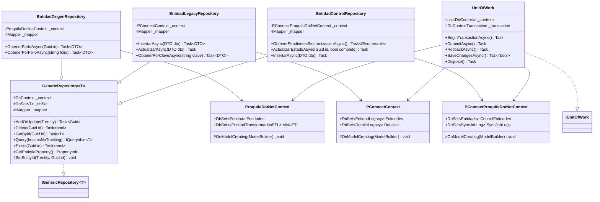

---

# Vistas Suplementarias

## Vista de Deployment (Despliegue)

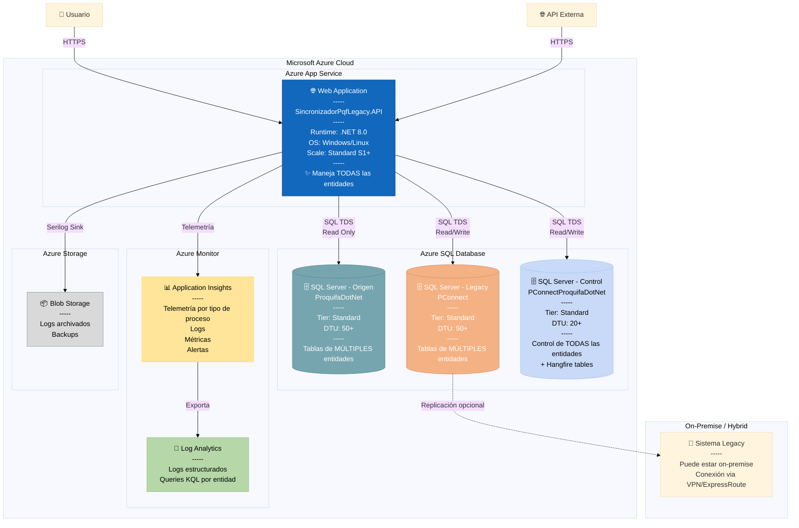

## Vista de Seguridad

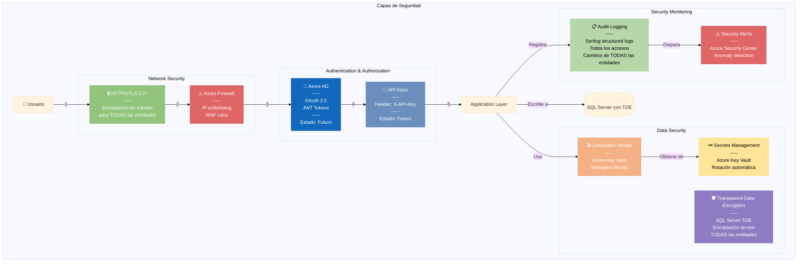

## Vista de Performance

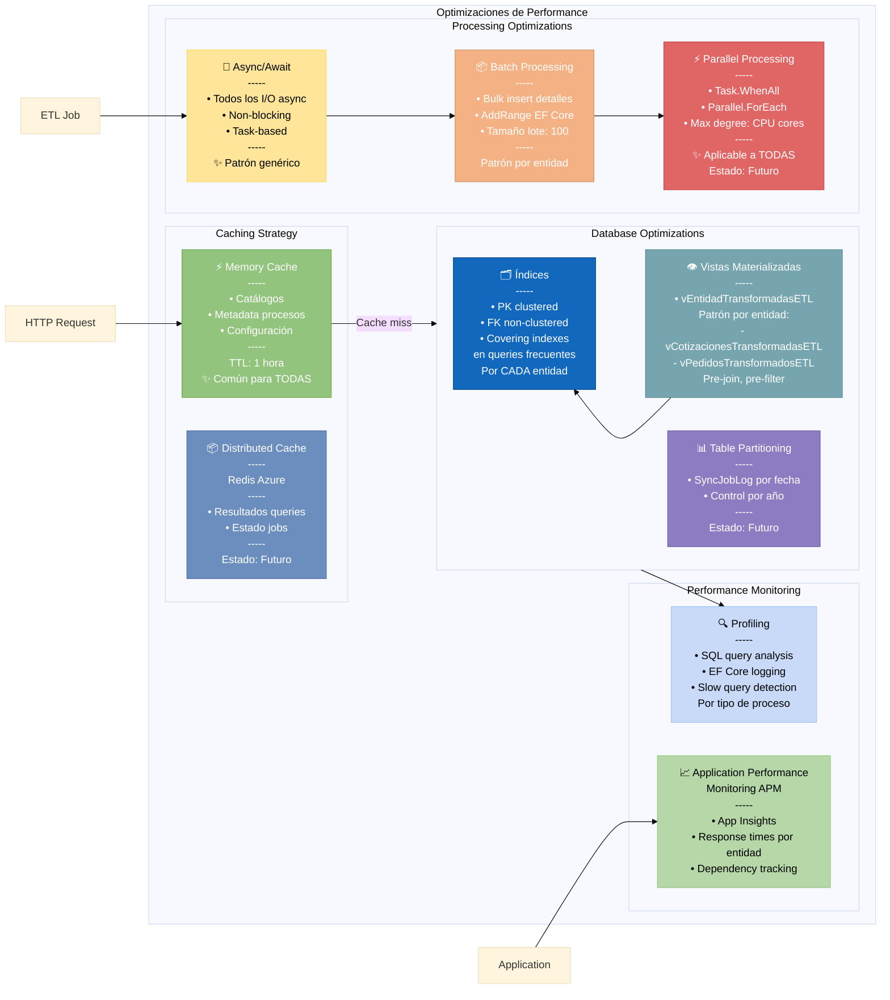

---

# Resumen de Decisiones Arquitectónicas (ADRs)

## ADR-001: Clean Architecture

**Estado**: Aceptado
**Contexto**: Necesidad de separación de responsabilidades y testabilidad
**Decisión**: Implementar Clean Architecture con 4 capas
**Consecuencias**:
- ✅ Alta testabilidad (cada capa se puede testear independientemente)
- ✅ Bajo acoplamiento
- ✅ Independencia de frameworks en Domain
- ⚠️ Más archivos y estructura inicial

## ADR-002: Patrón Genérico Extensible a Múltiples Entidades

**Estado**: Aceptado
**Contexto**: Necesidad de sincronizar múltiples tipos de entidades (Cotizaciones, Pedidos, Facturas, etc.)
**Decisión**: Diseñar patrón reutilizable con componentes genéricos y específicos
**Consecuencias**:
- ✅ Agregar nueva entidad es rápido (15-30 min)
- ✅ Componentes genéricos (ExceptionClassifier, SyncLog, etc.) reutilizables al 100%
- ✅ Mantenimiento centralizado de lógica común
- ✅ Un solo controlador API maneja todas las entidades
- ⚠️ Requiere disciplina para seguir el patrón

## ADR-003: Repository Pattern + Unit of Work

**Estado**: Aceptado
**Contexto**: Abstracción de acceso a datos y coordinación transaccional
**Decisión**: Implementar Repository Pattern con UnitOfWork y GenericRepository
**Consecuencias**:
- ✅ Facilita testing (mocking)
- ✅ Abstracción de EF Core
- ✅ Transacciones coordinadas
- ✅ GenericRepository reutilizable para TODAS las entidades
- ⚠️ Overhead adicional

## ADR-004: Múltiples DbContexts

**Estado**: Aceptado
**Contexto**: Acceso a 3 bases de datos diferentes (Origen, Legacy, Control)
**Decisión**: Un DbContext por base de datos, extensible con nuevas entidades
**Consecuencias**:
- ✅ Separación clara de concerns
- ✅ Transacciones independientes
- ✅ Fácil agregar nuevas entidades sin afectar contextos
- ⚠️ No hay transacciones distribuidas

## ADR-005: Hangfire para Background Jobs

**Estado**: Aceptado
**Contexto**: Necesidad de procesamiento asíncrono y jobs recurrentes
**Decisión**: Usar Hangfire con SQL Server Storage
**Consecuencias**:
- ✅ Dashboard integrado para TODAS las entidades
- ✅ Reintentos automáticos genéricos
- ✅ Escalabilidad (múltiples workers)
- ✅ Persistencia de estado en BD
- ✅ Fácil agregar jobs para nuevas entidades
- ⚠️ Dependencia adicional

## ADR-006: Clasificación de Errores (Transient vs Permanent)

**Estado**: Aceptado
**Contexto**: Evitar reintentos innecesarios y reducir intervención manual
**Decisión**: Implementar ExceptionClassifier genérico con Strategy Pattern
**Consecuencias**:
- ✅ Resiliencia automatizada (80% de errores son transitorios)
- ✅ Reduce costos operativos
- ✅ Mejor experiencia de usuario
- ✅ Funciona para TODAS las entidades sin modificación
- ⚠️ Necesita mantenimiento para nuevos tipos de error

## ADR-007: AutoMapper para Transformaciones

**Estado**: Aceptado
**Contexto**: Mapeo entre DTOs (Origen → Legacy) para múltiples entidades
**Decisión**: Usar AutoMapper con profiles por entidad
**Consecuencias**:
- ✅ Reduce código boilerplate
- ✅ Mapeos declarativos
- ✅ Fácil testing
- ✅ Profile por entidad facilita agregar nuevas
- ⚠️ Magic strings (cuidado con refactoring)

## ADR-008: Serilog para Logging Estructurado

**Estado**: Aceptado
**Contexto**: Necesidad de logs trazables y consultables para múltiples entidades
**Decisión**: Usar Serilog con sinks a Console y File
**Consecuencias**:
- ✅ Logs estructurados (JSON)
- ✅ Enriquecimiento con contexto (tipo de entidad)
- ✅ Múltiples sinks
- ✅ Integración con Application Insights
- ✅ Filtrado por tipo de proceso
- ⚠️ Overhead mínimo

---

# Extensibilidad: Agregar Nueva Entidad

## Checklist Completo (15-30 minutos)

### 1. Domain Layer (5 min)

```csharp
// DTOs/{Entidad}OrigenDto.cs
public class {Entidad}OrigenDto
{
    public Guid Id{Entidad} { get; set; }
    public string Folio { get; set; }
    // ... propiedades específicas
}

// DTOs/{Entidad}LegacyDto.cs
public class {Entidad}LegacyDto
{
    public int PK_Folio { get; set; }
    public string Folio { get; set; }
    // ... propiedades específicas
}

// DTOs/{Entidad}ControlDto.cs
public class {Entidad}ControlDto
{
    public Guid {Entidad}PQF { get; set; }
    public int? {Entidad}Legacy { get; set; }
    public bool RegistroCompleto { get; set; }
}

// Interfaces/I{Entidad}OrigenRepository.cs
public interface I{Entidad}OrigenRepository : IGenericRepository<{Entidad}OrigenDto>
{
    Task<{Entidad}OrigenDto?> ObtenerPorIdAsync(Guid id);
}

// Actualizar Enums/TipoProcesoEtl.cs
public enum TipoProcesoEtl
{
    Cotizacion = 1,
    {Entidad} = X  // ← Agregar
}
```

### 2. Application Layer (10 min)

```csharp
// Services/Sincronizar{Entidad}Service.cs
public class Sincronizar{Entidad}Service : ISincronizar{Entidad}
{
    public async Task<Guid> Sincronizar{Entidad}(Guid id)
    {
        // 1. EXTRACT
        var origenDto = await _origenRepo.ObtenerPorIdAsync(id);

        // 2. TRANSFORM
        var legacyDto = _mapper.Map<{Entidad}LegacyDto>(origenDto);

        // 3. LOAD
        var insertada = await _legacyRepo.InsertarAsync(legacyDto);

        // 4. UPDATE CONTROL
        await _controlRepo.ActualizarAsync(control);

        return id;
    }
}
```

### 3. Infrastructure Layer (10 min)

```csharp
// Repository/{Entidad}OrigenRepository.cs
public class {Entidad}OrigenRepository : GenericRepository<{Entidad}OrigenDto>, I{Entidad}OrigenRepository
{
    public async Task<{Entidad}OrigenDto?> ObtenerPorIdAsync(Guid id)
    {
        var entity = await _context.v{Entidad}TransformadasETL
            .AsNoTracking()
            .FirstOrDefaultAsync(x => x.Id{Entidad} == id);

        return _mapper.Map<{Entidad}OrigenDto>(entity);
    }
}

// Mappers/{Entidad}MappingProfile.cs
public class {Entidad}MappingProfile : Profile
{
    public {Entidad}MappingProfile()
    {
        CreateMap<{Entidad}OrigenDto, {Entidad}LegacyDto>()
            .ForMember(dest => dest.PK_Folio, opt => opt.Ignore())
            .AfterMap((src, dest) => {
                // Reglas de negocio específicas
            });
    }
}
```

### 4. API Layer (5 min)

```csharp
// En ServiceExtensions.cs - ConfigureETLServices
services.AddScoped<ISincronizar{Entidad}, Sincronizar{Entidad}Service>();
services.AddScoped<I{Entidad}OrigenRepository, {Entidad}OrigenRepository>();
services.AddScoped<I{Entidad}LegacyRepository, {Entidad}LegacyRepository>();
services.AddScoped<I{Entidad}ControlRepository, {Entidad}ControlRepository>();

// AutoMapper
services.AddAutoMapper(typeof({Entidad}MappingProfile));
```

### 5. Hangfire Job (opcional, 5 min)

```csharp
// En Program.cs - ConfigureRecurringJobs
recurringJobManager.AddOrUpdate<SincronizacionJobService>(
    "sincronizar-{entidad}-automatico",
    service => service.EjecutarSincronizacionPendientesRecurrente(
        TipoProcesoEtl.{Entidad},
        null
    ),
    "*/30 * * * *",  // CRON expression
    new RecurringJobOptions { TimeZone = TimeZoneInfo.Local }
);
```

### 6. Testing (15 min)

```csharp
// Tests unitarios
public class {Entidad}MappingProfileTests { }
public class Sincronizar{Entidad}ServiceTests { }

// Tests de integración
public class {Entidad}OrigenRepositoryIntegrationTests { }
```

---

# Métricas de Calidad

## Complejidad Ciclomática

| Componente | Complejidad | Evaluación |
|------------|-------------|------------|
| ExceptionClassifier | 8 | ✅ Aceptable |
| Sincronizar{Entidad}Service | 10-12 | ✅ Aceptable |
| GenericRepository | 6 | ✅ Buena |
| SincronizacionJobService | 15 | ⚠️ Mejorar (maneja múltiples tipos) |

## Cobertura de Tests

| Capa | Cobertura Actual | Objetivo |
|------|------------------|----------|
| Domain | 0% | 80% |
| Application | 0% | 75% |
| Infrastructure | 0% | 60% |
| API | 0% | 50% |

**Estado**: ⚠️ Crítico - Prioridad ALTA implementar tests

## Acoplamiento

- **Acoplamiento Aferente (Ca)**: Bajo ✅
- **Acoplamiento Eferente (Ce)**: Medio ✅
- **Inestabilidad (I = Ce / (Ca + Ce))**: 0.4 ✅ (estable)

## Cohesión

- **Domain**: Alta ✅ (responsabilidad única)
- **Application**: Media-Alta ✅ (componentes genéricos + específicos bien separados)
- **Infrastructure**: Alta ✅ (bien separado)
- **API**: Alta ✅ (thin layer)

---

# Glosario

| Término | Definición |
|---------|------------|
| **ETL** | Extract-Transform-Load: Patrón para migración de datos |
| **PoC** | Proof of Concept: Implementación de prueba (Cotizaciones) |
| **Patrón Genérico** | Componente reutilizable para TODAS las entidades sin modificación |
| **Patrón Específico** | Componente que debe replicarse por cada tipo de entidad |
| **Clean Architecture** | Arquitectura en capas con dependencias hacia el centro (Domain) |
| **Repository Pattern** | Patrón que abstrae el acceso a datos |
| **GenericRepository\<T\>** | Repositorio base CRUD reutilizable para cualquier entidad |
| **Unit of Work** | Patrón que coordina transacciones entre múltiples repositorios |
| **DTO** | Data Transfer Object: Objeto para transferir datos entre capas |
| **Transient Error** | Error temporal que puede resolverse reintentando |
| **Permanent Error** | Error persistente que requiere corrección manual |
| **TipoProcesoEtl** | Enum extensible que define qué tipo de entidad sincronizar |
| **NombreEntidad** | Campo string en SyncJobLog que identifica el tipo (Cotizacion, Pedido, etc.) |

---

**Versión**: 2.0 (Generalizada)
**Fecha**: 2025-12-10
**Estado**: ✅ Completo - Patrón Extensible
**Próxima revisión**: Al implementar nuevas entidades en producción

---

## Referencias

1. [Modelo C4](https://c4model.com/) - Simon Brown
2. [Clean Architecture](https://blog.cleancoder.com/uncle-bob/2012/08/13/the-clean-architecture.html) - Robert C. Martin
3. [Repository Pattern](https://docs.microsoft.com/en-us/dotnet/architecture/microservices/microservice-ddd-cqrs-patterns/infrastructure-persistence-layer-design) - Microsoft
4. [Generic Repository Pattern](https://docs.microsoft.com/en-us/aspnet/mvc/overview/older-versions/getting-started-with-ef-5-using-mvc-4/implementing-the-repository-and-unit-of-work-patterns-in-an-asp-net-mvc-application)
5. [Hangfire Documentation](https://docs.hangfire.io/)
6. [AutoMapper Documentation](https://docs.automapper.org/)
