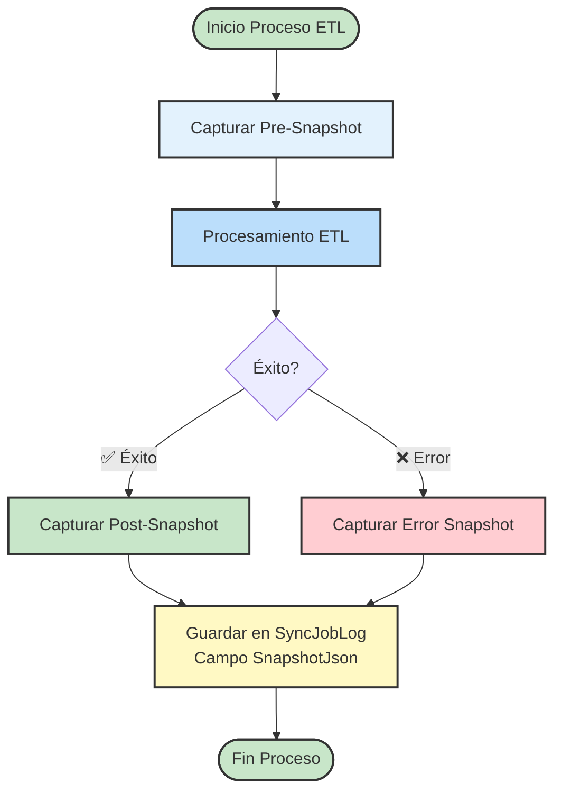

# Servicio de Captura de Snapshots ETL

**Propósito**: Capturar "foto" completa de datos procesados en formato JSON para trazabilidad
**Fecha**: 2025-12-19
**Versión**: 2.0

---

## 🎯 Objetivo del Servicio

El servicio de captura de snapshots permite:
1. **Registrar estado completo** de los datos antes y después del ETL
2. **Guardar trazabilidad** detallada en formato JSON estructurado
3. **Facilitar auditoría** y depuración de procesos
4. **Ser reutilizable** para cualquier tipo de entidad/proceso
5. **Soportar versionado** de snapshots para comparación

---

## 📸 Arquitectura del Servicio

### Componentes Principales



---

## 🔧 Estructura del Snapshot

### DTO Base del Snapshot

```csharp
public class EtlSnapshotDto
{
    // Metadatos del snapshot
    public Guid SnapshotId { get; set; } = Guid.NewGuid();
    public DateTime FechaCaptura { get; set; } = DateTime.UtcNow;
    public string TipoSnapshot { get; set; }  // PRE_PROCESO, POST_PROCESO, ERROR_PROCESO
    public string TipoProceso { get; set; }     // Cotizacion, Pedido, Factura, etc.
    public Guid ProcessId { get; set; }        // ID del proceso
    public Guid RecordId { get; set; }         // ID del registro de negocio
    
    // Información del entorno
    public string Maquina { get; set; }      // Servidor/ejecutor
    public string Usuario { get; set; }       // Usuario de sistema
    public string VersionAplicacion { get; set; }
    public string Ambiente { get; set; }      // DEV, QA, PROD
    
    // Datos de origen (antes del ETL)
    public object DatosOrigen { get; set; }    // Datos completos del origen
    
    // Datos procesados (después del ETL)
    public object DatosProcesados { get; set; } // Datos transformados
    
    // Datos destino (datos que se van a guardar)
    public object DatosDestino { get; set; }   // Datos para INSERT/UPDATE
    
    // Información del procesamiento
    public EtlProcesamientoInfo Procesamiento { get; set; }
    
    // Errores (si aplica)
    public EtlErrorInfo? Error { get; set; }
    
    // Validaciones ejecutadas
    public List<EtlValidacionInfo> Validaciones { get; set; } = new();
    
    // Métricas del proceso
    public EtlMetricasProceso Metricas { get; set; }
}

public class EtlProcesamientoInfo
{
    public DateTime Inicio { get; set; }
    public DateTime? Fin { get; set; }
    public int? DuracionMilisegundos { get; set; }
    public string SubprocesoActual { get; set; }
    public int Reintentos { get; set; }
    public string Estado { get; set; }
    public List<string> PasosEjecutados { get; set; } = new();
}

public class EtlErrorInfo
{
    public string TipoError { get; set; }
    public string Mensaje { get; set; }
    public string StackTrace { get; set; }
    public DateTime FechaError { get; set; }
    public string Subproceso { get; set; }
    public Dictionary<string, object> Contexto { get; set; } = new();
}

public class EtlValidacionInfo
{
    public string NombreValidacion { get; set; }
    public bool Exitosa { get; set; }
    public string Mensaje { get; set; }
    public DateTime FechaValidacion { get; set; }
    public object DatosValidados { get; set; }
}

public class EtlMetricasProceso
{
    public int RegistrosLeidos { get; set; }
    public int RegistrosProcesados { get; set; }
    public int RegistrosExitosos { get; set; }
    public int RegistrosConError { get; set; }
    public long BytesProcesados { get; set; }
    public Dictionary<string, TimeSpan> TiemposSubproceso { get; set; } = new();
}
```

---

## 🛠️ Servicio de Captura

### IEtlSnapshotService

```csharp
public interface IEtlSnapshotService
{
    Task<EtlSnapshotDto> CapturarPreProcesoAsync<TOrigen>(
        int tipoProceso, 
        Guid processId, 
        TOrigen datosOrigen,
        Dictionary<string, object> contexto = null);
    
    Task<EtlSnapshotDto> CapturarPostProcesoAsync<TOrigen, TDestino>(
        EtlSnapshotDto snapshotPrevio,
        TOrigen datosOrigen,
        TDestino datosDestino,
        Dictionary<string, object> contexto = null);
    
    Task<EtlSnapshotDto> CapturarErrorProcesoAsync<TOrigen>(
        EtlSnapshotDto snapshotPrevio,
        Exception exception,
        TOrigen datosOrigen,
        Dictionary<string, object> contexto = null);
    
    Task GuardarSnapshotAsync(EtlSnapshotDto snapshot);
    
    Task<string> SerializarSnapshotAsync(EtlSnapshotDto snapshot);
    Task<EtlSnapshotDto> DeserializarSnapshotAsync(string snapshotJson);
}
```

### EtlSnapshotService (Implementación)

```csharp
public class EtlSnapshotService : IEtlSnapshotService
{
    private readonly ILogger<EtlSnapshotService> _logger;
    private readonly ISyncLogService _syncLogService;
    private readonly IWebHostEnvironment _environment;
    
    public EtlSnapshotService(
        ILogger<EtlSnapshotService> logger,
        ISyncLogService syncLogService,
        IWebHostEnvironment environment)
    {
        _logger = logger;
        _syncLogService = syncLogService;
        _environment = environment;
    }

    public async Task<EtlSnapshotDto> CapturarPreProcesoAsync<TOrigen>(
        int tipoProceso, 
        Guid processId, 
        TOrigen datosOrigen,
        Dictionary<string, object> contexto = null)
    {
        try
        {
            var snapshot = new EtlSnapshotDto
            {
                TipoSnapshot = "PRE_PROCESO",
                TipoProceso = ObtenerNombreProceso(tipoProceso),
                ProcessId = processId,
                RecordId = ObtenerRecordId(datosOrigen),
                DatosOrigen = datosOrigen,
                Procesamiento = new EtlProcesamientoInfo
                {
                    Inicio = DateTime.UtcNow,
                    Estado = "EnProcesoInicio"
                },
                Metricas = new EtlMetricasProceso
                {
                    RegistrosLeidos = 1,
                    BytesProcesados = CalcularBytes(datosOrigen)
                }
            };

            // Agregar información del entorno
            snapshot.Maquina = Environment.MachineName;
            snapshot.Usuario = Environment.UserName;
            snapshot.VersionAplicacion = Assembly.GetExecutingAssembly().GetName().Version.ToString();
            snapshot.Ambiente = _environment.EnvironmentName;

            // Agregar contexto adicional
            if (contexto != null)
            {
                foreach (var kvp in contexto)
                {
                    snapshot.Procesamiento.Contexto ??= new Dictionary<string, object>();
                    snapshot.Procesamiento.Contexto[kvp.Key] = kvp.Value;
                }
            }

            _logger.LogInformation("Snapshot PRE_PROCESO capturado para ProcessId: {ProcessId}", processId);
            return snapshot;
        }
        catch (Exception ex)
        {
            _logger.LogError(ex, "Error al capturar snapshot PRE_PROCESO para ProcessId: {ProcessId}", processId);
            throw;
        }
    }

    public async Task<EtlSnapshotDto> CapturarPostProcesoAsync<TOrigen, TDestino>(
        EtlSnapshotDto snapshotPrevio,
        TOrigen datosOrigen,
        TDestino datosDestino,
        Dictionary<string, object> contexto = null)
    {
        try
        {
            snapshotPrevio.TipoSnapshot = "POST_PROCESO";
            snapshotPrevio.DatosDestino = datosDestino;
            snapshotPrevio.Procesamiento.Fin = DateTime.UtcNow;
            snapshotPrevio.Procesamiento.DuracionMilisegundos = 
                (int)(DateTime.UtcNow - snapshotPrevio.Procesamiento.Inicio).TotalMilliseconds;
            snapshotPrevio.Procesamiento.Estado = "Completado";
            snapshotPrevio.Procesamiento.PasosEjecutados.Add("PROCESO_ETL_COMPLETADO");

            // Actualizar métricas finales
            snapshotPrevio.Metricas.RegistrosProcesados = 1;
            snapshotPrevio.Metricas.RegistrosExitosos = 1;
            snapshotPrevio.Metricas.BytesProcesados += CalcularBytes(datosDestino);

            // Agregar contexto adicional si existe
            if (contexto != null)
            {
                foreach (var kvp in contexto)
                {
                    snapshotPrevio.Procesamiento.Contexto ??= new Dictionary<string, object>();
                    snapshotPrevio.Procesamiento.Contexto[kvp.Key] = kvp.Value;
                }
            }

            await GuardarSnapshotAsync(snapshotPrevio);
            
            _logger.LogInformation("Snapshot POST_PROCESO capturado y guardado para ProcessId: {ProcessId}", 
                snapshotPrevio.ProcessId);
            
            return snapshotPrevio;
        }
        catch (Exception ex)
        {
            _logger.LogError(ex, "Error al capturar snapshot POST_PROCESO para ProcessId: {ProcessId}", 
                snapshotPrevio.ProcessId);
            throw;
        }
    }

    public async Task<EtlSnapshotDto> CapturarErrorProcesoAsync<TOrigen>(
        EtlSnapshotDto snapshotPrevio,
        Exception exception,
        TOrigen datosOrigen,
        Dictionary<string, object> contexto = null)
    {
        try
        {
            snapshotPrevio.TipoSnapshot = "ERROR_PROCESO";
            snapshotPrevio.Error = new EtlErrorInfo
            {
                TipoError = exception.GetType().Name,
                Mensaje = exception.Message,
                StackTrace = exception.StackTrace,
                FechaError = DateTime.UtcNow,
                Subproceso = snapshotPrevio.Procesamiento.SubprocesoActual,
                Contexto = new Dictionary<string, object>
                {
                    ["ProcessId"] = snapshotPrevio.ProcessId,
                    ["RecordId"] = snapshotPrevio.RecordId,
                    ["EstadoActual"] = snapshotPrevio.Procesamiento.Estado
                }
            };

            snapshotPrevio.Procesamiento.Fin = DateTime.UtcNow;
            snapshotPrevio.Procesamiento.DuracionMilisegundos = 
                (int)(DateTime.UtcNow - snapshotPrevio.Procesamiento.Inicio).TotalMilliseconds;
            snapshotPrevio.Procesamiento.Estado = "FalloPersistente";
            snapshotPrevio.Procesamiento.PasosEjecutados.Add("ERROR_EN_PROCESO");

            // Actualizar métricas con error
            snapshotPrevio.Metricas.RegistrosConError = 1;

            // Agregar contexto del error
            if (contexto != null)
            {
                foreach (var kvp in contexto)
                {
                    snapshotPrevio.Error.Contexto[kvp.Key] = kvp.Value;
                }
            }

            await GuardarSnapshotAsync(snapshotPrevio);
            
            _logger.LogError(exception, "Snapshot ERROR_PROCESO capturado para ProcessId: {ProcessId}", 
                snapshotPrevio.ProcessId);
            
            return snapshotPrevio;
        }
        catch (Exception ex)
        {
            _logger.LogError(ex, "Error al capturar snapshot ERROR_PROCESO para ProcessId: {ProcessId}", 
                snapshotPrevio.ProcessId);
            throw;
        }
    }

    public async Task GuardarSnapshotAsync(EtlSnapshotDto snapshot)
    {
        try
        {
            var snapshotJson = await SerializarSnapshotAsync(snapshot);
            
            // Guardar en SyncLogService con campo SnapshotJson
            await _syncLogService.LogSnapshotAsync(
                snapshot.TipoProceso,
                snapshot.ProcessId,
                snapshot.TipoSnapshot,
                snapshotJson,
                snapshot.Error?.Mensaje,
                snapshot.Procesamiento.DuracionMilisegundos);

            _logger.LogDebug("Snapshot guardado en SyncJobLog para ProcessId: {ProcessId}", snapshot.ProcessId);
        }
        catch (Exception ex)
        {
            _logger.LogError(ex, "Error al guardar snapshot para ProcessId: {ProcessId}", snapshot.ProcessId);
            throw;
        }
    }

    public async Task<string> SerializarSnapshotAsync(EtlSnapshotDto snapshot)
    {
        try
        {
            var options = new JsonSerializerOptions
            {
                WriteIndented = false,
                PropertyNamingPolicy = JsonNamingPolicy.CamelCase,
                DefaultIgnoreCondition = JsonIgnoreCondition.WhenWritingNull
            };

            return JsonSerializer.Serialize(snapshot, options);
        }
        catch (Exception ex)
        {
            _logger.LogError(ex, "Error al serializar snapshot para ProcessId: {ProcessId}", snapshot.ProcessId);
            throw;
        }
    }

    public async Task<EtlSnapshotDto> DeserializarSnapshotAsync(string snapshotJson)
    {
        try
        {
            var options = new JsonSerializerOptions
            {
                PropertyNamingPolicy = JsonNamingPolicy.CamelCase,
                PropertyNameCaseInsensitive = true
            };

            return JsonSerializer.Deserialize<EtlSnapshotDto>(snapshotJson, options)
                ?? throw new InvalidOperationException("No se pudo deserializar el snapshot");
        }
        catch (Exception ex)
        {
            _logger.LogError(ex, "Error al deserializar snapshot JSON");
            throw;
        }
    }

    private string ObtenerNombreProceso(int tipoProceso)
    {
        return tipoProceso switch
        {
            1 => "Cotizacion",
            2 => "Pedido",
            3 => "Factura",
            4 => "Inventario",
            _ => $"Desconocido({tipoProceso})"
        };
    }

    private Guid ObtenerRecordId<T>(obj)
    {
        // Usar反射 para obtener la propiedad RecordId o Id
        var property = typeof(T).GetProperty("RecordId") 
            ?? typeof(T).GetProperty("Id") 
            ?? typeof(T).GetProperties().FirstOrDefault(p => p.PropertyType == typeof(Guid));

        return property?.GetValue(obj) as Guid ?? Guid.Empty;
    }

    private long CalcularBytes<T>(obj)
    {
        try
        {
            var json = JsonSerializer.Serialize(obj);
            return Encoding.UTF8.GetByteCount(json);
        }
        catch
        {
            return 0;
        }
    }
}
```

---

## 🗄️ Actualización de SyncJobLog

### Nueva Columna en la Base de Datos

```sql
-- Agregar columna para snapshots JSON a SyncJobLog
ALTER TABLE SyncJobLog 
ADD SnapshotJson NVARCHAR(MAX) NULL;

-- Agregar índice para búsquedas rápidas
CREATE INDEX IX_SyncJobLog_SnapshotJson ON SyncJobLog(SnapshotJson) 
WHERE SnapshotJson IS NOT NULL;

-- Agregar columna para tipo de snapshot
ALTER TABLE SyncJobLog 
ADD TipoSnapshot VARCHAR(20) NULL;
```

### Actualización de SyncLogService

```csharp
public class SyncLogService : ISyncLogService
{
    // Métodos existentes...
    
    public async Task LogSnapshotAsync(
        string tipoProceso,
        Guid identificadorRegistro,
        string tipoSnapshot,
        string snapshotJson,
        string? mensajeError = null,
        int? duracionMilisegundos = null)
    {
        try
        {
            var syncJobLog = new SyncJobLog
            {
                Id = Guid.NewGuid(),
                NombreEntidad = tipoProceso,
                IdentificadorRegistro = identificadorRegistro,
                FechaRegistro = DateTime.UtcNow,
                Estado = tipoSnapshot == "POST_PROCESO" ? "Sincronizado" : "Error",
                Mensaje = mensajeError ?? $"Snapshot {tipoSnapshot} capturado",
                Duracion = duracionMilisegundos,
                SnapshotJson = snapshotJson,
                TipoSnapshot = tipoSnapshot
            };

            await _context.SyncJobLogs.AddAsync(syncJobLog);
            await _context.SaveChangesAsync();

            _logger.LogInformation("Snapshot {TipoSnapshot} guardado para {TipoProceso} - {IdentificadorRegistro}", 
                tipoSnapshot, tipoProceso, identificadorRegistro);
        }
        catch (Exception ex)
        {
            _logger.LogError(ex, "Error al guardar snapshot en SyncJobLog");
            throw;
        }
    }
}
```

---

## 🔄 Integración con Servicios ETL

### Modificación de SincronizarEntidadService

```csharp
public class SincronizarCotizacionService : ISincronizarEntidad
{
    private readonly IEtlSnapshotService _snapshotService;
    
    // Constructor existente + nuevo parámetro
    public SincronizarCotizacionService(
        ICotizacionOrigenRepository origenRepo,
        ICotizacionLegacyRepository legacyRepo,
        ICotizacionControlRepository controlRepo,
        IMapper mapper,
        ILogger<SincronizarCotizacionService> logger,
        IEtlSnapshotService snapshotService)
    {
        // Asignaciones existentes...
        _snapshotService = snapshotService;
    }

    public async Task SincronizarAsync(Guid idCotizacion, Guid procesoControlId)
    {
        EtlSnapshotDto? snapshot = null;
        
        try
        {
            // 1. CAPTURAR PRE-PROCESO
            var cotizacionOrigen = await _origenRepo.ObtenerPorIdAsync(idCotizacion);
            if (cotizacionOrigen == null)
                throw new AppKeyNotFoundException("Cotización no encontrada");

            snapshot = await _snapshotService.CapturarPreProcesoAsync(
                1, // TipoProceso.Cotizacion
                procesoControlId,
                cotizacionOrigen,
                new Dictionary<string, object>
                {
                    ["IdCotizacion"] = idCotizacion,
                    ["Folio"] = cotizacionOrigen.Folio,
                    ["MetodoCaptura"] = "ETL_COTIZACION"
                });

            // 2. PROCESO ETL EXISTENTE
            await _controlService.ActualizarSubprocesoAsync(procesoControlId, "Extract");
            // ... lógica existente de extract/transform/load ...

            // 3. CAPTURAR POST-PROCESO (ÉXITO)
            var cotizacionLegacy = await _legacyRepo.ObtenerPorFolioAsync(cotizacionOrigen.Folio);
            
            snapshot = await _snapshotService.CapturarPostProcesoAsync(
                snapshot,
                cotizacionOrigen,
                cotizacionLegacy,
                new Dictionary<string, object>
                {
                    ["FolioDestino"] = cotizacionLegacy.Folio,
                    ["PKGenerada"] = cotizacionLegacy.PK_Folio,
                    ["FechaCarga"] = DateTime.UtcNow
                });

            await _controlService.CompletarProcesoAsync(procesoControlId);
        }
        catch (Exception ex)
        {
            // 4. CAPTURAR ERROR (si existe snapshot previo)
            if (snapshot != null)
            {
                var cotizacionOrigen = await _origenRepo.ObtenerPorIdAsync(idCotizacion);
                snapshot = await _snapshotService.CapturarErrorProcesoAsync(
                    snapshot,
                    ex,
                    cotizacionOrigen,
                    new Dictionary<string, object>
                    {
                        ["ContextoError"] = "ETL_COTIZACION_ERROR",
                        ["Reintentos"] = await ObtenerReintentosAsync(procesoControlId)
                    });
            }

            // Manejo de errores existente...
            throw;
        }
    }
}
```

---

## 📊 Visualización de Snapshots

### Endpoints para Consulta de Snapshots

```csharp
[ApiController]
[Route("api/[controller]")]
public class SnapshotController : ControllerBase
{
    private readonly ISyncLogService _syncLogService;
    private readonly IEtlSnapshotService _snapshotService;

    /// <summary>
    /// Obtiene snapshot por tipo y proceso
    /// </summary>
    [HttpGet("proceso/{processId}/snapshots")]
    public async Task<ActionResult> ObtenerSnapshotsPorProceso(
        Guid processId, 
        [FromQuery] string? tipoSnapshot = null)
    {
        var snapshots = await _syncLogService.ObtenerSnapshotsPorProcesoAsync(
            processId, 
            tipoSnapshot);
        return Ok(snapshots);
    }

    /// <summary>
    /// Compara snapshots (antes vs después)
    /// </summary>
    [HttpGet("proceso/{processId}/comparacion")]
    public async Task<ActionResult> CompararSnapshots(Guid processId)
    {
        var preSnapshot = await _syncLogService.ObtenerSnapshotPorTipoAsync(
            processId, "PRE_PROCESO");
        var postSnapshot = await _syncLogService.ObtenerSnapshotPorTipoAsync(
            processId, "POST_PROCESO");

        if (preSnapshot == null || postSnapshot == null)
            return NotFound("Snapshots no encontrados");

        var comparacion = new
        {
            ProcesoId = processId,
            Antes = await _snapshotService.DeserializarSnapshotAsync(preSnapshot.SnapshotJson),
            Despues = await _snapshotService.DeserializarSnapshotAsync(postSnapshot.SnapshotJson),
            Diferencias = await CompararSnapshotsAsync(preSnapshot, postSnapshot)
        };

        return Ok(comparacion);
    }

    private async Task<object> CompararSnapshotsAsync(
        SyncJobLog preSnapshot, 
        SyncJobLog postSnapshot)
    {
        var datosPre = await _snapshotService.DeserializarSnapshotAsync(preSnapshot.SnapshotJson);
        var datosPost = await _snapshotService.DeserializarSnapshotAsync(postSnapshot.SnapshotJson);

        // Lógica de comparación genérica
        return new
        {
            Duracion = postSnapshot.Duracion - preSnapshot.Duracion,
            CambiosDatos = await DetectarCambiosAsync(datosPre.DatosOrigen, datosPost.DatosDestino),
            Estado = $"{datosPre.Procesamiento.Estado} → {datosPost.Procesamiento.Estado}"
        };
    }

    private async Task<List<object>> DetectarCambiosAsync(object objetoPre, object objetoPost)
    {
        // Lógica genérica para detectar diferencias entre dos objetos
        var cambios = new List<object>();
        
        // Implementación simplificada - en producción usar librerías como Compare.NET
        var jsonPre = JsonSerializer.Serialize(objetoPre);
        var jsonPost = JsonSerializer.Serialize(objetoPost);
        
        if (jsonPre != jsonPost)
        {
            cambios.Add(new { Tipo = "DatosModificados", Mensaje = "Los datos cambiaron durante el proceso" });
        }
        
        return cambios;
    }
}
```

---

## 🎯 Beneficios del Sistema de Snapshots

### 1. **Trazabilidad Completa**
- Registro exacto de datos antes y después del ETL
- Auditoría de cambios por proceso y tiempo
- Soporte para cumplimiento normativo

### 2. **Depuración Mejorada**
- Identificación rápida de dónde ocurren errores
- Comparación de datos para debugging
- Análisis de impacto de cambios

### 3. **Análisis y Métricas**
- Estadísticas de transformaciones
- Patrones de errores frecuentes
- Optimización basada en datos históricos

### 4. **Reutilización**
- Genérico para cualquier tipo de entidad
- Extensible para nuevos procesos
- Configurable según necesidades

### 5. **Recuperación**
- Posibilidad de restaurar datos desde snapshots
- Rollback a punto específico si es necesario
- Análisis de incidentes post-mortem

---

## 🚀 Uso en Producción

### Configuración Recomendada

```json
{
  "Snapshot": {
    "Habilitado": true,
    "MaxTamanoSnapshotMB": 50,
    "RetencionDias": 90,
    "ComprimirSnapshots": true,
    "CapturarSoloErrores": false,
    "TipoProcesosConSnapshot": [1, 2, 3, 4],
    "ExcludeCamposSensibles": ["Password", "Token", "ApiKey"]
  }
}
```

### Monitoreo y Limpieza

```bash
-- Job recurrente para limpiar snapshots antiguos
DELETE FROM SyncJobLog 
WHERE TipoSnapshot IS NOT NULL 
  AND FechaRegistro < DATEADD(DAY, -90, GETDATE());

-- Consulta de uso de storage de snapshots
SELECT 
    COUNT(*) AS TotalSnapshots,
    AVG(DATALENGTH(SnapshotJson)) / 1024.0 / 1024.0 AS TamanoPromedioMB,
    SUM(DATALENGTH(SnapshotJson)) / 1024.0 / 1024.0 AS TamanoTotalMB
FROM SyncJobLog 
WHERE SnapshotJson IS NOT NULL;
```

Este sistema proporciona una solución completa y reutilizable para capturar snapshots de procesos ETL, garantizando trazabilidad y auditabilidad completas.