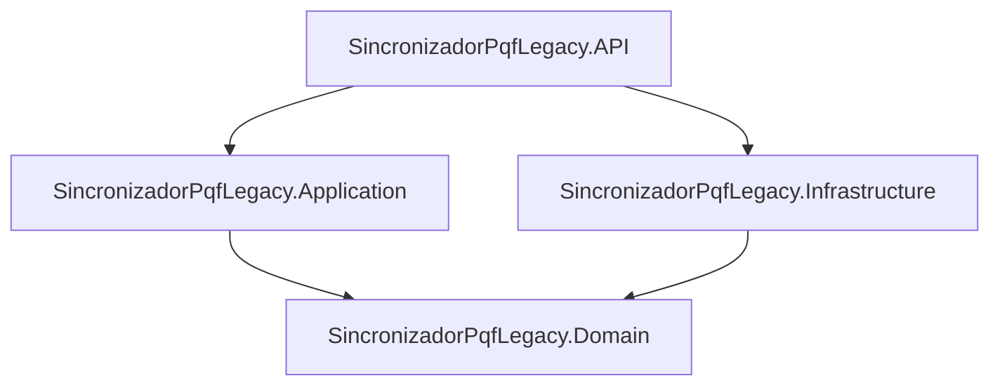
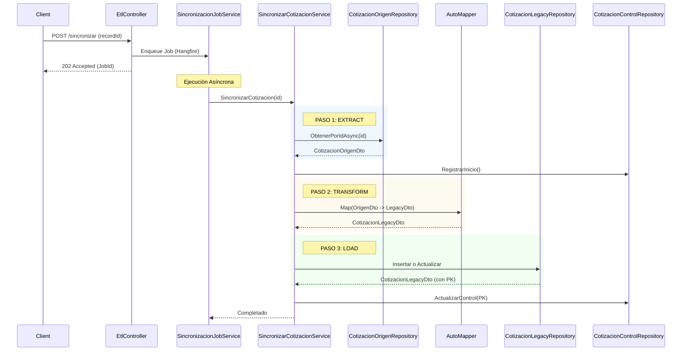

# Documentación Técnica: SincronizadorPqfLegacy

## 1. Arquitectura General

La solución sigue una arquitectura basada en **Clean Architecture** (Arquitectura Limpia), organizando el código en capas concéntricas para separar responsabilidades y facilitar el mantenimiento y las pruebas.

### Estructura de Capas
*   **API (Presentación)**: Punto de entrada de la aplicación. Contiene los controladores REST, configuración de servicios e inicialización.
*   **Application (Aplicación)**: Contiene la lógica de negocio, casos de uso (servicios), interfaces de repositorios y validaciones. Orquesta el flujo de datos.
*   **Domain (Dominio)**: Núcleo de la aplicación. Contiene las entidades, enumeraciones e interfaces fundamentales. No tiene dependencias externas.
*   **Infrastructure (Infraestructura)**: Implementación de detalles técnicos. Acceso a datos (EF Core), repositorios, integraciones externas y mapeo de datos.

### Patrones Principales
*   **Repository Pattern**: Abstracción del acceso a datos.
*   **Dependency Injection (DI)**: Gestión de dependencias a través del contenedor de .NET.
*   **DTO (Data Transfer Object)**: Transferencia de datos entre capas.
*   **ETL (Extract, Transform, Load)**: Patrón utilizado para la sincronización de datos.

---

## 2. Inventario de Proyectos

| Proyecto | Tipo | Descripción | Responsabilidades |
| :--- | :--- | :--- | :--- |
| **SincronizadorPqfLegacy.API** | Web API (.NET 8/10) | Capa de presentación y entrada. | - Exponer endpoints REST - Configurar DI y Middleware - Gestionar Jobs de Hangfire - Logging y Manejo de Errores |
| **SincronizadorPqfLegacy.Application** | Class Library | Lógica de negocio. | - Servicios de Sincronización (ETL) - Validaciones (FluentValidation) - Interfaces de Servicios - DTOs |
| **SincronizadorPqfLegacy.Domain** | Class Library | Entidades y contratos. | - Modelos de Dominio - Interfaces de Repositorios - Enums (e.g., `TipoProcesoEtl`) |
| **SincronizadorPqfLegacy.Infrastructure** | Class Library | Implementación técnica. | - DbContexts (EF Core) - Implementación de Repositorios - AutoMapper Profiles - Servicios de Infraestructura |
| **Microservicio.UnitTest** | Test Project | Pruebas unitarias. | - Validar lógica de negocio y componentes. |

---

## 3. Dependencias

### Mapa de Dependencias

> **Nota**: La arquitectura ahora cumple estrictamente con Clean Architecture, donde **Application** solo depende de `Domain`. Las implementaciones concretas de **Infrastructure** son inyectadas en `API`.

### Paquetes NuGet Principales
*   **Hangfire**: Gestión de tareas en segundo plano y cron jobs (`Hangfire.AspNetCore`, `Hangfire.SqlServer`).
*   **Entity Framework Core**: ORM para acceso a datos (`Microsoft.EntityFrameworkCore.SqlServer`).
*   **Serilog**: Logging estructurado (`Serilog.AspNetCore`, `Serilog.Sinks.File`).
*   **AutoMapper**: Mapeo de objetos (`AutoMapper`).
*   **FluentValidation**: Validación de modelos (`FluentValidation.AspNetCore`).
*   **Swashbuckle**: Documentación de API (Swagger).

---

## 4. Flujos de Datos

### Flujo de Sincronización (ETL)
El proceso principal es la sincronización de cotizaciones desde un sistema origen (**ProquifaDotNet**) hacia un sistema legacy (**PConnect**).

---

## 5. Funcionalidades Clave

### Endpoints Principales (**EtlController**)
*   `POST /api/Etl/sincronizar`: Detona un proceso ETL específico para un registro.
*   `POST /api/Etl/sincronizar-pendientes`: Inicia la sincronización masiva de registros pendientes.
*   `GET /api/Etl/catalogo`: Devuelve los metadatos de los procesos ETL disponibles.

### Servicios Core
*   **SincronizacionJobService**: Wrapper para Hangfire. Maneja reintentos (Transient vs Permanent errors) y logging de progreso.
*   **SincronizarCotizacionService**: Implementa la lógica específica de negocio para cotizaciones (Extract, Transform, Load).
*   **SincronizacionMultipleService**: Orquesta la sincronización de múltiples registros (pendientes).

### Repositorios
*   **CotizacionOrigenRepository**: Lee de **ProquifaDotNet**.
*   **CotizacionLegacyRepository**: Escribe en **PConnect**.
*   **CotizacionControlRepository**: Gestiona el estado de la sincronización en **PConnectProquifaDotNet**.

---

## 6. Configuración

### Archivos de Configuración (**appsettings.json**)
*   **ConnectionStrings**:
    *   **ProquifaDotNet**: Sistema Origen.
    *   **PConnect**: Sistema Destino (Legacy).
    *   **PConnectProquifaDotNet**: Base de datos de control y Hangfire.
*   **Hangfire**: Configuración de reintentos (`RetryAttempts`, `RetryDelays`).
*   **SincronizacionAutomatica**: Configuración de Cron Jobs (`Habilitado`, `CronExpression`).
*   **Serilog**: Niveles de log y sinks (Consola, Archivo).

### Inicialización (**Program.cs** / **ServiceExtensions**)
*   **ConfigureDatabases**: Registra los 4 DbContexts.
*   **ConfigureHangfire**: Configura el almacenamiento en SQL Server y filtros de reintento.
*   **ConfigureETLServices**: Registra servicios y repositorios específicos del dominio ETL.

---

## 7. Patrones y Prácticas

### Manejo de Errores
*   **IExceptionClassifier**: Clasifica excepciones en `Transient` (reintentables) y **Permanent** (no reintentables).
*   **Hangfire Retry**: Los errores transitorios lanzan excepción para que Hangfire reintente automáticamente. Los permanentes se loguean y marcan el job como exitoso (pero con error lógico) para evitar bucles infinitos.
*   **ProblemDetails**: Middleware para estandarizar respuestas de error HTTP.

### Logging
*   Uso extensivo de **Serilog**.
*   **Contexto**: Se usa `LogContext` para enriquecer logs con IDs de correlación.
*   **Hangfire Console**: Integración para ver logs en tiempo real dentro del dashboard de Hangfire.

### Validación
*   **FluentValidation**: Reglas de validación separadas de las entidades. Se valida automáticamente en la entrada de los controladores.

---

## 8. Puntos de Entrada

*   **Program.cs**:
    1.  Inicializa el `BootstrapLogger` de Serilog.
    2.  Crea el `WebApplicationBuilder`.
    3.  Llama a métodos de extensión (`ConfigureServices`, **ConfigureHangfire**, etc.).
    4.  Construye la **App**.
    5.  Configura el pipeline HTTP (Swagger, Hangfire Dashboard, Controllers).
    6.  Configura Jobs Recurrentes (**ConfigureRecurringJobs**).
    7.  Ejecuta `app.Run()`.

---

## 9. Integraciones Externas

### Bases de Datos
La solución interactúa con múltiples bases de datos SQL Server:
1.  **Origen (ProquifaDotNet)**: Fuente de verdad para las nuevas cotizaciones.
2.  **Destino (PConnect)**: Sistema legacy donde se deben replicar los datos.
3.  **Control (PConnectProquifaDotNet)**: Almacena tablas intermedias de control (`vETLCotizacionesPendiete`, **SyncJobLog**) y tablas de Hangfire.

### Hangfire Dashboard
*   Accesible en `/hangfire`.
*   Permite visualizar jobs en cola, en proceso, fallidos y recurrentes.
*   Provee métricas de rendimiento y logs detallados por job.